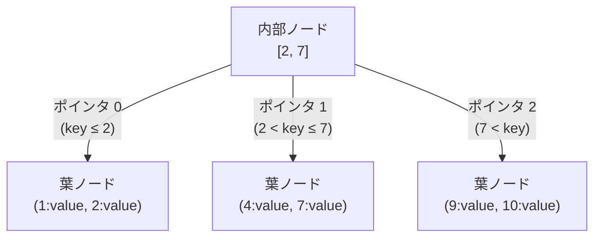

# B+Tree

## 概要

- B+Tree は B-Tree の一種 (B-Tree は key-value のペアを key でソートして格納するのに向いているデータ構造)
  - B+Tree は大きく分けて以下の 2 種類のノードで構成される
    - 葉ノード
    - 内部ノード
- `O(log n)` の計算量で検索できる
- 参考:
  - [MySQL with InnoDB のインデックスの基礎知識とありがちな間違い](https://techlife.cookpad.com/entry/2017/04/18/092524)

### 葉ノード

- Tree の末端に位置するノード
- データ (key-value のペア) を持つ
  - 1 つのノードには、複数の key-value ペアが格納される
- 葉ノード同士はポインタで連結されている
  - このため範囲検索が高速に行える

### 内部ノード

- value を持たない
- N 個の key を持つ場合、最大 N+1 個の子ノードへのポインタを持つ (以下図を参照)
  - key が範囲の境界線となり、各ポインタはその範囲に該当する子ノードを指す

#### N = 2 の例

### 検索の流れ

#### 1. 目的の葉ノードに到達するまで、内部ノードを辿る

- 内部ノードの key はソートされているため、二分探索することで効率良く目的の子ノードを特定できる

#### 2. 葉ノード内を二分探索する

- 完全に一致する key が見つかれば、その key に対応する value を返す
- 見つからなければ、該当する key は存在しないと判断する
