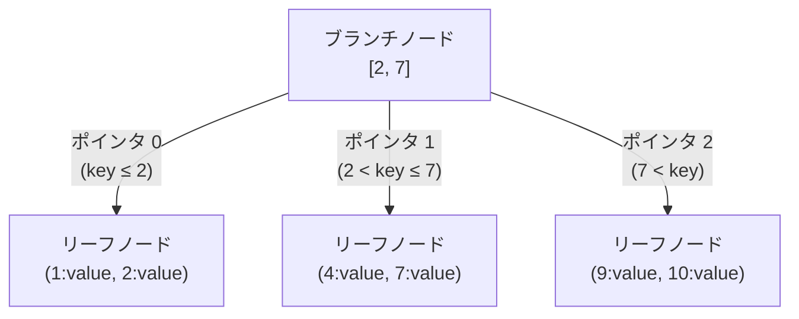

# B+Tree

- 実装コード
  - [iterator.go](../../../internal/storage/access/btree/iterator.go)
  - [search_mode.go](../../../internal/storage/access/btree/search_mode.go)
  - [btree.go](../../../internal/storage/access/btree/btree.go)

## 実装順

1. [Slotted Page](./slotted-page.md)
2. [Meta Page](./meta-page.md)
3. [Node](./node.md)
4. B+Tree 本体(このドキュメント)
   - Iterator
   - Search Mode
   - B+Tree

## 概要

- B+Tree は B-Tree の一種 (B-Tree は key-value のペアを key でソートして格納するのに向いているデータ構造)
  - B+Tree は大きく分けて以下の 2 種類のノードで構成される
    - リーフノード
    - ブランチノード
- `O(log n)` の計算量で検索できる
- B+Tree のノードはページ単位で扱われる
- B+Tree 全体はあくまで構造 (抽象) にすぎず、B+Tree 内のノード (=ページ) がバッファプールに格納されているのか、ディスクに格納されているのかという情報は、B+Tree は気にしない
- 参考:
  - [MySQL with InnoDB のインデックスの基礎知識とありがちな間違い](https://techlife.cookpad.com/entry/2017/04/18/092524)
  - [インデックスの役割と構成](https://qiita.com/immrshc/items/6cdb47f61e10de8ee1a5)

### ブランチノード

- value を持たない
- N 個の key を持つ場合、最大 N+1 個の子ノードへのポインタを持つ (以下図を参照)
  - key が範囲の境界線となり、各ポインタはその範囲に該当する子ノードを指す

#### N = 2 の例



### リーフノード

- Tree の末端に位置するノード
- データ (key-value のペア) を持つ
  - 1 つのノードには、複数の key-value のペアが格納される
  - また value は固定長ではなく可変長の場合があり、複数の可変長のデータを格納するためには、ブロックにおける「それぞれのデータの開始位置 (オフセット)」とサイズを管理する必要がある
    - これを実現するために、Slotted Page という手法を用いる (詳細は [Slotted Page](./slotted-page.md) を参照)
- リーフノード同士はポインタで連結されている
  - このため範囲検索が高速に行える

## B+Tree の操作

### B+Tree の作成

- 新しい B+Tree を作成する際は、まず空のリーフノードを 1 つ作成し、そのノードをルートノードとして設定する
- また、メタページも作成し、ルートノード (作ったリーフノード) のページ ID をメタページに保存する

### B+Tree のノードの検索

1. 目的のリーフノードに到達するまで、ブランチノードを辿る
   - ブランチノードの key はソートされているため、二分探索することで効率良く目的の子ノードを特定できる

2. リーフノード内を二分探索する
   - 完全に一致する key が見つかれば、その key に対応する value を返す
   - 見つからなければ、該当する key は存在しないと判断する

_以下例: key = "grape" を検索_

```txt
B+Tree の構造:
                    [Root: Branch Node]
                    Pairs: [(key="dog", pageId=10), (key="monkey", pageId=20)]
                    RightChild: pageId=30
                           /            |              \
                      (<dog)         (dog~monkey)    (>=monkey)
                      PageID=10       PageID=20       PageID=30
                        /                |                \
         [Leaf: apple,cat,dog]  [Leaf: fish,grape,lion]  [Leaf: tiger,zebra]

ステップ 1: ルートノード (ブランチノード) で二分探索
  - "grape" と "dog" を比較 → dog < grape
  - "grape" と "monkey" を比較 → grape < monkey
  - → インデックス 1 のペア (key="monkey", pageId=20) を取得

ステップ 2: 子ページ (PageID=20) を取得し、再帰的に探索

ステップ 3: リーフノードで二分探索
  - "grape" と "fish" を比較 → fish < grape
  - "grape" と "grape" を比較 → 一致
  - → インデックス 1 のペア (key="grape", value=v2) を取得

最終結果: value=v2 を返す
```

### B+Tree へのデータの挿入

#### 基本的な流れ

- メタページからルートページの ID を取得
- ルートノードから再帰的に挿入処理を行う
- ノードが分割された場合、親ノードに新しいキーとページ ID を挿入
- ルートノードが分割された場合、新しいルートノードを作成

#### リーフノードへの挿入

リーフノードへの挿入は以下の手順で行う

1. 二分探索により、挿入すべき位置を特定
2. 重複キーがあればエラーを返す
3. 空き容量がある場合
   - 指定された位置にペアを挿入
4. 空き容量がない場合
   - 新しいリーフノードを作成
   - 既存のペアと新しいペアを、2 つのノードに半分ずつ分割
   - リーフノード間の連結を更新 (前後のリーフノードとのポインタを更新)
   - 新しいノードの最小キーと新しいノードのページ ID を親ノードに返す

#### ブランチノードへの挿入

ブランチノードへの挿入は以下の手順で行う

1. 二分探索により、挿入先の子ノードを特定し、子ノードのページ ID を取得
2. 子ノードに対して挿入処理を再帰的に実行
3. 子ノードが分割されなかった場合、挿入完了
4. 子ノードが分割された場合
   - 子ノードから返されたキーとページ ID をペアとして、ブランチノードに挿入
5. 空き容量がある場合
   - 指定された位置にペアを挿入
6. 空き容量がない場合
   - 新しいブランチノードを作成
   - 既存のペアと新しいペアを、2 つのノードに半分ずつ分割
   - 新しいノードの最小キーと新しいノードのページ ID を親ノードに返す

#### ルートノードの分割

- ルートノードが分割された場合、新しいルートノード (ブランチノード) を作成
- 新しいルートノードは以下を持つ
  - 分割によって返されたキー
  - 古いルートノードのページ ID (左の子)
  - 新しく作成されたノードのページ ID (右の子)
- メタページのルートページ ID を新しいルートノードの ID に更新

_以下例: key = 4 をリーフノードに挿入 (ノード分割が発生する場合)_

```txt
初期状態: leafNode = [(1, v1), (3, v3), (5, v5), (7, v7), (9, v9)] (満杯)
挿入するペア: (4, v4)

ステップ 1: 挿入位置を二分探索
  - 4 と 1 を比較 → 1 < 4
  - 4 と 5 を比較 → 4 < 5
  - → インデックス 2 が挿入位置

ステップ 2: 空き容量がないため、ノード分割を実行
  - 新しいリーフノードを作成
  - 既存のペアと新しいペアを 2 つに分割

ステップ 3: 分割後の状態
  - 新しいリーフノード: [(1, v1), (3, v3), (4, v4)]
  - 元のリーフノード: [(5, v5), (7, v7), (9, v9)]
  - リーフノード間の連結を更新

ステップ 4: 親ノードに返す
  - オーバーフローキー: 5 (新しいノードの最大キーの次のキー)
  - 新しいノードのページ ID
```
