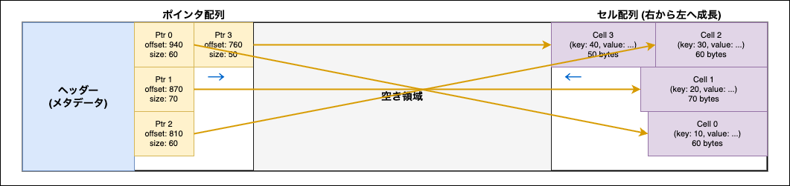

# Slotted Page

- 実装コード
  - [header.go](../../../internal/storage/access/btree/slotted_page/header.go)
  - [pointer.go](../../../internal/storage/access/btree/slotted_page/pointer.go)
  - [slotted_page.go](../../../internal/storage/access/btree/slotted_page/slotted_page.go)

## 概要

- ページ内に複数の可変長のデータを格納するための手法
- ページを以下の 3 つの部分に分けて管理する
  - ヘッダー
  - ポインタ配列
  - セル配列

### 構成

- ヘッダー
  - ページ全体のメタデータを管理する

- ポインタ配列
  - データの開始位置 (オフセット) とサイズを管理する
  - (ヘッダーを除いて) ページの左端に位置する
  - 左から右へ新しいポインタが追加される

- セル配列
  - 実際のデータを格納する
  - ページの右端に位置し、データは右から左へ追加される

以下イメージ



## ヘッダーの構成

- サイズ: 8 byte
  - スロット数の情報: 2 byte (先頭から 2 byte)
    - スロット数: ページ内に格納されているデータの数
  - フリースペースの開始位置 (offset) の情報: 2 byte (スロット数の情報の次の 2 byte)
  - 予約領域: 4 byte (フリースペースの開始位置の情報の次の 4 byte)

つまりスロット数を読み取る際には、Slotted Page のデータの先頭から 2 byte を読み取れば良い。(同様にフリースペースの開始位置もその次の 2 byte を読み取れば良い)

#### フリースペースのサイズの算出

_仮定_

- ページサイズ: 4096 byte
- ヘッダーサイズ: 8 byte
- スロット数: 3
- 各ポインタのサイズ: 4 byte
- ポインタ配列のサイズ: 3 × 4 = 12 byte
- フリースペースの開始位置 (offset): 4000 byte

この場合、Slotted Page は以下のような内訳になる

```txt
|ヘッダー|Ptr0|Ptr1|Ptr2|========空き領域========|Cell2|Cell1|Cell0|
0       8    12   16  20                      4000              4096
　　　　　↑___12 bytes___↑                      ↑
　　　　　pointersSize                          freeSpaceOffset
```

フリースペースのサイズ = 4000 (freeSpaceOffset) - 12 (pointersSize) - 8 (ヘッダーサイズ) = 3980 byte

## ポインタの構成

- サイズ: 4 byte
  - オフセット: 2 byte (先頭から 2 byte)
    - データの開始位置 (offset)
  - サイズ: 2 byte (オフセットの次の 2 byte)
    - データのサイズ

これにより、インデックス (0 から始まるポインタの番号) を指定すれば、該当するデータの開始位置とサイズを取得でき、またそれによりデータを読み取ることができる。

- 例えば、インデックス 1 のポインタが以下のような内容だった場合
  - 該当のポインタは、`ヘッダーサイズ + (インデックス × 各ポインタのサイズ)` の位置から読み取る
    - 8 + (1 × 4) = 12 byte から 4 byte 読み取る (先頭 2 byte がオフセット、次の 2 byte がサイズ)
    - そのオフセットが 3500 でサイズが 100 の場合
      - データの開始位置は 3500 byte、サイズは 100 byte であることが分かるので、Slotted Page のデータの 3500 byte から 100 byte を読み取れば実際のデータを取得できる

<br />

### データ追加手順

#### 1. フリースペースの開始位置 (offset) をずらす

- 追加するデータのサイズ分だけフリースペースの開始位置を左にずらす
- ヘッダーのフリースペースの開始位置 (offset) の情報を書き換える

#### 2. スロット数を増やす

- ヘッダーのスロット数の情報を書き換える (スロット数を 1 増やす)

#### 3. ポインタ配列をシフトする

- 仮定
  - 該当のデータを挿入するポインタの index が i とする
- i がスロット数より大きい場合は、フリースペースにスロットが追加されるだけなので、この手順は不要
- それ以外の場合、ポインタ配列の index i 以降のポインタを右にシフトする

#### 4. 新しいポインタを追加する

- ポインタ配列の index i に新しいポインタを追加する

<br />

### データのサイズ変更手順

#### 1. データサイズの差分を計算する

- 差分が 0 なら何もしないで終了

#### 2. データ領域をシフトする

- 差分が正の場合 (データサイズが大きくなる場合)
  - データの後ろにあるデータを右にシフトする
- 差分が負の場合 (データサイズが小さくなる場合)
  - データの後ろにあるデータを左にシフトする

#### 2. フリースペースの開始位置 (offset) をずらす

- 元々のフリースペースの開始位置から、データサイズの差分を減算する
  - `新しいフリースペースの開始位置 = 元々のフリースペースの開始位置 - データサイズの差分`
- ヘッダーのフリースペースの開始位置 (offset) の情報を書き換える

#### 3. 影響を受けるポインタのオフセットを更新する

- 該当データのデータの開始が変わるので、該当データのポインタのオフセットを更新する
- また、シフトしたデータのポインタのオフセットも更新する (シフトによりデータの開始位置が変わるため)

#### 4. ポインタのサイズを更新する

- 該当データのポインタのサイズを更新する

<br />

### データ削除手順

#### 1. データサイズを 0 にする

上述の [データサイズの変更手順](#データのサイズ変更手順) を用いて、該当データのサイズを 0 にする。

#### 2. ポインタ配列をシフトする

- 仮定
  - 該当のデータを挿入するポインタの index が i とする
- 削除するデータのポインタの index が i とする
- ポインタ配列の index i+1 以降のポインタを左にシフトする

#### 3. スロット数を減らす

- ヘッダーのスロット数の情報を書き換える (スロット数を 1 減らす)
