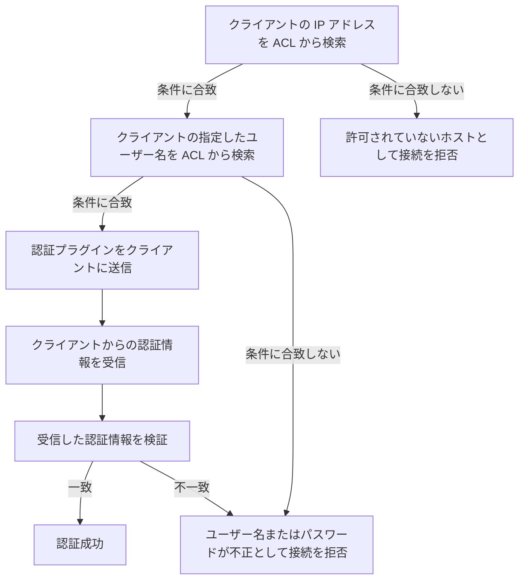

# アカウント

- アカウントは `ユーザー名@ホスト名` の形式で一意に識別される
- 各アカウントの情報 (ホスト名、ユーザー名など) は、ACL (Access Control List) と呼ばれるデータ構造に格納される
- 認可はしない (すべてのアカウントは、サーバーに接続してクエリを実行するための完全な権限を持つ)
- 認証は[接続フェーズ](../server/protocol/life-cycle.md#接続フェーズ-connection-phase)の中で行われる

## 権限の評価順序

- サーバー接続時のユーザー認証は、以下の流れで行われる

1. 接続を試行するクライアントの IP アドレスを ACL から検索する
2. 条件に合致した場合、クライアントの指定したユーザー名を ACL から検索する
3. 条件に合致した場合、そのアカウントに対する[認証プラグイン](authentication-plugin.md)をクライアントに送信する
4. クライアントは指定された認証プラグインの方式でパスワードやその他の認証情報をサーバーに送信する
5. 送信された情報を検証し、一致した場合は、クライアントの接続を許可する

## ACL の構築

- ACL はカタログに永続化される
- サーバー初回起動時にコマンドライン引数 (`--init-user`, `--init-password`, `--init-host`) で初期ユーザーを設定する
- 2 回目以降の起動ではカタログから読み込む。`--init-*` 引数を指定した場合は無視される (WARN ログを出力)

## ホストマッチング

- 接続元の IP アドレスと、ACL に登録されたホスト名を照合する
- マッチングの優先順位:
  1. 完全一致 (例: `192.168.1.100`)
  2. サブネットパターン (例: `192.168.1.%` は `192.168.1.` で始まる全 IP にマッチ)
  3. `%` (全ホスト許可)

## 初期ユーザー

- サーバー初回起動時にコマンドライン引数 (`--init-user`, `--init-host`) で初期ユーザーを設定する
- パスワードはランダム生成されてログに出力される
- ユーザーは ALTER USER でパスワードを変更する
- 2 回目以降の起動ではカタログから読み込む。`--init-*` 引数を指定した場合は無視される (WARN ログを出力)

## ALTER USER

- `ALTER USER 'user'@'host' IDENTIFIED BY 'new_password';` でパスワードを変更する
- カタログの UserMeta を更新し、オンメモリの ACL も再構築する
- 変更は即座に反映される (次回の認証から新しいパスワードが使われる)
