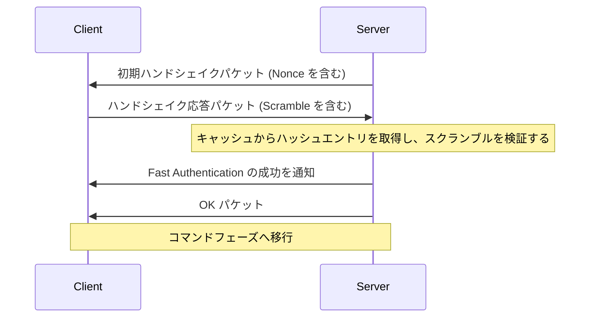
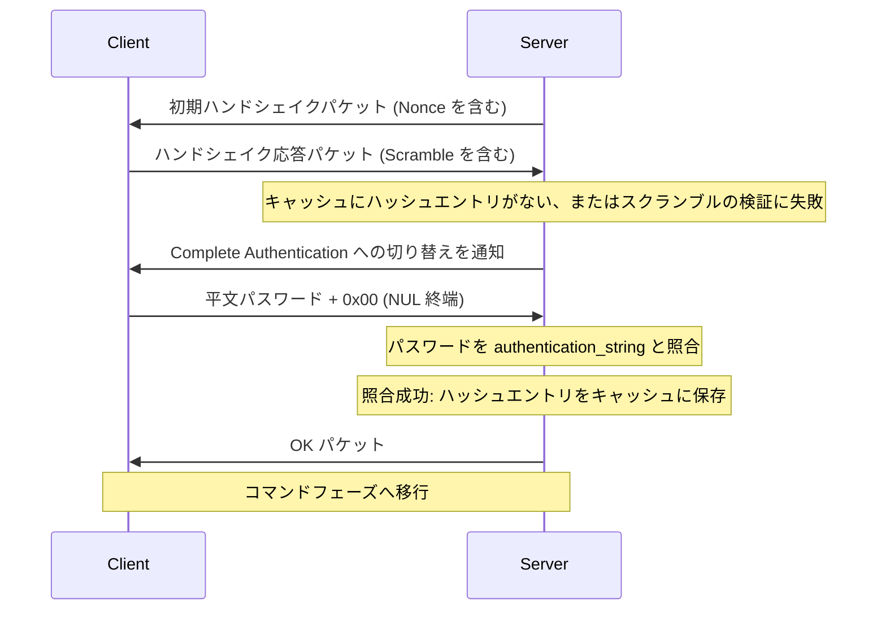
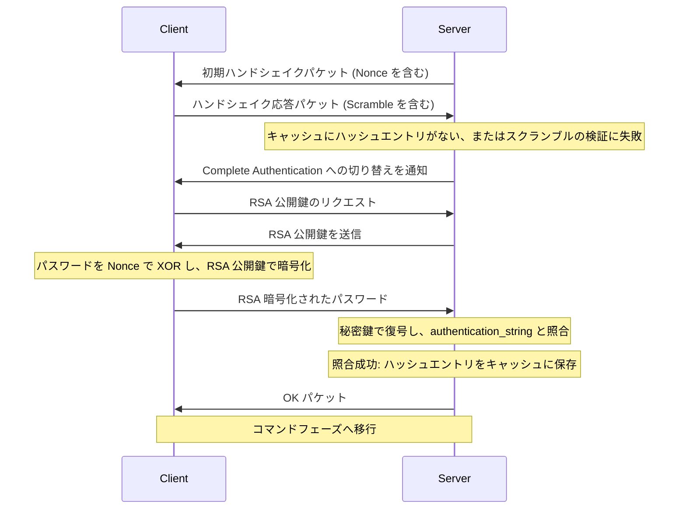

# 認証プラグイン

- 参考: https://dev.mysql.com/doc/dev/mysql-server/latest/page_caching_sha2_authentication_exchanges.html

## 概要

- (MySQL プロトコルを使用して) サーバーとクライアントが接続を行う中で「どのようにパスワード (またはそれ以外の認証に使う情報) をやり取りして検証するか」を決めるためのもの
- caching_sha2_password のみをサポートしている

## caching_sha2_password

- SHA-256 ハッシングを実装する認証プラグイン
  - ソルト付きでハッシュ化されるため、同じパスワードでも異なるハッシュ値になる
- `Fast authentication` と `Complete authentication` の 2 つのフェーズで動作する
  - サーバーがメモリ上に対象ユーザーのハッシュ値のキャッシュを保持している場合、クライアントから送信されたスクランブル値 (暗号化されたデータ) を使用して高速に認証を行う (Fast authentication)
  - Fast authentication に失敗した場合、サーバーはクライアントに対して Complete authentication への切り替えを通知する
  - Complete authentication では、安全な接続を介してサーバーにパスワードが送信される
    - サーバーはそのパスワードを `authentication_string` と照合し、照合に成功すると、サーバーはそのアカウントのハッシュ値をキャッシュに保存する (以降はコマンドフェーズへ移行する)

### 用語

| 用語 | 説明 |
| --- | --- |
| Nonce | サーバーが接続ごとに生成する 20 バイトのランダムデータ。初期ハンドシェイクパケットに含まれる |
| Scramble | クライアントがパスワードと Nonce から計算した 32 バイトのデータ。パスワードそのものをネットワーク上に流さずに認証するために使う |
| Hash Entry | サーバーがメモリ上にキャッシュしている `SHA256(SHA256(password))` の値 |

### 認証フロー全体

### Fast Authentication のシーケンス

### Complete Authentication のシーケンス (TLS 接続の場合)

### Complete Authentication のシーケンス (非 TLS 接続の場合)

### Scramble の計算方法

#### クライアント側の計算

1. `stage1 = SHA256(password)`
2. `stage2 = SHA256(stage1)` (= `SHA256(SHA256(password))`)
3. `digest = SHA256(stage2 || nonce)` (= `SHA256(SHA256(SHA256(password)) || nonce)`)
4. `scramble = XOR(stage1, digest)`

#### サーバー側の検証 (Fast authentication)

1. サーバーは `cached_hash = SHA256(SHA256(password))` をキャッシュとして保持している
2. `expected = SHA256(cached_hash || nonce)` を計算
3. `candidate_stage1 = XOR(client_scramble, expected)` で `SHA256(password)` を復元
4. `candidate_stage2 = SHA256(candidate_stage1)` を計算
5. `candidate_stage2 == cached_hash` なら認証成功
