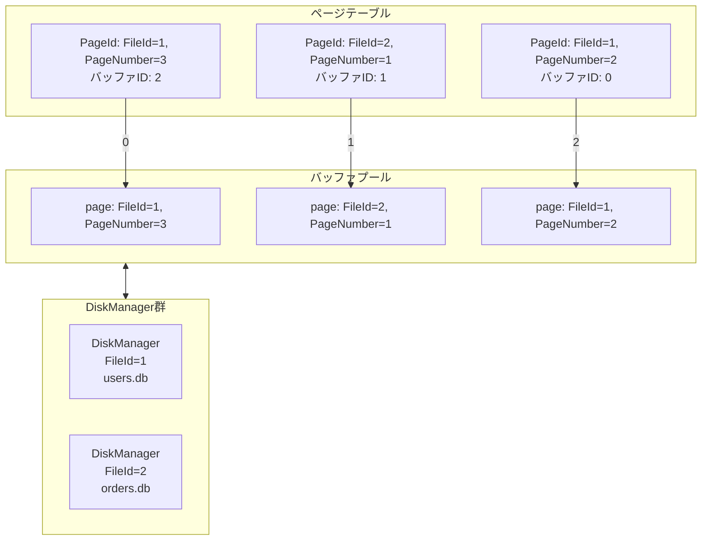
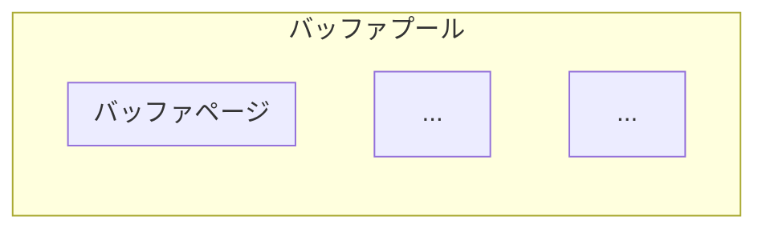

# バッファプール

- 該当コード:
  - [buffer/page_table.go](../../internal/storage/bufferpool/page_table.go)
  - [buffer/buffer_page.go](../../internal/storage/bufferpool/buffer_page.go)
  - [buffer/buffer_pool.go](../../internal/storage/bufferpool/buffer_pool.go)
  - [buffer/manager.go](../../internal/storage/bufferpool/manager.go)

## 概要

- ディスク I/O は遅く、頻繁に発生するとパフォーマンスが下がるため、バッファプールを用いてディスク I/O を削減する
  - バッファプールはページの内容をメモリ上にキャッシュすることでディスクの遅さを隠蔽する
  - 一度読み込んだページをメモリに保持しておき、それ以降の読み取りではメモリから読み取ることでディスク I/O を削減する
  - 書き込みも同様に、まずバッファプール上のページを書き換え、後でまとめてディスクに書き込むことでディスク I/O を削減する
- 「どのページのデータがどのバッファに入っているか」の対応関係を、ページテーブルで管理する (以下図を参照)

## BufferPoolManager

BufferPoolManager は低レベルのページキャッシュと I/O 調整を担当する

- FileId を用いて複数の DiskManager を管理し、各テーブルのディスクファイルへのアクセスを調整する
- 新しいテーブルやインデックス用に一意な FileId を採番する
- 指定された FileId に対して新しい PageId を割り当てる

### ファイルシステムのビルトインのキャッシュを利用せず、バッファプールを実装する理由

- RDBMS の動作を把握している RDBMS 自身がキャッシュ管理した方が、ファイルシステムにキャッシュ管理させるよりも賢く管理をできるため
  - 例えば LRU (Least Recently Used) アルゴリズムを用いて、最近使われたページを優先的にキャッシュするなど

### バッファプールの内部

- バッファページ
  - ページに `Referenced` や `IsDirty` フィールドなどを付加した構造体
- バッファプール
  - 複数のバッファページを格納する
  - `Pointer` (Clock sweep アルゴリズムで使用するポインタ) や `MaxBufferSize` (バッファプールの最大サイズ) などのメタデータを持つ

## バッファプールの整理

- バッファプールの大きさは有限であるため、バッファプールに容量の空きがなくなった場合は、いずれかのバッファページを捨てて容量を確保する必要がある
  - 捨てるバッファページを選ぶアルゴリズムとして、今回は Clock sweep アルゴリズムを採用する
- Clock sweep アルゴリズム:
  - バッファプール内のバッファページを円環状に並べ、ポインタを持つ
  - ポインタが指しているバッファページの `Referenced` ビットを確認し、以下のように動作する
    - `Referenced` ビットが立っている場合:
      - `Referenced` ビットをクリアし、ポインタを次のバッファページに進める
    - `Referenced` ビットが立っていない場合:
      - そのバッファページを捨てて、新しいページをそのバッファページに読み込む
  - この操作を繰り返すことで、最近参照されたページは `Referenced` ビットが立っているため捨てられにくくなり、古く参照されていないページが優先的に捨てられるようになる

### ページのフェッチ

#### 1. 指定された PageId がページテーブルにすでにあるか (=バッファプールにあるか) を確認する

- PageId には FileId と PageNumber が含まれており、どのディスクファイルのどのページかを一意に特定できる

#### 2. 存在する場合はそのページを返す (ディスク I/O は発生しない)

- このとき、該当バッファページの `Referenced` ビットを立てる

#### 3. 存在しない場合、ディスクのページをバッファプールに読み込む

- PageId に含まれる FileId を使って、対応する DiskManager を特定する
- バッファプールに空きがある場合:
  - DiskManager を通じてページを読み込み、ページテーブルを更新する
- バッファプールに空きがない場合:
  - Clock sweep アルゴリズムで捨てるバッファページを選択する
  - 選択されたバッファページが `IsDirty` ビットを持っている場合 (バッファプール内のページの内容とディスクのページの内容に差分がある場合) は、該当する DiskManager を通じてディスクに書き出す
