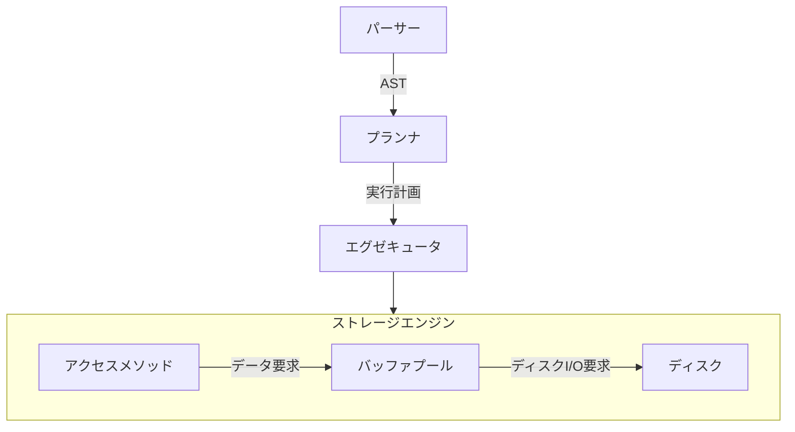

# アーキテクチャ

## 概要

- [パーサー](#パーサー)
- [プランナ](#プランナ)
- [エグゼキュータ](#エグゼキュータ)
- ストレージエンジン
  - [アクセスメソッド](access.md)
  - [バッファプール](bufferpool.md)
  - [ディスク](disk.md)

- 基本的には下から順に (ディスク -> バッファープール -> アクセスメソッド -> エグゼキュータ -> プランナ -> パーサー の順で) 実装する

### パーサー

- クエリを構文解析して抽象構文木の形にする

### プランナ

- 抽象構文木を元に実行計画を作る
  - 実行計画: エグゼキュータをどのような順序で、どのようなパラメータで呼び出すかという情報
- MySQL での "オプティマイザ" に相当
  - このリポジトリでは最適化は行わないため、"オプティマイザ" とは呼ばない

### エグゼキュータ

- 実行計画の通りにアクセスメソッドを呼び出してクエリを実行する

## アーキテクチャ図

