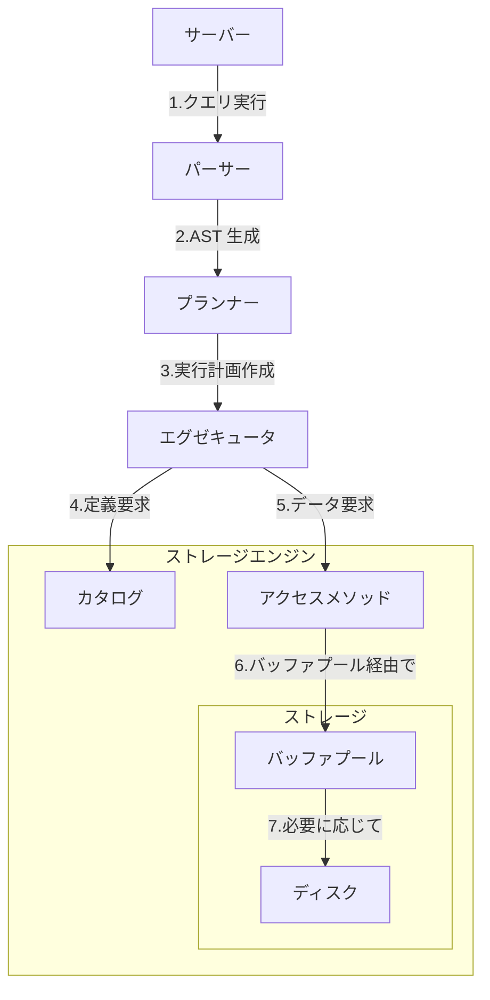

# アーキテクチャ

## 概要 (minesql server)

- [サーバー](./server.md)
- [パーサー](./parser.md)
- [プランナー](./planner.md)
- [エグゼキュータ](./executor.md)
- [エンジン](./engine.md)
- [カタログ](./catalog.md)
- [アクセスメソッド](./access.md)
- [ストレージ](./storage)

## アーキテクチャ図

```mermaid
graph TD
    server[サーバー]
    parser[パーサー]
    planner[プランナー]
    executor[エグゼキュータ]

    server --1.クエリ実行--> parser
    parser --2.AST 生成--> planner
    planner --3.実行計画作成--> executor
    executor --4.定義要求--> catalog
    executor --5.データ要求--> access
    access --6.バッファプール経由で--> bufferpool

    subgraph storageEngine[ストレージエンジン]
        catalog[カタログ]
        access[アクセスメソッド]

        subgraph storage[ストレージ]
            bufferpool[バッファプール]
            disk[ディスク]

            bufferpool --7.必要に応じて--> disk
        end
    end
```

※エンジン (`internal/engine`) はサーバー起動時にバッファプールとカタログを初期化するパッケージ  
図ではクエリ処理の流れを優先し省略している
