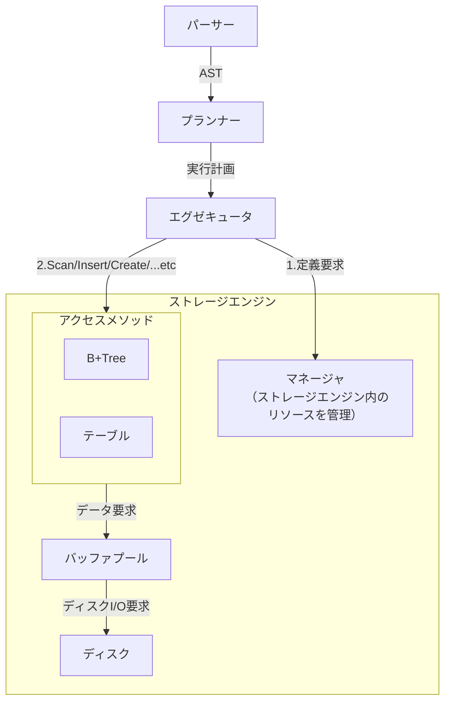

# アーキテクチャ

## 概要

- [パーサー](./parser.md)
- [プランナー](./planner.md)
- [エグゼキュータ](./executor.md)
- ストレージエンジン
  - [アクセスメソッド](./access/overview.md)
  - [バッファプール](./bufferpool.md)
  - [ディスク](./disk.md)

- 基本的には下から順に (ディスク -> バッファープール -> アクセスメソッド -> エグゼキュータ -> プランナー -> パーサー の順で) 実装する

## アーキテクチャ図

```mermaid
graph TD
    parser[パーサー] --AST--> planner[プランナー]
    planner --実行計画-->executor[エグゼキュータ]
    executor --1.定義要求--> manager[マネージャ]
    executor --2.Scan/Insert/Create/...etc--> accessMethod[アクセスメソッド]

    subgraph storageEngine[ストレージエンジン]
        direction TB
        subgraph accessMethod[アクセスメソッド]
            b-tree[B+Tree]
            table[テーブル]
        end
        manager[マネージャ<br/> （ストレージエンジン内のリソースを管理）]
        accessMethod[アクセスメソッド] --データ要求-->bufferPool[バッファプール]
        bufferPool --ディスクI/O要求-->diskManager[ディスク]
    end
```
