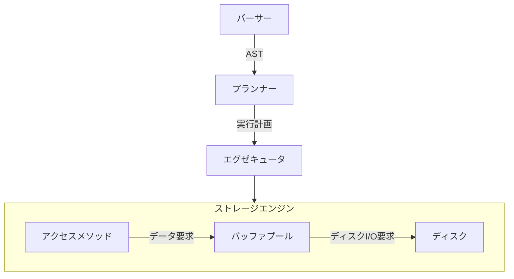

# アーキテクチャ

## 概要

- [パーサー](#パーサー)
- [プランナー](#プランナー)
- [エグゼキュータ](./executor.md)
- ストレージエンジン
  - [アクセスメソッド](./access/overview.md)
  - [バッファプール](bufferpool.md)
  - [ディスク](disk.md)

- 基本的には下から順に (ディスク -> バッファープール -> アクセスメソッド -> エグゼキュータ -> プランナー -> パーサー の順で) 実装する

### パーサー

- クエリを構文解析して抽象構文木の形にする

### プランナー

- 抽象構文木を元に実行計画を作る
  - 実行計画: エグゼキュータをどのような順序で、どのようなパラメータで呼び出すかという情報
- MySQL での "オプティマイザ" に相当
  - このリポジトリでは最適化は行わないため、"オプティマイザ" とは呼ばない

## アーキテクチャ図

