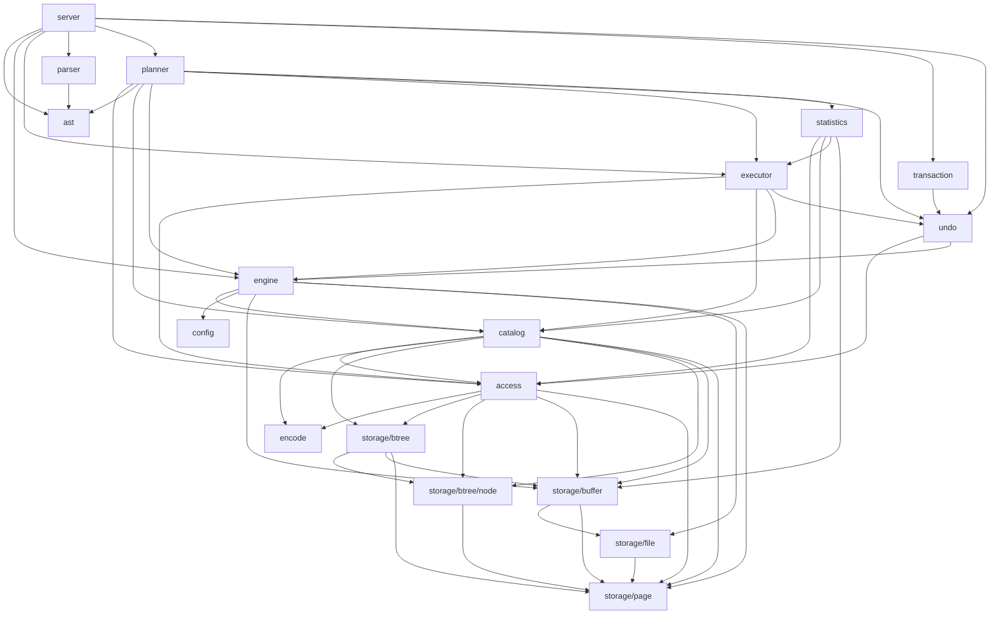
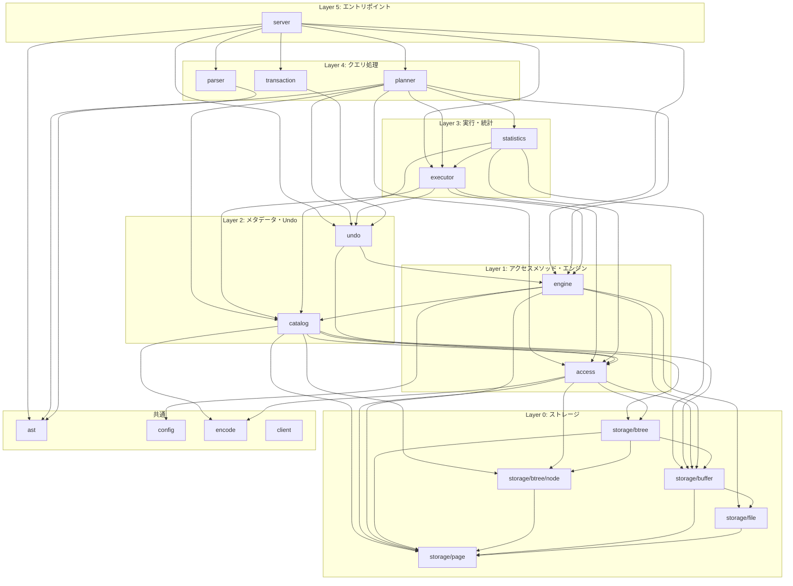

# パッケージ依存関係グラフ

`internal/` 配下のパッケージ間の依存関係を示す。テストコードの依存は含まない。

## 全体図

```mermaid
graph TD
    server --> ast
    server --> engine
    server --> executor
    server --> parser
    server --> planner
    server --> transaction
    server --> undo

    planner --> access
    planner --> ast
    planner --> catalog
    planner --> engine
    planner --> executor
    planner --> statistics
    planner --> undo

    executor --> access
    executor --> catalog
    executor --> engine
    executor --> undo

    statistics --> access
    statistics --> catalog
    statistics --> executor
    statistics --> storage/buffer

    catalog --> access
    catalog --> encode
    catalog --> storage/btree
    catalog --> storage/btree/node
    catalog --> storage/buffer
    catalog --> storage/page

    parser --> ast

    transaction --> undo

    undo --> access
    undo --> engine

    access --> encode
    access --> storage/btree
    access --> storage/btree/node
    access --> storage/buffer
    access --> storage/page

    engine --> catalog
    engine --> config
    engine --> storage/buffer
    engine --> storage/file
    engine --> storage/page

    storage/btree --> storage/btree/node
    storage/btree --> storage/buffer
    storage/btree --> storage/page

    storage/btree/node --> storage/page

    storage/buffer --> storage/file
    storage/buffer --> storage/page

    storage/file --> storage/page
```

## レイヤー構造

```mermaid
graph TD
    subgraph "Layer 5: エントリポイント"
        server
    end

    subgraph "Layer 4: クエリ処理"
        planner
        parser
        transaction
    end

    subgraph "Layer 3: 実行・統計"
        executor
        statistics
    end

    subgraph "Layer 2: メタデータ・Undo"
        catalog
        undo
    end

    subgraph "Layer 1: アクセスメソッド・エンジン"
        access
        engine
    end

    subgraph "Layer 0: ストレージ"
        storage/btree
        storage/btree/node
        storage/buffer
        storage/file
        storage/page
    end

    subgraph "共通"
        ast
        config
        encode
        client
    end

    server --> planner & parser & executor & transaction & undo & engine & ast
    planner --> executor & statistics & catalog & access & undo & ast & engine
    executor --> catalog & access & engine & undo
    statistics --> catalog & access & executor & storage/buffer
    catalog --> access & encode & storage/btree & storage/btree/node & storage/buffer & storage/page
    parser --> ast
    transaction --> undo
    undo --> access & engine
    access --> encode & storage/btree & storage/btree/node & storage/buffer & storage/page
    engine --> catalog & config & storage/buffer & storage/file & storage/page
    storage/btree --> storage/btree/node & storage/buffer & storage/page
    storage/btree/node --> storage/page
    storage/buffer --> storage/file & storage/page
    storage/file --> storage/page
```

## 依存の少ないパッケージ (リーフ)

依存先がないパッケージ:

- `ast`
- `client`
- `config`
- `encode`
- `storage/page`
