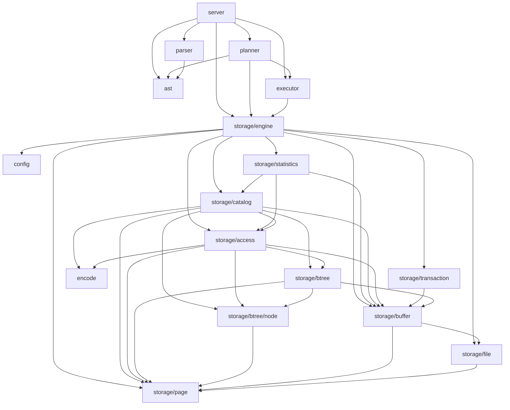
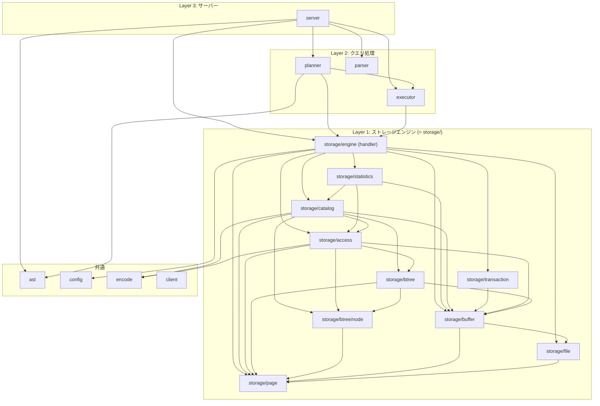

# パッケージ依存関係グラフ

`internal/` 配下のパッケージ間の依存関係を示す。テストコードの依存は含まない。

## 全体図



## レイヤー構造



## MySQL InnoDB との対応

| MySQL InnoDB (`storage/innobase/`) | minesql (`internal/storage/`) |
|---|---|
| `handler/` (ha_innodb.cc) | `engine/` |
| `row/` | `access/` |
| `btr/` | `btree/` |
| `buf/` | `buffer/` |
| `dict/` | `catalog/` |
| `dict/dict0stats.cc` | `statistics/` |
| `fil/` | `file/` |
| `page/` | `page/` |
| `trx/` | `transaction/` |

## 依存の少ないパッケージ (リーフ)

依存先がないパッケージ:

- `ast`
- `client`
- `config`
- `encode`
- `storage/page`

## storage 外からのアクセスルール

`storage/` 外のパッケージ (`server`, `planner`, `executor`) は `storage/engine` のみを参照する。`storage/` 内の他のパッケージ (`access`, `catalog`, `btree` 等) を直接参照しない。

```
server  ──→ storage/engine ──→ storage/* 内部
planner ──→ storage/engine ──→ storage/* 内部
executor ──→ storage/engine ──→ storage/* 内部
```
