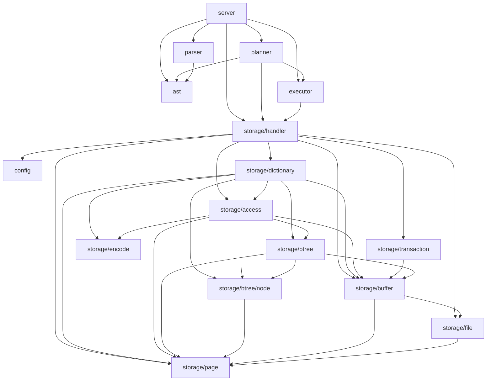
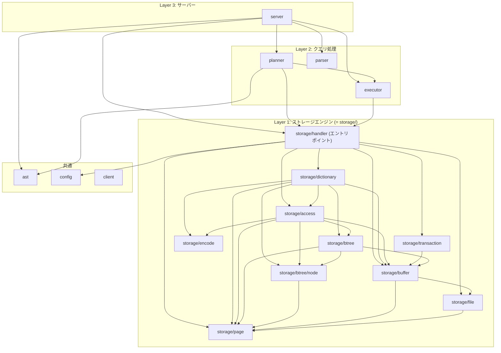

# パッケージ依存関係グラフ

`internal/` 配下のパッケージ間の依存関係を示す。テストコードの依存は含まない。

## 全体図

## レイヤー構造

## MySQL InnoDB との対応

| MySQL InnoDB (`storage/innobase/`) | minesql (`internal/storage/`) |
|---|---|
| `handler/` (ha_innodb.cc) | `handler/` |
| `row/` | `access/` |
| `btr/` | `btree/` |
| `buf/` | `buffer/` |
| `dict/` | `dictionary/` |
| `rem/` | `encode/` |
| `fil/` | `file/` |
| `page/` | `page/` |
| `trx/` | `transaction/` |
