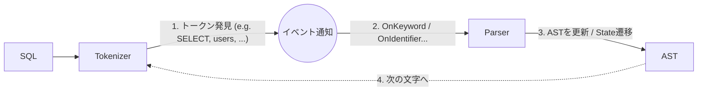

# パーサー

## 概要

- クエリを構文解析して抽象構文木の形にする
- Tokenize -> Parse のように 2 ステップで処理を行うのではなく、Tokenize と Parse を一列で処理する
- Tokenizer がトークンを識別したら、その都度 Parser にイベント通知
  - Tokenize でトークンの種別を識別した後に、その種別ごとに Parser にイベント通知する (e.g. SELECT キーワードなら `OnSelect` イベント)

以下ざっくりフロー

## Tokenizer

