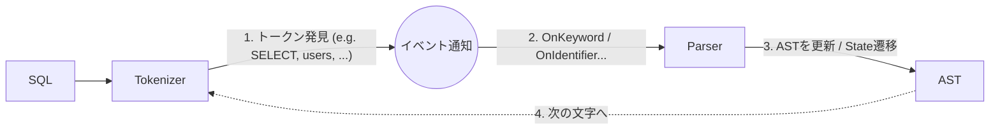
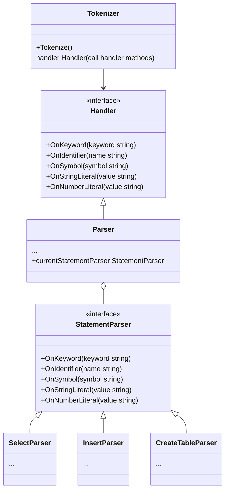

# パーサー

## 概要

- クエリを構文解析して抽象構文木の形にする
- Tokenize -> Parse のように 2 ステップで処理を行うのではなく、Tokenize と Parse を一列で処理する (https://github.com/fb55/htmlparser2 を参考)
- Tokenizer がトークンを識別したら、その都度 Parser にイベント通知
  - Tokenize でトークンの種別を識別した後に、その種別ごとに Parser にイベント通知する (e.g. SELECT キーワードなら `OnSelect` イベント)

以下ざっくりフロー

## 設計の補足

各ステートメント (e.g. SELECT, INSERT, CREATE TABLE) ごとの処理が割と複雑なので、ステートメントごとに StatementParser (e.g. SelectParser, InsertParser) を用意し、Parser が (ステートメントに応じて) それを呼び出す形にしている

以下ざっくりクラス図

