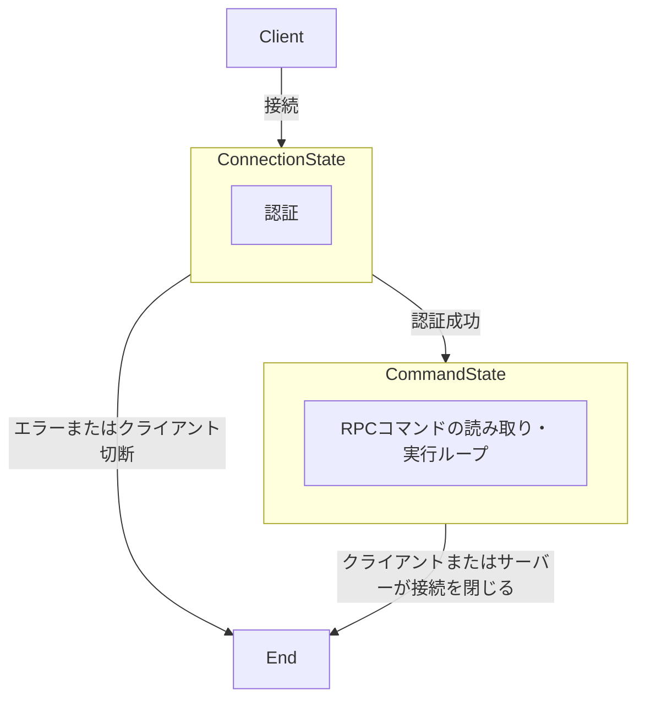
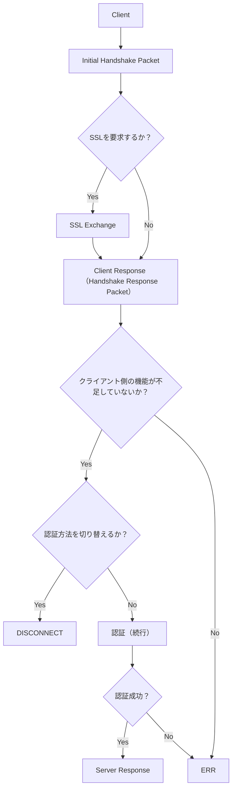
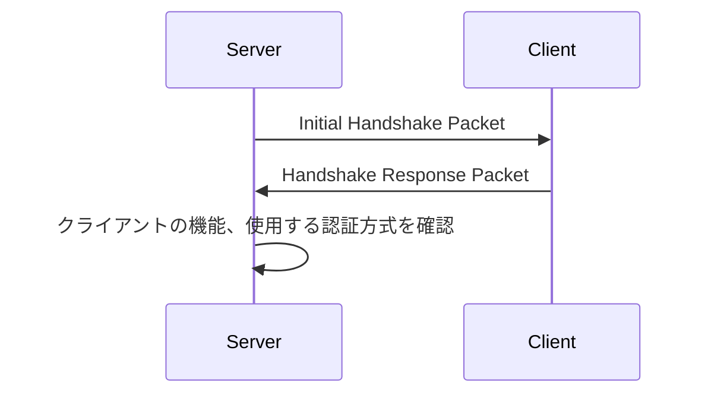
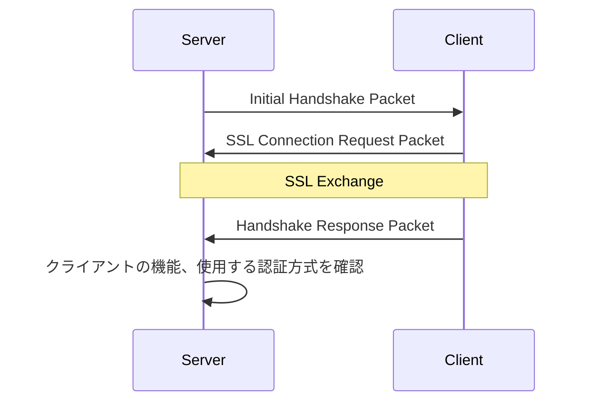
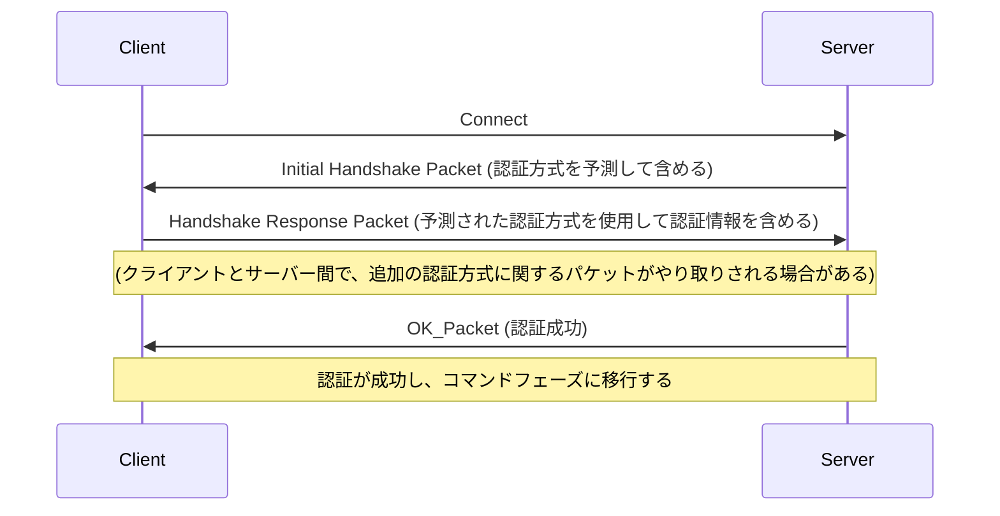
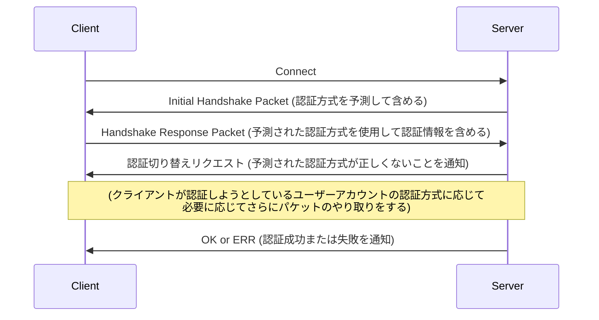

# コネクションのライフサイクル

## 参考文献

- [MySQL Source Code Documentation - Client/Server Protocol](https://dev.mysql.com/doc/dev/mysql-server/latest/PAGE_PROTOCOL.html#protocol_overview)

## 概要

- MySQL プロトコルはステートフルなプロトコルである
- 接続が確立されると、サーバーはまず「接続フェーズ (Connection Phase)」を開始する
- 接続フェーズが完了すると、接続は「コマンドフェーズ (Command Phase)」に移行する
  - コマンドフェーズは、接続が終了するまで継続する
- MineSQL にはレプリケーションはないので、Replication Protocol は存在しない

## 接続フェーズ (Connection Phase)

- 接続フェーズは以下のタスクを実行する
  - クライアントとサーバー間での機能情報の交換
  - 要求に応じた SSL 通信チャネルのセットアップ
  - サーバーによるクライアントの認証
- 接続フェーズは、クライアントがサーバーに対して `connect()` を呼び出すことで始まる
- これに対してサーバーは ERR パケットを返してハンドシェイクを終了するか、もしくは `Initial Handshake Packet` を送信する
  - サーバーが最初のパケットとして ERR パケットを送信した場合、それはクライアントとサーバーの間で機能情報のネゴシエーションが行われる前に発生する
- クライアントが `Initial Handshake Packet` を受け取ると、`Handshake Response Packet` を返す
  - この段階で、クライアントは SSL 接続を要求することができる
  - その場合は、クライアントが認証応答を送信する前に、SSL 通信チャネルが確立される
- 最初のハンドシェイクが終わると、サーバーは認証に使用する方法をクライアントに通知する
- その後、サーバーが OK_Packet を送信して接続を承認するか、ERR_Packet を送信して拒否するまで、認証情報のやり取りが継続される (OK_Packet や ERR_Packet の詳細は後述)

### Initial Handshake

- 最初のハンドシェイクは、サーバーが `Initial Handshake Packet` を送信することから始まる
- その後、必要に応じてクライアントが `SSLRequest` パケットで SSL の接続を要求する
- 続いて `Handshake Response Packet` を送信する

#### Handshake のみ

#### SSL Handshake

### 機能情報の交換

- クライアントとサーバーは、接続フェーズの最初の段階で、互いの機能 (capabilities) を交換する
- サーバーが Initial Handshake Packet を送信する際に、サーバーの機能をクライアントに通知する
- クライアントが、Handshake Response Packet を送信する際に、自身とサーバーがの両方が共通して持っている機能のみを通知する
- クライアントの機能が不足している場合、サーバーは ERR_Packet を返して接続を終了する

### 認証方式の決定

- 認証に使用される方式はユーザーアカウントに関連づけられている
- クライアントは、Handshake Response Packet を使用して、ログインを希望するユーザーアカウントをサーバーに伝える
- サーバーは、通知されたユーザーアカウントに基づいて、そのユーザーが使用すべき認証方式を特定する
- ただし、通信の往復回数を減らすために、サーバーとクライアントは Initial Handshake の段階で、使用される認証方式を予測し、認証情報のやり取りを開始することができる
  - サーバーは、`authentication_policy` で定義されたデフォルトの認証方式を使用して初期認証データを作成し、使用した方式名とともに `Initial Handshake Packet` に含めてクライアントに送信する
  - クライアントは、サーバーから送られた認証データへの応答を `Handshake Response Packet` に含めてサーバーに送信する
    - この際に、クライアントは必ずしもサーバーが `Initial Handshake Packet` で予測した認証方式を使用する必要はない
    - Initial Handshake において、予測した認証方式が正しくなかった場合、サーバーは「認証切り替えリクエスト」を用いて、予測された認証方式が正しくないことを通知
    - 認証方式の不一致が起きた場合は、正しい認証方式を用いて認証プロセスを最初からやり直す必要がある

#### 認証の高速パスが正常に完了する場合の流れ

※サーバーがユーザーの認証を拒否すると判断した場合は、OK_Packet ではなく ERR_Packet を返し、接続を終了する

#### 認証方法の変更の流れ

## コマンドフェーズ (Command Phase)

https://dev.mysql.com/doc/dev/mysql-server/latest/page_protocol_command_phase.html

<!-- TODO: 記載 -->