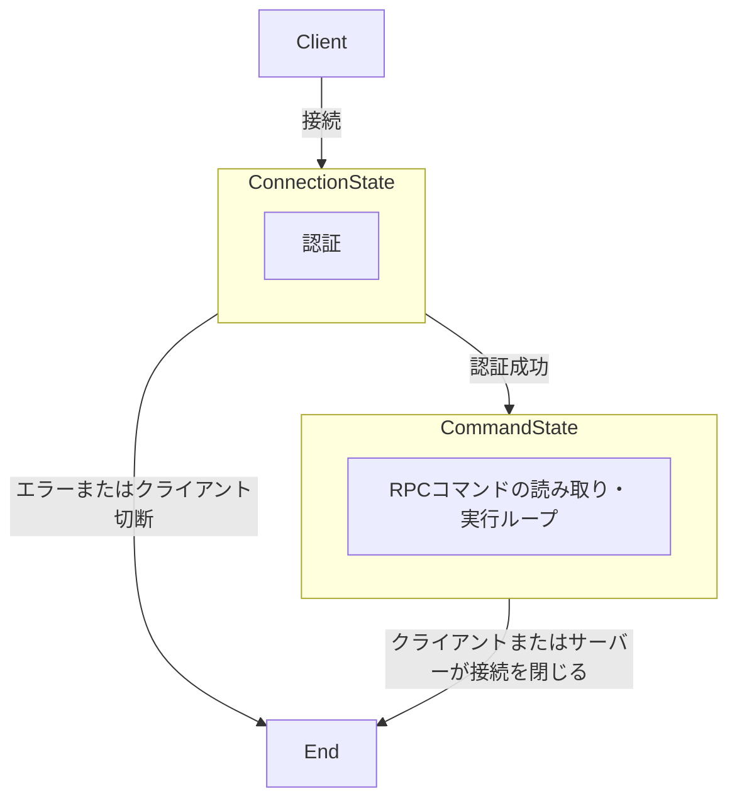
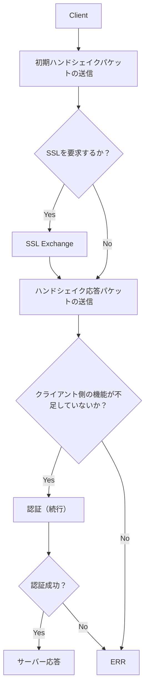
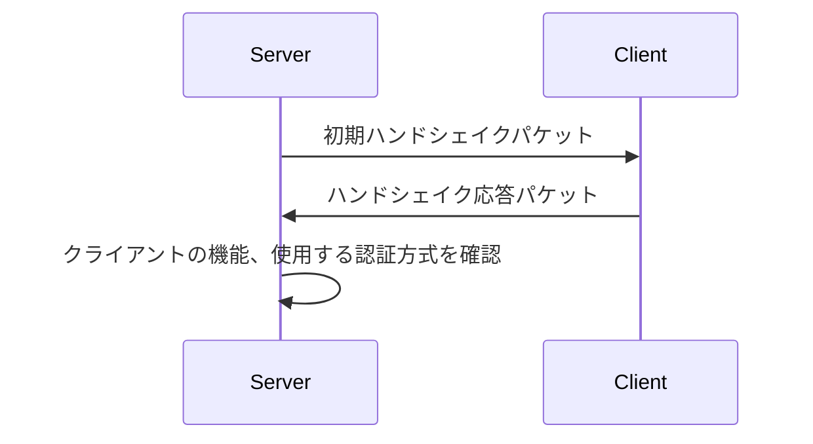
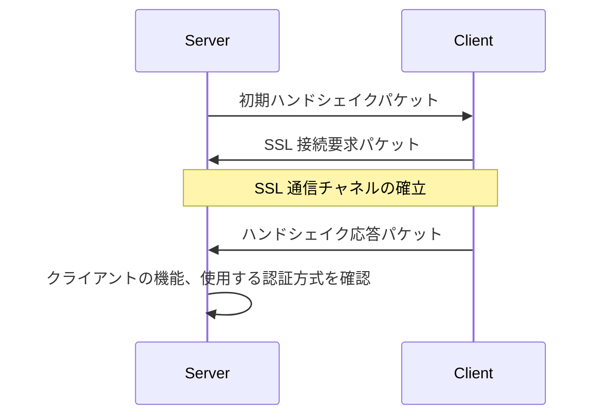

# コネクションのライフサイクル

## 参考文献

- [MySQL Source Code Documentation - Client/Server Protocol](https://dev.mysql.com/doc/dev/mysql-server/latest/PAGE_PROTOCOL.html#protocol_overview)

## 概要

- MySQL プロトコルはステートフルなプロトコルである
- 接続が確立されると、サーバーはまず「接続フェーズ (Connection Phase)」を開始する
- 接続フェーズが完了すると、接続は「コマンドフェーズ (Command Phase)」に移行する
  - コマンドフェーズは、接続が終了するまで継続する
- MineSQL にはレプリケーションはないので、Replication Protocol は存在しない

## 接続フェーズ (Connection Phase)

- 参考: https://dev.mysql.com/doc/dev/mysql-server/latest/page_protocol_connection_phase.html
- 接続フェーズは以下のタスクを実行する
  - クライアントとサーバー間での機能情報の交換
  - 要求に応じた SSL 通信チャネルのセットアップ
  - サーバーによるクライアントの認証
- 接続フェーズは、クライアントがサーバーに対して `connect()` を呼び出すことで始まる
- これに対してサーバーは [ERR パケット](./packet.md#err_packet)を返してハンドシェイクを終了するか、もしくは「初期ハンドシェイクパケット」を送信する
- クライアントが初期ハンドシェイクパケットを受け取ると「ハンドシェイク応答パケット」を返す
  - この段階で、クライアントは SSL 接続を要求することができる
  - その場合は、クライアントが認証応答を送信する前に、SSL 通信チャネルが確立される
- サーバーは初期ハンドシェイクパケットの中に認証方式の名前と初期認証データを含めてクライアントに送信する
- その後、サーバーが [OK パケット](./packet.md#ok_packet)を送信して接続を承認するか、ERR パケットを送信して拒否するまで、認証情報のやり取りが継続される

### 初期ハンドシェイクの流れ

- 最初のハンドシェイクは、サーバーが「初期ハンドシェイクパケット」を送信することから始まる
- その後、必要に応じてクライアントが「SSL 接続要求パケット」で SSL の接続を要求する
- 続いて「ハンドシェイク応答パケット」を送信する

#### ハンドシェイク のみ

#### SSL ハンドシェイク

### 機能情報の交換

- クライアントとサーバーは、接続フェーズの最初の段階で、互いの機能 (capabilities) を交換する
- サーバーが初期ハンドシェイクパケットを送信する際に、サーバーの機能をクライアントに通知する
- クライアントが、ハンドシェイク応答パケットを送信する際に、自身とサーバーの両方が共通して持っている機能のみを通知する
- クライアントの機能が不足している場合、サーバーは ERR パケットを返して接続を終了する

### 認証方式の決定

- 認証方式はユーザーアカウントに関連づけられている
  - 詳細は[認証プラグイン](../../account/authentication-plugin.md)を参照
  - 認証の詳細なフローは[アカウント](../../account/acount.md)を参照
- 通信の往復回数を減らすために、サーバーとクライアントは初期ハンドシェイクの段階で、使用される認証方式を予測し、認証情報のやり取りを開始する
  - サーバーは、デフォルトの認証方式 (MineSQL では caching_sha2_password) を使用して初期認証データを作成し、方式名とともに初期ハンドシェイクパケットに含めてクライアントに送信する
  - クライアントは、サーバーから送られた認証データへの応答をハンドシェイク応答パケットに含めてサーバーに送信する
- MineSQL では caching_sha2_password のみサポートしているため、認証方式の切り替えは発生しない

## コマンドフェーズ (Command Phase)

- 参考: https://dev.mysql.com/doc/dev/mysql-server/latest/page_protocol_command_phase.html
- コマンドフェーズでは、クライアントはシーケンス ID を含むコマンドパケットを送信する
- ペイロードの先頭 1 バイトは、コマンドの種類を表す

- 各コマンドは、以下のいずれかのサブプロトコルに属している
  - Text Protocol
  - Utility Commands

※1. Prepared Statements はサポートしていない\
※2. Multi-Statement, Multi-Resultset をサポートしてないため、Stored Programs もサポートしていない

### Text Protocol

- クライアントが SQL ステートメント (SELECT, INSERT, UPDATE, DELETE など) を文字列としてサーバーに送信し、結果を文字列として受け取る
- クライアントは、クエリを送信するために [COM_QUERY](https://dev.mysql.com/doc/dev/mysql-server/latest/page_protocol_com_query.html) コマンドを使用する

### Utility Commands

- Utility Commands は、クエリの実行以外の目的で使用されるコマンド
- 以下の種類がある
  - [COM_QUIT](https://dev.mysql.com/doc/dev/mysql-server/latest/page_protocol_com_quit.html)
    - クライアントが接続の終了を求めていることを、サーバーに伝える
  - [COM_PING](https://dev.mysql.com/doc/dev/mysql-server/latest/page_protocol_com_ping.html)
    - サーバーが稼働しているかを確認する

- 以下のコマンドはサポートしていない
  - [COM_RESET_CONNECTION](https://dev.mysql.com/doc/dev/mysql-server/latest/page_protocol_com_reset_connection.html)
    - MineSQL ではセッション状態のリセットをサポートしていないため
  - [COM_SET_OPTION](https://dev.mysql.com/doc/dev/mysql-server/latest/page_protocol_com_set_option.html)
    - MineSQL ではオプション設定をサポートしていないため
  - [COM_INIT_DB](https://dev.mysql.com/doc/dev/mysql-server/latest/page_protocol_com_init_db.html)
    - MineSQL では複数スキーマ (データベース) をサポートしていないため
  - [COM_FIELD_LIST](https://dev.mysql.com/doc/dev/mysql-server/latest/page_protocol_com_field_list.html)
    - MySQL 5.7.11 以降では非推奨となっているため
  - [COM_STATISTICS](https://dev.mysql.com/doc/dev/mysql-server/latest/page_protocol_com_statistics.html)
    - MineSQL では統計情報の参照をサポートしていないため
  - [COM_DEBUG](https://dev.mysql.com/doc/dev/mysql-server/latest/page_protocol_com_debug.html)
    - MineSQL ではデバッグ情報の取得をサポートしていないため
  - [COM_CHANGE_USER](https://dev.mysql.com/doc/dev/mysql-server/latest/page_protocol_com_change_user.html)
    - MineSQL では、接続後のユーザーの切り替えをサポートしていないため
