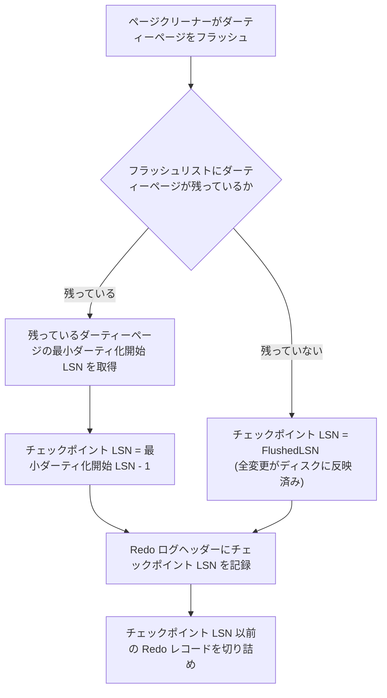

# チェックポイント

## 概要

- チェックポイントは「この LSN 以前の前変更がディスクに反映済みである」ことを示す仕組み
- チェックポイントにより、リカバリ時に Redo ログの先頭からではなくチェックポイント以降から走査すれば済むようになる
- チェックポイント以前の Redo ログレコードは不要になるため切り詰めることができる

## チェックポイント LSN

チェックポイント LSN は「この LSN 以前の変更は全てディスクに反映済み」であることを意味する

### 決定方法

チェックポイント LSN は以下の方針で決定する

- バッファプール内のダーティーページの内、最初にダーティ化した時の LSN の最小を取得する
- チェックポイント LSN = (最小の最初ダーティ化 LSN) -1
- ダーティーページが存在しない場合 `チェックポイント LSN = Flushed LSN` になる (全変更がディスクに反映済み)

「最初にダーティ化した時の LSN」とは、そのページが直近のクリーン状態から再びダーティになった瞬間に対応する [mini-transaction](../log/redo.md#mini-transaction-の区切り) の開始マーカー LSN を指す。同じページが同じダーティ期間中に複数の mini-transaction で繰り返し変更されても、最初の mini-transaction の開始マーカー LSN を保持する

- [Page LSN](../log/redo.md#page-lsn) (ページに最後に適用された LSN) を使わない理由は、リカバリが「対応する開始マーカーが揃った mini-transaction だけを適用する」という原則に基づくため
- Page LSN は同じページが繰り返し変更されると最終変更の LSN に上書きされ、それ以前の mini-transaction 境界を超えてチェックポイント LSN を前進させてしまう
- 結果として、その mini-transaction の開始マーカーや一部の変更レコードが切り詰められ、リカバリで適用できなくなる

## Fuzzy Checkpoint

トランザクションを停止させずに、一部のダーティーページだけをフラッシュしてチェックポイントを進める方式

### Fuzzy Checkpoint の流れ

1. [ページクリーナー](./page-cleaner.md)がバッファプール内のダーティーページの一部をディスクにフラッシュする
2. フラッシュ後、残っているダーティーページの最小ダーティ化開始 LSN から、チェックポイント LSN を算出する
3. Redo ログファイルのヘッダーに、チェックポイント LSN を記録する
4. チェックポイント LSN 以前の Redo ログレコードを切り詰める

### 例: チェックポイント LSN の進行

以下の例では、3 つのページ (A, B, C) がダーティーになり、ページクリーナーが順にフラッシュすることで チェックポイント LSN が進む様子を示す

#### 初期状態

3 つのページがダーティーで、それぞれ以下のダーティ化開始 LSN を持つ

| ページ | ダーティ化開始 LSN | 状態 |
| --- | --- | --- |
| A | 3 | ダーティー |
| B | 5 | ダーティー |
| C | 8 | ダーティー |

- フラッシュリスト: A → B → C (ダーティーになった順)
- チェックポイント LSN = min(3, 5, 8) - 1 = 2
- Redo ログ: LSN 3 以降のレコードが必要 (LSN 1, 2 のレコードは切り詰め可能)

#### ページクリーナー 1 回目: ページ A をフラッシュ

| ページ | ダーティ化開始 LSN | 状態 |
| --- | --- | --- |
| A | - | クリーン (フラッシュ済み) |
| B | 5 | ダーティー |
| C | 8 | ダーティー |

- フラッシュリスト: B → C
- チェックポイント LSN = min(5, 8) - 1 = 4
- Redo ログ: LSN 5 以降のレコードが必要 (LSN 3, 4 のレコードも切り詰め可能に)

#### ページクリーナー 2 回目: ページ B をフラッシュ

| ページ | ダーティ化開始 LSN | 状態 |
| --- | --- | --- |
| A | - | クリーン |
| B | - | クリーン (フラッシュ済み) |
| C | 8 | ダーティー |

- フラッシュリスト: C
- チェックポイント LSN = min(8) - 1 = 7
- Redo ログ: LSN 8 以降のレコードが必要

## チェックポイントの実行タイミング

- サーバー正常終了時
  - 全ページのフラッシュ + Redo ログのクリアを行う
- 通常運用中
  - ページクリーナーがダーティーページをフラッシュする度に、チェックポイント LSN を更新する
  - ページクリーナーは以下の契機でフラッシュを実行する
    - Redo ログのサイズが閾値を超えた場合
    - バッファプールのダーティーページ率が閾値を超えた場合

## チェックポイントがある場合のリカバリの流れ

1. Redo ログヘッダーから、チェックポイント LSN を読み取る
2. チェックポイント LSN 以降の Redo ログレコードのみ適用する (それ以前の変更はディスクに反映済み)
3. Redo ログ適用後、Undo ページを操作して未完了のトランザクションをロールバックする
