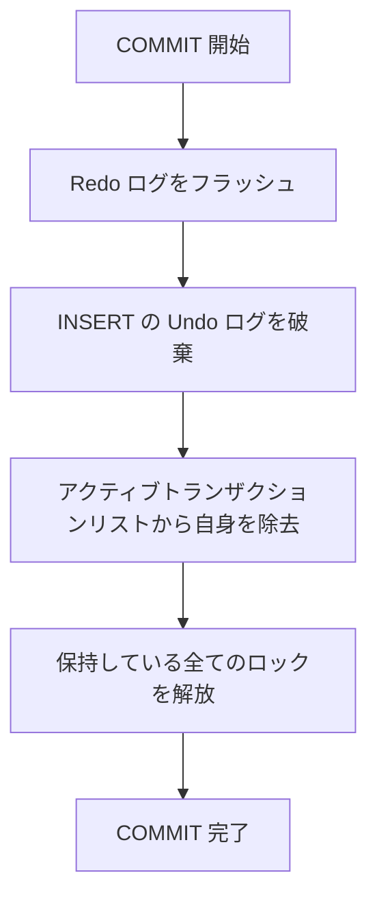
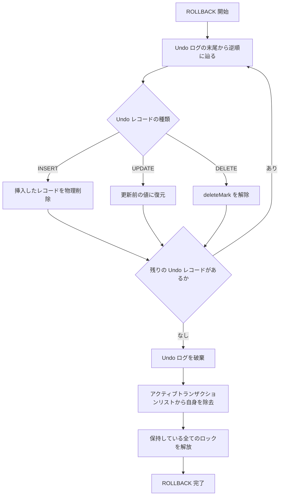

# MVCC

## 参考文献

- [InnoDB Multi-Versioning - MySQL 8.0 Reference Manual](https://dev.mysql.com/doc/refman/8.0/en/innodb-multi-versioning.html)
- [Consistent Nonlocking Reads - MySQL 8.0 Reference Manual](https://dev.mysql.com/doc/refman/8.0/en/innodb-consistent-read.html)
- [Locking Reads - MySQL 8.0 Reference Manual](https://dev.mysql.com/doc/refman/8.0/en/innodb-locking-reads.html)

## 概要

- MVCC によってトランザクション管理を実装する
- MVCC はデータの複数バージョンを保持することで読み取りと書き込みの競合を回避する同時実行制御方式
  - Strict 2 Phase Lock (Strict 2PL) はデータの一貫性を保証するが、読み取りと書き込みが互いにブロックし合うので、並行性が制限される (読み取り同士はブロックしないが、読み取りと書き込みはブロックする)
  - MVCC は読み取りと書き込みが同時に行えるようにすることで、並行性を向上させる
    - 書き込み同士はブロックするが、読み取りと書き込みはブロックしない
- 大半の仕組みを MySQL InnoDB を参考にしている

### レコードの構造

[プライマリインデックスのレコード構造](../access/access-method.md#プライマリインデックス) に記載のとおり、データベース内に格納された各レコードに対して以下のフィールドが含まれる

| フィールド | 内容 |
| --- | --- |
| `lastTrxId` | このレコードを最後に INSERT/UPDATE したトランザクションの ID <br/> INSERT/UPDATE の実行時に即座に設定される (コミット時ではない) |
| `rollPtr` | undo ログレコードへのポインタ (ロールバックポインタ) <br/> レコードが更新されるたびに、更新前の内容を復元するための undo ログレコードを指す |
| `deleteMark` | 削除済みかどうかを示すフラグ <br/> DELETE 時に設定され、後で Purge によって物理削除される |

またレコードの旧バージョンは undo ログに格納されるため、`rollPtr` がチェーンを形成し、更新履歴を遡ることができる:

```text
現在のレコード (lastTrxId=103, rollPtr→)
  → undo ログレコード (lastTrxId=101, rollPtr→)
    → undo ログレコード (lastTrxId=99, rollPtr=NULL)
```

### スナップショット (Read View)

- MVCC では、トランザクションが「どのデータが見えるか」を決定するためにスナップショット (Read View) を使用する
- Read View はトランザクションごとに作られる
- 現状は REPEATABLE READ のトランザクション分離レベルのみサポートしているため、Read View はトランザクションの最初の読み取り時に作成され、以降のステートメント (DML) で使い回す
  - 補足: READ COMMITTED をサポートする場合は、ステートメントごとに Read View が作る必要がある (トランザクション分離レベルによって Read View の作成タイミングが違う)

| 項目 | 説明 |
| --- | --- |
| `trxId` | 自分のトランザクション ID <br/> 単調増加する |
| `mUpLimitId` | Read View の作成時点でアクティブなトランザクションの最小 trxId <br/> これ未満の trxId は確実にコミット済みで可視 |
| `mLowLimitId` | Read View 作成時点で次に払い出される trxId <br/> これ以上の trxId は ReadView 作成後に開始されたため不可視 |
| `mIds` | Read View 作成時点でアクティブ (未コミット) なトランザクション ID 一覧 |

※ それぞれの変数名や意味などは InnoDB を参考\
やや直感に反するが、`m_up_limit_id` が「可視範囲の上限」(= 最小のアクティブ trxId)、`m_low_limit_id` が「不可視範囲の下限」(= 次に払い出される trxId) を意味する\
参考: [InnoDB ソースコード: ReadView (read0types.h L282-L289)](https://github.com/mysql/mysql-server/blob/89e1c722476deebc3ddc8675e779869f6da654c0/storage/innobase/include/read0types.h#L282-L289) - `m_low_limit_id` / `m_up_limit_id` の定義

## レコードの読み取り

### 読み取りの種類

- SELECT と UPDATE/DELETE で異なる読み取り方式を使用する

- Consistent Read (一貫性読み取り)
  - Read View によるスナップショット読み取り
  - ロックを取得しない
  - SELECT で使用
- Current Read (現在読み取り)
  - プライマリインデックス上の最新バージョンを読み取り、排他ロックを取得する
  - UPDATE/DELETE で使用

### 可視性の判定

レコードの `lastTrxId` に記録された trxId に対して、以下のように可視性を判定する

1. レコードの可視性を判定する
    - `trxId < mUpLimitId` -> 可視
    - `trxId >= mLowLimitId` -> 不可視
      - `mUpLimitId <= trxId < mLowLimitId` -> `mIds` を確認
      - `mIds` に含まれている -> 不可視 (Read View 作成時点で実行中だったため)
    - `mIds` に含まれていない -> 可視 (Read View 作成時点でコミット済みだったため)

2. `rollPtr` を用いて Undo ログを辿る
    - 不可視と判定された場合
      - Consistent Read の場合
        - `rollPtr` を用いて Undo ログを辿り、可視なバージョンが見つかるまで `1` の手順で辿る
        - 最後まで見つからなければ、そのレコードは存在しないものとして扱う
      - Current Read の場合
        - その行は読めない

#### 例

- Trx1 がレコードを INSERT -> Trx2 が UPDATE -> Trx3 が UPDATE した状態のレコードがあると仮定
- Trx3 は未コミット、Trx2, Trx1 はコミット済み
- レコードの状態
  - 現在のレコード
    - columns: Trx3 が書いた値
    - lastTrxId: 3
    - rollPtr: Trx3 の undo ログレコード
  - Trx3 の undo ログレコード
    - columns: Trx2 が書いた値 (Trx3 が上書きする前の値)
    - prevLastTrx: 2
    - rollPtr: Trx2 の undo ログレコード
  - Trx2 の undo ログレコード
    - columns: Trx1 が書いた値 (Trx2 が上書きする前の値)
    - prevLastTrx: 1
    - rollPtr: null (Trx1 は INSERT なのでそれ以前のバージョンは存在しない)

この状態で、Trx4 が Consistent Read でこの行を読む場合の流れは以下となる

1. B+Tree から行を読む
    - lastTrxId = 3 であるが、未コミットのため不可視と判定される
2. rollPtr から Trx3 の undo ログレコードを読む
    - lastTrxId = 2 であり、コミット済みのため可視と判定される
    - Trx2 が書いた値を読み取り結果とする

## 処理の流れ

### INSERT

1. Undo ログレコードに、レコードの挿入内容を記録する
2. 書き込み対象のページをバッファプールから取得し (なければディスクから読み込み)、レコードを書き込む
    - `lastTrxId` には自分の trxId を設定
    - `rollPtr` に Undo ログレコードへのポインタを設定する

※ Undo ログを先に書く必要がある\
仮に後で書く方針を採用した場合、レコード挿入後に (Undo ログが未記入で) クラッシュした場合はクラッシュリカバリによるロールバックができなくなってしまう

### SELECT (Consistent Read)

※単純化するために、プライマリキーのイコール検索を例とする

1. プライマリインデックス B+Tree を辿って対象のレコードを見つける
2. レコードの `deleteMark` を確認する
3. レコードの `lastTrxId` を Read View と照合し、可視性を判定する (上述の[可視性の判定](#可視性の判定)を参照)
    - 可視かつ `deleteMark=0` -> そのレコードを返す
    - 可視かつ `deleteMark=1` -> 空の結果を返す
    - 不可視 -> `rollPtr` を辿って Undo ログから旧バージョンを参照し、再度可視性を判定する (可視なバージョンが見つかるか、すべて不可視と判定できるまで繰り返す)

### UPDATE (Current Read)

1. プライマリインデックスの B+Tree を辿って対象のレコードの最新バージョンを見つける
2. 対象のレコードに排他ロックを取得する (他のトランザクションが排他ロックを保持していればロック待ち)
3. Undo ログに、更新前後のレコード内容を記録する
4. 書き込み対象のページをバッファプールから取得し (なければディスクから読み込み) レコードを更新する
    - `lastTrxId` には自分の trxId を設定
    - `rollPTr` に Undo ログレコードへのポインタを設定

### DELETE (Current Read)

1. プライマリインデックスの B+Tree を辿って対象のレコードの最新バージョンを見つける
2. 対象のレコードに排他ロックを取得する (他のトランザクションが排他ロックを保持していればロック待ち)
3. Undo ログに、削除前のレコード内容を記録する
4. 書き込み対象のページをバッファプールから取得し (なければディスクから読み込み) レコードの `deleteMark` を設定する
    - `lastTrxId` には自分の trxId を設定
    - `rollPTr` に Undo ログレコードへのポインタを設定

### COMMIT



- INSERT の Undo ログは他のトランザクションが参照する必要がないため、コミット時に即座に破棄する
- それ以外の DML によって生まれた Undo ログは、他のトランザクションから参照される可能性があるため、破棄しない
  - 参照されなくなったと判定されたら、Undo ログは、特定のタイミングで Purge によって破棄される

### ROLLBACK


