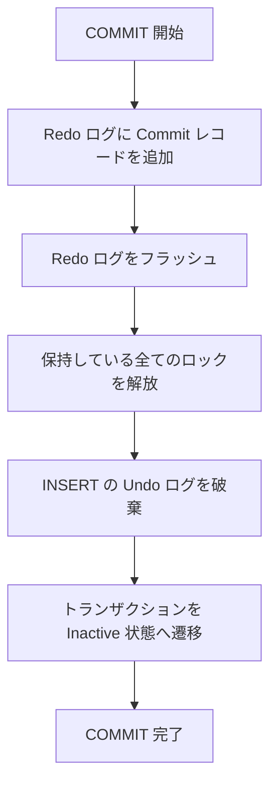
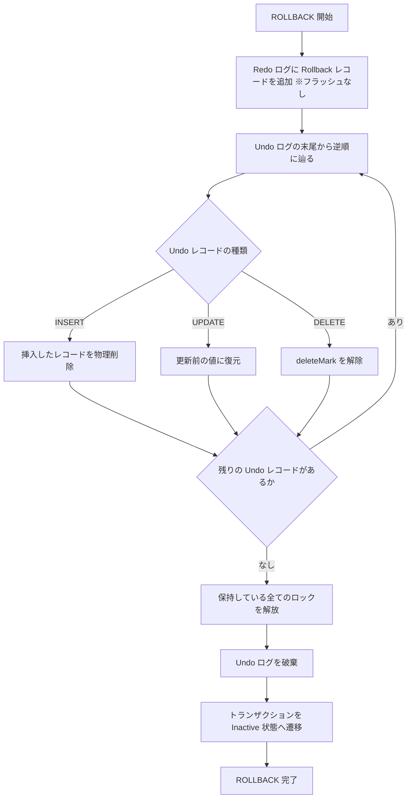

# MVCC

## 参考文献

- [InnoDB Multi-Versioning - MySQL 8.0 Reference Manual](https://dev.mysql.com/doc/refman/8.0/en/innodb-multi-versioning.html)
- [Consistent Nonlocking Reads - MySQL 8.0 Reference Manual](https://dev.mysql.com/doc/refman/8.0/en/innodb-consistent-read.html)
- [Locking Reads - MySQL 8.0 Reference Manual](https://dev.mysql.com/doc/refman/8.0/en/innodb-locking-reads.html)

## 概要

- MVCC によってトランザクション管理を実装する
- MVCC はデータの複数バージョンを保持することで読み取りと書き込みの競合を回避する同時実行制御方式
  - Strict 2 Phase Lock (Strict 2PL) はデータの一貫性を保証するが、読み取りと書き込みが互いにブロックし合うので、並行性が制限される (読み取り同士はブロックしないが、読み取りと書き込みはブロックする)
  - MVCC は読み取りと書き込みが同時に行えるようにすることで、並行性を向上させる
    - 書き込み同士はブロックするが、読み取りと書き込みはブロックしない
- 大半の仕組みを MySQL InnoDB を参考にしている

### レコードの構造

[プライマリインデックスのレコード構造](../access/access-method.md#プライマリインデックス) に記載のとおり、データベース内に格納された各レコードに対して以下のフィールドが含まれる

| フィールド | 内容 |
| --- | --- |
| `lastTrxId` | このレコードを最後に INSERT/UPDATE したトランザクションの ID <br/> INSERT/UPDATE の実行時に即座に設定される (コミット時ではない) |
| `rollPtr` | undo ログレコードへのポインタ (ロールバックポインタ) <br/> レコードが更新されるたびに、更新前の内容を復元するための undo ログレコードを指す |
| `deleteMark` | 削除済みかどうかを示すフラグ <br/> DELETE 時に設定され、後で Purge によって物理削除される |

またレコードの旧バージョンは undo ログに格納されるため、`rollPtr` がチェーンを形成し、更新履歴を遡ることができる:

```text
現在のレコード (lastTrxId=103, rollPtr→)
  → undo ログレコード (lastTrxId=101, rollPtr→)
    → undo ログレコード (lastTrxId=99, rollPtr=NULL)
```

### スナップショット (Read View)

- MVCC では、トランザクションが「どのデータが見えるか」を決定するためにスナップショット (Read View) を使用する
- Read View が持つ情報は以下のとおり

| 項目 | 説明 |
| --- | --- |
| `trxId` | 自分のトランザクション ID <br/> 単調増加する |
| `mUpLimitId` | Read View の作成時点で、自分以外のアクティブなトランザクションの最小 trxId <br/> これ未満の trxId は確実にコミット済みで可視 |
| `mLowLimitId` | Read View 作成時点で次に払い出される trxId <br/> これ以上の trxId は ReadView 作成後に開始されたため不可視 |
| `mIds` | Read View 作成時点で、自分以外のアクティブ (未コミット) なトランザクション ID 一覧 |

Read View の作成タイミング・保持責務・ライフサイクルは[トランザクション](./transaction.md#readview-の保持と作成)を参照

※ それぞれの変数名や意味などは InnoDB を参考\
やや直感に反するが、`m_up_limit_id` が「可視範囲の上限」(= 最小のアクティブ trxId)、`m_low_limit_id` が「不可視範囲の下限」(= 次に払い出される trxId) を意味する\
参考: [InnoDB ソースコード: ReadView (read0types.h L282-L289)](https://github.com/mysql/mysql-server/blob/89e1c722476deebc3ddc8675e779869f6da654c0/storage/innobase/include/read0types.h#L282-L289) - `m_low_limit_id` / `m_up_limit_id` の定義

## レコードの読み取り

### 読み取りの種類

- SELECT と UPDATE/DELETE で異なる読み取り方式を使用する

- Consistent Read (一貫性読み取り)
  - Read View によるスナップショット読み取り
  - ロックを取得しない
  - SELECT で使用
- Current Read (現在読み取り)
  - プライマリインデックス上の最新バージョンを排他ロック付きで読み取る
  - ロック取得前に他のトランザクションが未コミットの変更を持つ場合はロック待ちになり、ロック獲得時点では確定した最新状態が読める
  - Read View は参照しない (可視性判定・Undo チェーン遡及を行わない。正しさは排他ロックが保証する)
  - UPDATE/DELETE で使用

### 可視性の判定

レコードの `lastTrxId` に記録された trxId に対して、以下のように可視性を判定する

1. レコードの可視性を判定する
    - `lastTrxId == 自分の trxId` -> 可視 (自分自身が書いた変更は常に見える)
    - `lastTrxId < mUpLimitId` -> 可視 (Read View 作成時点で確実にコミット済み)
    - `lastTrxId >= mLowLimitId` -> 不可視 (Read View 作成後に開始されたトランザクションの変更)
    - `mUpLimitId <= lastTrxId < mLowLimitId` の場合
      - `mIds` に含まれている -> 不可視 (Read View 作成時点で実行中だったため)
      - `mIds` に含まれていない -> 可視 (Read View 作成時点でコミット済みだったため)

2. `rollPtr` を用いて Undo ログを辿る
    - 不可視と判定された場合
      - `rollPtr` を用いて Undo ログを辿り、可視なバージョンが見つかるまで `1` の手順で辿る (詳細は [Undo チェーン遡及](#undo-チェーン遡及)を参照)
      - 最後まで見つからなければ、そのレコードは存在しないものとして扱う

この可視性の判定と Undo チェーン遡及は Consistent Read のための手順である。Current Read は Read View を参照せず、可視性判定も Undo チェーン遡及も行わず、最新バージョンをそのまま読む

### Undo チェーン遡及

- 不可視と判定された場合、`rollPtr` を辿って旧バージョンを取得し、可視性を再判定する

#### Undo ポインタからレコードを取得する仕組み

- レコードの `rollPtr` は Undo ポインタ (「Undo ページのページ番号」と「ページ内オフセット」の組) を保持する
  - 詳細: [Undo ログ - Undo ポインタ](../log/undo.md#undo-ポインタ)
- Undo ポインタが指す Undo ページ内の位置を直接参照することで、Undo ログレコードを取得する
  - Undo ページはバッファプール経由でアクセスする (データページと同じ管理)
  - ページ内オフセットがレコードの先頭を指すため、そこからバイト列を直接デコードする

#### Undo レコードから旧バージョンを再構築する論理

- Undo レコードから、可視性判定に必要な以下の情報を取り出す
  - 旧バージョンの `lastTrxId` (Undo レコードに記録された `prevLastTrxId`)
  - 旧バージョンの `rollPtr` (Undo レコードに記録された `prevRollPtr`)
  - 旧バージョンの行データ
  - 旧バージョンの `deleteMark`
- レコード種別ごとに「旧バージョンとして使う行データ」と「旧バージョンの `deleteMark`」が異なる

| Undo レコード種別 | 旧バージョンとして使う行データ | 旧バージョンの `deleteMark` |
| --- | --- | --- |
| Insert | (旧バージョンは存在しない。下記「INSERT による Undo チェーン終端」を参照) | - |
| Update | 「更新前の行」(Undo レコードに記録された 1 セット目のカラムセット) | `0` (更新前は active なレコード) |
| Delete | 「削除前の行」(Undo レコードに記録された 1 セット目のカラムセット) | `0` (削除前は active なレコード) |

- Undo レコード経由で再構築された旧バージョンの `deleteMark` は常に `0` となる
  - Undo レコードに記録される行が常に「操作前の active 状態」を表現するため
  - 詳細: [Undo ログ - Delete Undo の DeleteMark=0 が意味するもの](../log/undo.md#delete-undo-の-deletemark0-が意味するもの)

#### INSERT による Undo チェーン終端

- Insert は「行が存在しない状態」から「行が存在する状態」への遷移であるため、それより前のバージョンは論理的に存在しない
- Insert の Undo レコードの `prevRollPtr` には、チェーン終端を示す無効値が格納される
- Undo チェーン遡及中に終端 (`prevRollPtr` が無効値) に到達した場合、「この Read View からはその行は存在しなかった」と判定し、空の結果を返す

#### セカンダリインデックス経由の可視性判定

- セカンダリインデックスのレコードは MVCC 情報として `lastTrxId` のみを保持し、`rollPtr` は持たない (理由は後述)
- セカンダリインデックスを用いた読み取りには 2 種類あり、それぞれ可視性判定の流れが異なる

##### プライマリインデックスに展開する読み取り

セカンダリインデックスに含まれないカラムを取得する場合に使用する。流れは以下

1. セカンダリインデックスの B+Tree から `(セカンダリキー, プライマリキー)` を含むレコードを取得する。この時点では `lastTrxId` や `deleteMark` による判定は行わない
2. プライマリキーを用いてプライマリインデックスを引き、本体レコードを取得する。対応する本体レコードが存在しなければ次のセカンダリレコードに進む
3. 本体レコードに対して、上述の [可視性の判定](#可視性の判定) と [Undo チェーン遡及](#undo-チェーン遡及) を行い、Read View から見えるバージョンを得る。可視なバージョンがない、または可視なバージョンが削除済みなら次のセカンダリレコードに進む
4. 可視バージョンが Undo チェーン遡及によって得られた場合、またはセカンダリレコードが削除マーク付きの場合は、可視バージョンが持つセカンダリキー構成カラムの値とセカンダリレコードのセカンダリキーが一致するかを確認する。一致しなければ結果から除外し、次のセカンダリレコードに進む
5. 一致する (または確認が不要な) 場合、その行データを結果として返す

セカンダリキーの一致確認が必要なのは、セカンダリキーが変更される UPDATE では旧キー (削除マーク付き) と新キーの 2 つのセカンダリレコードが同じプライマリキーを指すため。一致確認を行わないと、両方のセカンダリレコードが同じ可視バージョンへ解決され、どの Read View から見ても同一行が重複して返ってしまう。可視バージョンのセカンダリキー構成カラムの値と一致するのは 2 つのうち一方だけであるため、一致確認によって重複が排除される

現在のバージョンがそのまま可視で、かつセカンダリレコードが削除マークなしの場合は、一致確認を省略できる。セカンダリインデックスは同一トランザクション内で本体レコードと同期して維持されるため、最新状態どうしでキーが一致しないことはあり得ない

この読み取りではセカンダリレコードの `lastTrxId` は可視性判定に使わず、`deleteMark` は一致確認の要否判定にのみ使う。後述のセカンダリインデックスのみで完結する読み取りは、従来どおりセカンダリレコードの `lastTrxId` を可視性判定に使う

##### セカンダリインデックスのみで完結する読み取り (Covering Index)

セカンダリインデックスに含まれるカラムのみで結果を返せる場合に使用する。プライマリインデックスを引かないため、セカンダリレコード単体で可視性判定を行う

1. セカンダリインデックスの B+Tree から `(セカンダリキー, プライマリキー, lastTrxId, deleteMark)` を含むレコードを取得する
2. セカンダリレコードの `lastTrxId` に対して [可視性の判定](#可視性の判定) を行う
3. 可視と判定された場合は `deleteMark` の値で削除済みかどうかを判定する (削除済みなら結果から除外、未削除なら結果に含める)
4. 不可視と判定された場合は後述の [PK 経路フォールバック](#pk-経路フォールバック) を実施する

##### PK 経路フォールバック

プライマリキーが不変かつセカンダリキーが変更される UPDATE では、古いセカンダリレコードは削除マークが付き `lastTrxId` がその UPDATE を行ったトランザクションの ID に更新される。同 UPDATE を行ったトランザクションが不可視のトランザクションから見ると、古いセカンダリキーは依然として可視であるべきだが、セカンダリレコード単体の可視性判定では `lastTrxId` 不可視となり「古いセカンダリキーが見えない」誤判定になる\
(補足: セカンダリインデックスには rollPtr がないので Redo ログを辿れない)

これを避けるため、不可視と判定された場合は以下を実施する

1. セカンダリレコードに含まれるプライマリキーを用いてプライマリインデックスを引き、本体レコードを取得する
2. 本体レコードに対して [Undo チェーン遡及](#undo-チェーン遡及) を行い、Read View から可視な旧バージョンを再構築する
3. 旧バージョンの行データから、セカンダリインデックスを構成するカラムの値を取り出す
4. 取り出した値がセカンダリレコードのセカンダリキーと一致するなら、そのトランザクションから見てセカンダリキーが一致する行が存在すると判定し、結果に含める
5. 一致しないなら、その時点ではセカンダリキーが異なっていたものとして結果から除外する

##### セカンダリレコードに `rollPtr` を持たない理由

- 行の更新履歴 (Undo チェーン) はプライマリインデックスに集約されているため、過去のバージョン再構築はプライマリ側で行えば十分
- セカンダリ側に Undo チェーンを持つと、複数のセカンダリインデックスごとに更新履歴を管理することになり、ストレージ効率と書き込みコストの両面で重い
- セカンダリレコード単体での可視性判定が確定しない場合は、上述の PK 経路フォールバックでプライマリ側の Undo チェーンを参照することで対応する

#### 例

- Trx1 がレコードを INSERT -> Trx2 が UPDATE -> Trx3 が UPDATE した状態のレコードがあると仮定
- Trx3 は未コミット、Trx2, Trx1 はコミット済み
- レコードの状態
  - 現在のレコード
    - columns: Trx3 が書いた値
    - lastTrxId: 3
    - rollPtr: Trx3 の undo ログレコード
  - Trx3 の undo ログレコード
    - columns: Trx2 が書いた値 (Trx3 が上書きする前の値)
    - prevLastTrx: 2
    - prevPollPtr: Trx2 の undo ログレコード
  - Trx2 の undo ログレコード
    - columns: Trx1 が書いた値 (Trx2 が上書きする前の値)
    - prevLastTrx: 1
    - prevPollPtr: null (Trx1 は INSERT なのでそれ以前のバージョンは存在しない)

この状態で、Trx4 が Consistent Read でこの行を読む場合の流れは以下となる

1. B+Tree から行を読む
    - lastTrxId = 3 であるが、未コミットのため不可視と判定される
2. rollPtr から Trx3 の undo ログレコードを読む
    - lastTrxId = 2 であり、コミット済みのため可視と判定される
    - Trx2 が書いた値を読み取り結果とする

## 処理の流れ

### INSERT

1. Undo ログレコードに、レコードの挿入内容を記録する
2. 書き込み対象のページをバッファプールから取得し (なければディスクから読み込み)、レコードを書き込む
    - `lastTrxId` には自分の trxId を設定
    - `rollPtr` に Undo ログレコードへのポインタを設定する

※ Undo ログを先に書く必要がある\
仮に後で書く方針を採用した場合、レコード挿入後に (Undo ログが未記入で) クラッシュした場合はクラッシュリカバリによるロールバックができなくなってしまう

### SELECT (Consistent Read)

※単純化するために、プライマリキーのイコール検索を例とする

1. Read View が未作成ならこの時点で作成する (最初の Consistent Read 時)
2. プライマリインデックス B+Tree を辿って対象のレコードを見つける
3. レコードの `deleteMark` を確認する
4. レコードの `lastTrxId` を Read View と照合し、可視性を判定する (上述の[可視性の判定](#可視性の判定)を参照)
    - 可視かつ `deleteMark=0` -> そのレコードを返す
    - 可視かつ `deleteMark=1` -> 空の結果を返す
    - 不可視 -> `rollPtr` を辿って Undo ログから旧バージョンを再構築し、再度可視性を判定する (詳細: [Undo チェーン遡及](#undo-チェーン遡及))

セカンダリインデックス経由で検索する場合は、セカンダリレコードからプライマリキーを取得して上記 2-3 を行う (詳細: [セカンダリインデックス経由の可視性判定](#セカンダリインデックス経由の可視性判定))

### UPDATE (Current Read)

1. プライマリインデックスの B+Tree を辿って対象のレコードの最新バージョンを Current Read で特定する
2. 対象のレコードに排他ロックを取得する (他のトランザクションが排他ロックを保持していればロック待ち)
    - ロックの取得は Undo ログの記録より前に行う
    - ロック獲得後に対象の最新バージョンが削除済み、または存在しない場合は、更新対象なしとして何も更新しない
3. Undo ログに、更新前後のレコード内容を記録する
4. 書き込み対象のページをバッファプールから取得し (なければディスクから読み込み) レコードを更新する
    - `lastTrxId` には自分の trxId を設定
    - `rollPtr` に Undo ログレコードへのポインタを設定

### DELETE (Current Read)

1. プライマリインデックスの B+Tree を辿って対象のレコードの最新バージョンを Current Read で特定する
2. 対象のレコードに排他ロックを取得する (他のトランザクションが排他ロックを保持していればロック待ち)
    - ロックの取得は Undo ログの記録より前に行う
    - ロック獲得後に対象の最新バージョンが削除済み、または存在しない場合は、削除対象なしとして何も削除しない
3. Undo ログに、削除前のレコード内容を記録する
4. 書き込み対象のページをバッファプールから取得し (なければディスクから読み込み) レコードの `deleteMark` を設定する
    - `lastTrxId` には自分の trxId を設定
    - `rollPtr` に Undo ログレコードへのポインタを設定

### COMMIT


```mermaid
flowchart TD
    A[COMMIT 開始] --> B[Redo ログに Commit レコードを追加]
    B --> C[Redo ログをフラッシュ]
    C --> D[保持している全てのロックを解放]
    D --> E[INSERT の Undo ログを破棄]
    E --> F[トランザクションを Inactive 状態へ遷移]
    F --> G[COMMIT 完了]
```

- INSERT の Undo ログは他のトランザクションが参照する必要がないため、コミット時に即座に破棄する
- それ以外の DML によって生まれた Undo ログは、他のトランザクションから参照される可能性があるため、破棄しない
  - 参照されなくなったと判定されたら、Undo ログは、特定のタイミングで Purge によって破棄される

### ROLLBACK


```mermaid
flowchart TD
    A[ROLLBACK 開始] --> B[Redo ログに Rollback レコードを追加 ※フラッシュなし]
    B --> C[Undo ログの末尾から逆順に辿る]
    C --> D{Undo レコードの種類}
    D -->|INSERT| E[挿入したレコードを物理削除]
    D -->|UPDATE| F[更新前の値に復元]
    D -->|DELETE| G[deleteMark を解除]
    E --> H{残りの Undo レコードがあるか}
    F --> H
    G --> H
    H -->|あり| C
    H -->|なし| I[保持している全てのロックを解放]
    I --> J[Undo ログを破棄]
    J --> K[トランザクションを Inactive 状態へ遷移]
    K --> L[ROLLBACK 完了]
```
