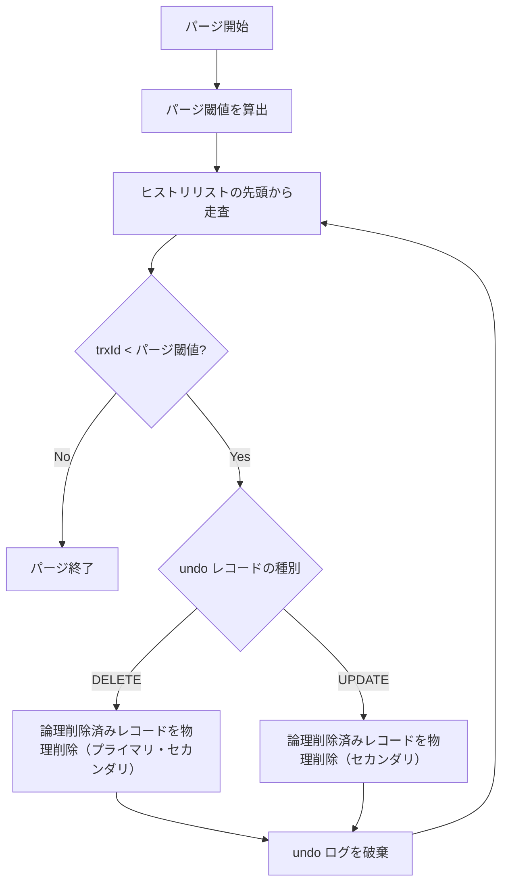

# パージ

## 参考文献

- [InnoDB Multi-Versioning - MySQL 8.0 Reference Manual](https://dev.mysql.com/doc/refman/8.0/en/innodb-multi-versioning.html)
- [Purge Configuration - MySQL 8.0 Reference Manual](https://dev.mysql.com/doc/refman/8.0/en/innodb-purge-configuration.html)
- [The basics of the InnoDB undo logging and history system](https://blog.jcole.us/2014/04/16/the-basics-of-the-innodb-undo-logging-and-history-system/)

## 概要

- パージは、MVCC で不要になったデータをバックグラウンドで回収する処理
- 以下の 2 つの責務を持つ

1. 論理削除済みレコードの物理削除 (プライマリインデックス + セカンダリインデックス)
2. 不要になった UPDATE/DELETE の Undo ログの破棄 (INSERT の Undo ログはコミット時に破棄されるので、パージでの破棄は不要)

### パージが必要な理由

- DELETE で行を削除しても、他のトランザクションの Consistent Read (詳細: [MVCC](./mvcc.md)) がまだその行を見ている可能性がある
- そのため即座に物理削除せず、deleteMark を設定するだけ (論理削除) に留めている
- UPDATE/DELETE の Undo ログも同様に、他のトランザクションが Undo チェーンを辿って旧バージョンを参照するのに必要なため、即座には破棄できない
- そのためバックグラウンドで定期的に破棄する仕組みをとっている

以下を参考

> Insert undo logs are needed only in transaction rollback and can be discarded as soon as the transaction commits. Update undo logs are used also in consistent reads, but they can be discarded only after there is no transaction present for which InnoDB has assigned a snapshot that in a consistent read could require the information in the update undo log to build an earlier version of a database row.\
> https://dev.mysql.com/doc/refman/8.0/en/innodb-multi-versioning.html

## パージ可否の判定

- パージ可否は「パージ閾値 (purge limit)」によって判定する
- パージ閾値は、全アクティブ ReadView の `mUpLimitId` の最小値
- パージ可否の判定は以下の通り
  - Undo レコードの TrxId がパージ閾値よりも小さい -> パージ可能 (どの ReadView からも参照されていない)
  - アクティブな ReadView がひとつも存在しない-> コミット済みの Undo レコードはすべてパージ可能

パージ可否判定 (閾値チェック) はバックグラウンド goroutine として動作し、1 秒間隔で行う

### 論理削除済みレコードを物理削除する条件

- 論理削除済みレコードの物理削除も、同じパージ閾値で判定する
- レコードの `lastTrxId` がパージ閾値より小さい -> 物理削除可能

## 処理フロー

1. パージ閾値を算出する (全アクティブ ReadView の `mUpLimitId` の最小値)
2. コミット済みトランザクションの Undo ログ (History List) を古い順に走査する
   - TrxId がパージ閾値以上であれば走査を終了 (これ以降はすべてパージ不可)
3. 論理削除済みレコードを物理削除する
4. 処理済みの undo ログを破棄する

※ UPDATE の場合、プライマリインデックスはインプレース更新されるが、セカンダリインデックスは「論理削除 + 作成」で処理されるため、セカンダリインデックスのみ削除する
