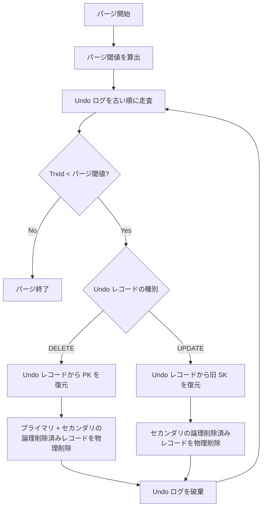

# パージ

## 参考文献

- [InnoDB Multi-Versioning - MySQL 8.0 Reference Manual](https://dev.mysql.com/doc/refman/8.0/en/innodb-multi-versioning.html)
- [Purge Configuration - MySQL 8.0 Reference Manual](https://dev.mysql.com/doc/refman/8.0/en/innodb-purge-configuration.html)
- [The basics of the InnoDB undo logging and history system](https://blog.jcole.us/2014/04/16/the-basics-of-the-innodb-undo-logging-and-history-system/)

## 概要

- パージは、MVCC で不要になったデータをバックグラウンドで回収する処理
- Undo ログ (History List) を駆動源として、以下の 2 つの責務を持つ

1. 論理削除済みレコードの物理削除 (プライマリインデックス + セカンダリインデックス)
2. 不要になった UPDATE/DELETE の Undo ログの破棄 (INSERT の Undo ログはコミット時に破棄されるので、パージでの破棄は不要)

### パージが必要な理由

- DELETE で行を削除しても、他のトランザクションの Consistent Read (詳細: [MVCC](./mvcc.md)) がまだその行を見ている可能性がある
- そのため即座に物理削除せず、deleteMark を設定するだけ (論理削除) に留めている
- UPDATE/DELETE の Undo ログも同様に、他のトランザクションが Undo チェーンを辿って旧バージョンを参照するのに必要なため、即座には破棄できない
- そのためバックグラウンドで定期的に破棄する仕組みをとっている

以下を参考

> Insert undo logs are needed only in transaction rollback and can be discarded as soon as the transaction commits. Update undo logs are used also in consistent reads, but they can be discarded only after there is no transaction present for which InnoDB has assigned a snapshot that in a consistent read could require the information in the update undo log to build an earlier version of a database row.\
> https://dev.mysql.com/doc/refman/8.0/en/innodb-multi-versioning.html

## Undo ログ駆動のパージ

- パージは Undo ログを起点として動作する
- レコード側 (プライマリ/セカンダリインデックス) から探索するのではなく、Undo ログを走査して削除対象のレコードを特定する
  - 理由
    - セカンダリインデックスのレコードヘッダーには LastTrxId が含まれるが、これは単体では「どの ReadView がその旧バージョンをまだ必要としているか」を確定できない
    - また、SK 変更 UPDATE では旧 SK と新 SK の 2 レコードがインデックスに残り、レコード側を見ただけでは「どちらを物理削除すべきか」を判定できない
    - Undo ログには TrxId と更新前後のカラム値が記録されているため、Undo ログの TrxId でパージ可否を判定し、Undo ログの内容から物理削除すべきプライマリ/セカンダリのレコードを特定する

## パージ可否の判定

- パージ可否は「パージ閾値 (purge limit)」によって判定する
- パージ閾値は、全アクティブ ReadView の `mUpLimitId` の最小値
- パージ可否の判定は以下の通り
  - Undo レコードの TrxId がパージ閾値よりも小さい -> パージ可能 (どの ReadView からも参照されていない)
  - アクティブな ReadView がひとつも存在しない -> コミット済みの Undo レコードはすべてパージ可能

パージ可否判定 (閾値チェック) はバックグラウンド goroutine として動作し、1 秒間隔で行う

## 処理フロー

1. パージ閾値を算出する (全アクティブ ReadView の `mUpLimitId` の最小値)
2. コミット済みトランザクションの Undo ログ (History List) を古い順に走査する
   - Undo レコードの TrxId がパージ閾値以上であれば走査を終了 (これ以降はすべてパージ不可)
3. Undo レコードの種別に応じてレコードを物理削除する
   - DELETE の Undo レコード: Undo レコードの内容からプライマリキーを復元し、プライマリインデックスとセカンダリインデックスの論理削除済みレコードを物理削除する
   - UPDATE の Undo レコード: Undo レコードの内容からセカンダリキーを復元し、セカンダリインデックスの論理削除済みレコードを物理削除する (プライマリはインプレース更新のため物理削除不要)
4. 処理済みの Undo ログを破棄する

### DELETE の Undo レコードからの物理削除

1. Undo レコードのカラムセットからプライマリキーを取得する
2. プライマリインデックスで該当レコードを検索し、deleteMark=1 であれば物理削除する
3. プライマリキーを元にセカンダリインデックスのキー (SK + PK) を構築し、deleteMark=1 であれば物理削除する

### UPDATE の Undo レコードからの物理削除

1. Undo レコードには更新前後のレコードが含まれる
2. 更新前のレコードからセカンダリキーを復元し、セカンダリインデックスで deleteMark=1 のレコードを物理削除する
3. プライマリインデックスはインプレース更新されるため、物理削除は不要

## クラッシュ耐性

- パージによる物理削除もページ変更を伴うため [Redo ログ](../log/redo.md#パージのバックグラウンド削除と-redo-記録) に記録する
- 記録がないと、クラッシュ後のリカバリで「物理削除されたはずの古バージョン」がディスクから復活し、その後の検索や挿入と矛盾する状態になりうる
- パージは内部的にユーザートランザクションを伴わないバックグラウンド処理のため、パージ専用に予約したトランザクション ID で mini-transaction を記録する
- パージ専用のトランザクション ID は、ユーザー採番および DDL / 起動時初期化用のシステム予約 ID のいずれとも衝突しない値を 1 つ確保する
- パージはリカバリ中には実行されない (リカバリ完了後にバックグラウンドゴルーチンを起動する) ため、リカバリの Undo 逆適用と二重実行になる心配はない
