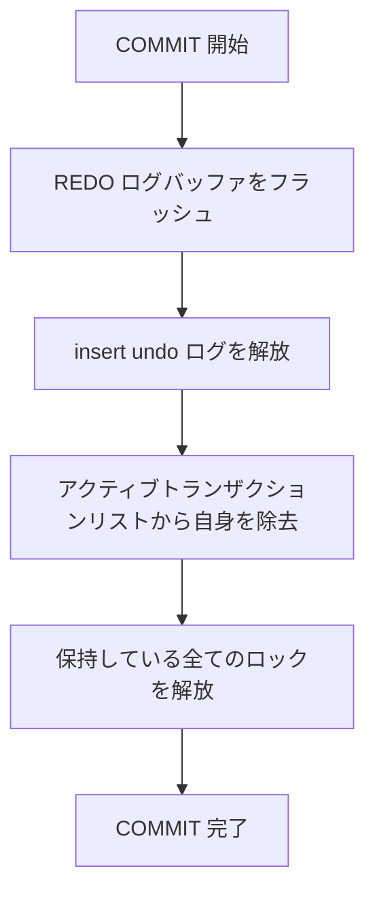
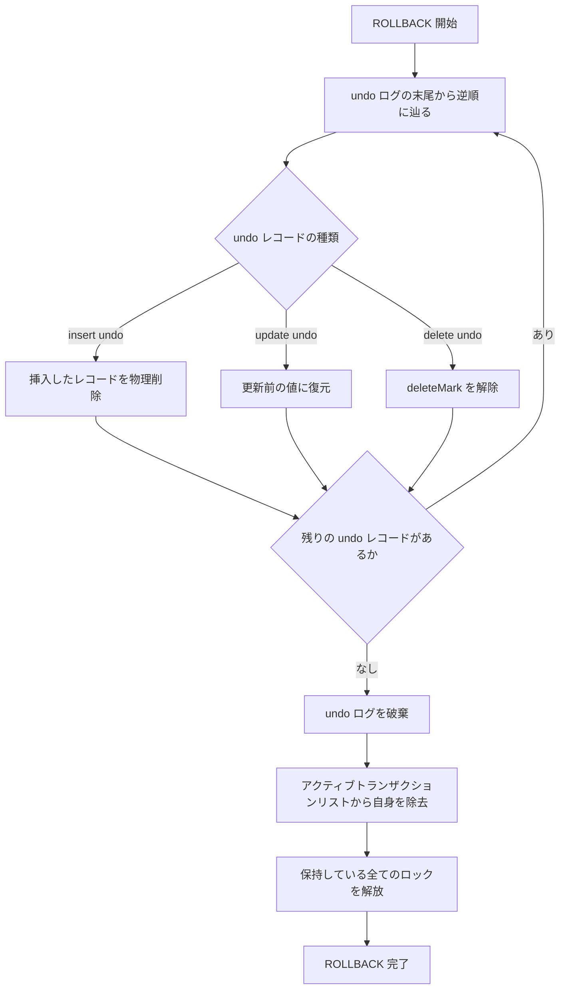

# トランザクション

## 参考文献

- [InnoDB Multi-Versioning - MySQL 8.0 Reference Manual](https://dev.mysql.com/doc/refman/8.0/en/innodb-multi-versioning.html)
- [Consistent Nonlocking Reads - MySQL 8.0 Reference Manual](https://dev.mysql.com/doc/refman/8.0/en/innodb-consistent-read.html)
- [Locking Reads - MySQL 8.0 Reference Manual](https://dev.mysql.com/doc/refman/8.0/en/innodb-locking-reads.html)

## 概要

- MineSQL では、MVCC によってトランザクション管理を実装する
- MVCC はデータの複数バージョンを保持することで読み取りと書き込みの競合を回避する同時実行制御方式
  - Strict 2PL はデータの一貫性を保証するが、読み取りと書き込みが互いにブロックし合うので、並行性が制限される (読み取り同士はブロックしないが、読み取りと書き込みはブロックする)
  - MVCC は読み取りと書き込みが同時に行えるようにすることで、並行性を向上させる
    - 書き込み同士はブロックするが、読み取りと書き込みはブロックしない
- 大半の仕組みを MySQL InnoDB を参考にしている

### 行の構造

MySQL 公式ドキュメントより:

> Internally, InnoDB adds three fields to each row stored in the database. A 6-byte DB_TRX_ID field indicates the transaction identifier for the last transaction that inserted or updated the row. Also, a deletion is treated internally as an update where a special bit in the row is set to mark it as deleted. Each row also contains a 7-byte DB_ROLL_PTR field called the roll pointer. The roll pointer points to an undo log record written to the rollback segment.

MineSQL では、データベース内に格納された各レコードに対して以下のフィールドを付与する

| フィールド | 内容 |
| --- | --- |
| `lastModified` | この行を最後に INSERT/UPDATE したトランザクションの ID。INSERT/UPDATE の実行時に即座に設定される (コミット時ではない) |
| `rollPtr` | undo ログレコードへのポインタ (ロールバックポインタ)。行が更新されるたびに、更新前の内容を復元するための undo ログレコードを指す |
| `deleteMark` | 削除済みかどうかを示すフラグ。DELETE 時に設定され、後で Purge によって物理削除される |

行の旧バージョンは undo ログに格納される。`rollPtr` がチェーンを形成し、更新履歴を遡ることができる:

```text
現在の行 (lastModified=103, rollPtr→)
  → undo ログレコード (lastModified=101, rollPtr→)
    → undo ログレコード (lastModified=99, rollPtr=NULL)
```

### スナップショット (Read View)

MySQL 公式ドキュメントより:

> A consistent read means that InnoDB uses multi-versioning to present to a query a snapshot of the database at a point in time. The query sees the changes made by transactions that committed before that point of time, and no changes made by later or uncommitted transactions.

MVCC では、トランザクションが「どのデータが見えるか」を決定するためにスナップショット (Read View) を使用する。Read View は以下の情報を持つ

| 項目 | 説明 |
| --- | --- |
| `trxId` | 自分のトランザクション ID |
| `mUpLimitId` | Read View 作成時点でのアクティブトランザクションの最小 trxId。これ未満の trxId は確実にコミット済みで可視 |
| `mLowLimitId` | Read View 作成時点で次に払い出される trxId。これ以上の trxId は Read View 作成後に開始されたため不可視 |
| `mIds` | Read View 作成時点でアクティブ (未コミット) なトランザクション ID のリスト |

※ InnoDB の命名規則は直感に反する。`m_up_limit_id` が「可視範囲の上限」(= 最小のアクティブ trxId)、`m_low_limit_id` が「不可視範囲の下限」(= 次に払い出される trxId) を意味する\
(参照: [InnoDB ソースコード: ReadView (read0types.h L282-L289)](https://github.com/mysql/mysql-server/blob/89e1c722476deebc3ddc8675e779869f6da654c0/storage/innobase/include/read0types.h#L282-L289) - `m_low_limit_id` / `m_up_limit_id` の定義)

<br />

Read View の作成タイミングはトランザクション分離レベルによって異なる

> With REPEATABLE READ isolation level, the snapshot is based on the time when the first read operation is performed.
> With READ COMMITTED isolation level, the snapshot is set to the time of each consistent read operation within the transaction.
> --- [Consistent Nonlocking Reads](https://dev.mysql.com/doc/refman/8.0/en/innodb-consistent-read.html)

- REPEATABLE READ: トランザクション内の最初の読み取り時に Read View を作成し、以降のステートメントで使い回す
- READ COMMITTED: ステートメントごとに Read View を作り直す

### 可視性の判定

あるレコードの `lastModified` に記録された trxId に対して、以下のアルゴリズムで可視性を判定する

1. `trxId < mUpLimitId` → 可視 (Read View 作成前にコミット済み)
2. `trxId >= mLowLimitId` → 不可視 (Read View 作成後に開始されたトランザクション)
3. `mUpLimitId <= trxId < mLowLimitId` → `mIds` を確認
   - `mIds` に含まれている → 不可視 (Read View 作成時点で実行中だった)
   - `mIds` に含まれていない → 可視 (Read View 作成時点でコミット済みだった)
4. 不可視と判定された場合は `rollPtr` で undo ログを辿り、可視なバージョンが見つかるまで遡る。最後まで見つからなければ、そのレコードは存在しないものとして扱う

### 読み取りの種類

InnoDB では読み取りに 2 種類ある。SELECT と UPDATE/DELETE で異なる読み取り方式を使用する

- Consistent Read (一貫性読み取り): Read View によるスナップショット読み取り。ロックを取得しない。SELECT で使用する
- Current Read (現在読み取り): クラスタ化インデックス上の最新バージョンを読み取り、排他ロックを取得する。UPDATE/DELETE で使用する

MySQL 公式ドキュメントより:

> A consistent read does not set any locks on the tables it accesses, and therefore other sessions are free to modify those tables at the same time a consistent read is being performed on the table.
> --- [Consistent Nonlocking Reads](https://dev.mysql.com/doc/refman/8.0/en/innodb-consistent-read.html)

<br />

> If you query data and then insert or modify related data within the same transaction, the regular SELECT statement does not give enough protection. Other transactions can update or delete the same rows you just queried. InnoDB supports two types of locking reads that offer extra safety: SELECT ... FOR SHARE and SELECT ... FOR UPDATE.
> --- [Locking Reads](https://dev.mysql.com/doc/refman/8.0/en/innodb-locking-reads.html)

## 処理の流れ

### INSERT

1. undo ログに insert undo レコードを記録する (ロールバック時にこのレコードを削除するため)
2. 書き込み対象のページをバッファプールから取得し (なければディスクから読み込み)、レコードを書き込む
   - `lastModified` に自分の trxId を設定する
   - `rollPtr` に insert undo ログレコードへのポインタを設定する

※ undo ログを先に書かないと、レコード挿入後にクラッシュした場合にロールバックできなくなるため、レコードの書き込みの前に undo ログに書き込む必要がある

### SELECT (Consistent Read)

※ 単純化するために、プライマリキーのイコール検索を例とする

1. クラスタ化インデックスの B+Tree を辿って対象のレコードを見つける
2. レコードの `deleteMark` を確認する (削除済みの場合も可視性判定の対象)(可視かつ削除済みなら「存在しない」として扱う)
3. レコードの `lastModified` を Read View と照合し、可視性を判定する (上述の可視性判定アルゴリズム)
   - 可視 → そのレコードを返す (ただし `deleteMark` が設定されていれば「存在しない」)
   - 不可視 → `rollPtr` を辿って undo ログから旧バージョンを復元し、再度可視性を判定する。可視なバージョンが見つかるまで遡る

### UPDATE (Current Read + 排他ロック)

1. クラスタ化インデックスの B+Tree を辿って対象のレコードの最新バージョンを見つける
2. 対象のレコードに排他ロックを取得する (他のトランザクションが排他ロックを保持していればロック待ち)
3. undo ログに update undo レコードを記録する (更新前のレコードの内容)
4. レコードを更新する
   - PK が変わらない場合は in-place 更新
   - PK が変わる場合は Delete + Insert (削除の undo ログと挿入の undo ログの両方を記録する)
5. `lastModified` に自分の trxId を、`rollPtr` に update undo ログレコードへのポインタを設定する

※ UPDATE は ReadView による可視性判定を行わない。常に最新バージョンに対して操作し、排他ロックで書き込み競合を制御する

### DELETE (Current Read + 排他ロック)

MySQL 公式ドキュメントより:

> a deletion is treated internally as an update where a special bit in the row is set to mark it as deleted. [...] InnoDB only physically removes the corresponding row and its index entries when it discards the update undo log record written for the deletion. This removal operation is called a purge
> --- [InnoDB Multi-Versioning](https://dev.mysql.com/doc/refman/8.0/en/innodb-multi-versioning.html)

1. クラスタ化インデックスの B+Tree を辿って対象のレコードの最新バージョンを見つける
2. 対象のレコードに排他ロックを取得する (他のトランザクションが排他ロックを保持していればロック待ち)
3. undo ログに update undo レコードを記録する (削除前のレコードの内容)
4. レコードの `deleteMark` を設定する (物理削除ではなく論理削除)
5. `lastModified` に自分の trxId を、`rollPtr` に undo ログレコードへのポインタを設定する

※ DELETE も UPDATE と同様、ReadView による可視性判定を行わない。最新バージョンに対して排他ロックを取得して操作する
※ 物理削除は後の Purge 処理で行われる

### COMMIT



- REDO ログのフラッシュにより、コミットした変更の永続性が保証される
- insert undo ログは他のトランザクションが参照する必要がないため、コミット時に即座に解放する (パージスレッドは関与しない)
- update undo ログは他のトランザクションの Consistent Read で旧バージョンの復元に使われる可能性があるため、すぐには破棄できない。DELETE 時に書き込まれる undo ログも update undo ログに分類される (InnoDB は内部的に DELETE を「deleteMark を設定する更新」として扱うため)

MySQL 公式ドキュメントより:

> Insert undo log records are needed only in transaction rollback. They can be discarded as soon as the transaction commits.\
> Update undo log records are used also in consistent reads, [...] They can be discarded only after there is no transaction present for which InnoDB has assigned a snapshot that in a consistent read could require the information in the update undo log record to build an earlier version of a database row.
> --- [InnoDB Multi-Versioning](https://dev.mysql.com/doc/refman/8.0/en/innodb-multi-versioning.html)

### ROLLBACK



### 補足

#### 1. Undo ログは 2 種類ある

| 種類 | 書き込まれるタイミング | 破棄の方法 |
| --- | --- | --- |
| insert undo ログ | INSERT 時 | コミット時にコミット処理自体が即座に解放する (パージスレッドは関与しない) |
| update undo ログ | UPDATE, DELETE 時 | パージスレッドが、参照し得るトランザクションが全て完了した後に破棄する |

#### 2. パージスレッドの責務は以下の通り

- 不要になった update undo ログの破棄
- `deleteMark` が設定されたレコードの物理削除
