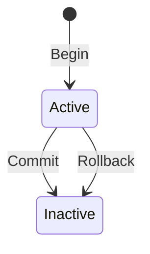
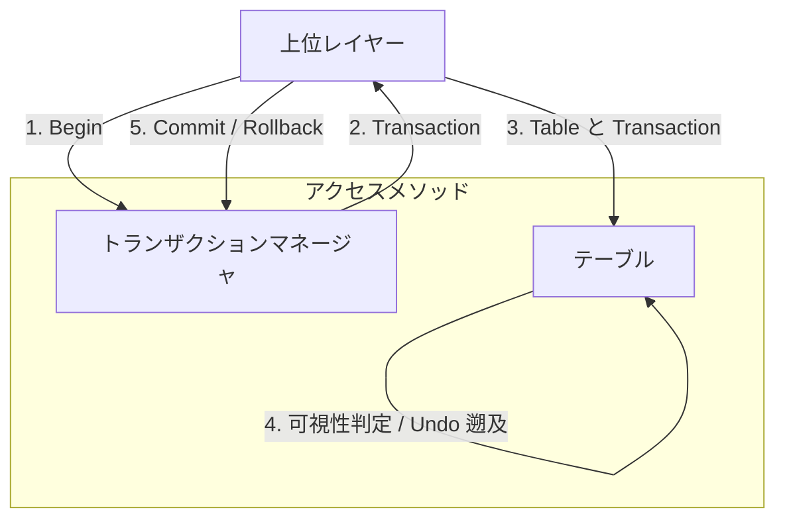

# トランザクション

## 参考文献

- [Isolation (分離レベル)](../../../about/isolation.md)
- [Durability (永続性)](../../../about/durability.md)

## 概要

- トランザクションは、データベースに対する複数の操作を 1 つの論理的な単位として扱うための仕組み
  - ACID 特性 (Atomicity / Consistency / Isolation / Durability) を実現するための基盤
- 1 つのトランザクションは「トランザクション ID」で一意に識別される
- トランザクション ID は、トランザクション開始時に単調増加で払い出される

## トランザクションのライフサイクル

トランザクションは以下の 3 つの状態を取り、状態遷移は Begin / Commit / Rollback の各操作で行われる

```mermaid
stateDiagram-v2
    [*] --> Active : Begin
    Active --> Inactive : Commit
    Active --> Inactive : Rollback
```

- Active: トランザクションが進行中の状態
- Inactive: トランザクションが完了 (コミットまたはロールバック) した状態
  - 完了後もトランザクションの情報 (ID) は、[パージ](./purge.md)が必要かどうかを判定するためにしばらく保持される

### Begin (トランザクション開始)

1. 新しいトランザクション ID を払い出す
2. アクティブトランザクション一覧に当該トランザクションを Active 状態として登録する

トランザクション開始時点では、[ReadView](./mvcc.md#スナップショット-read-view) は作成されない (後述)

### Commit (コミット)

1. Redo ログに Commit レコードを追加する
2. ログバッファをディスクにフラッシュする (fsync を含む)
3. 保持している全ロックを解放する
4. INSERT 用の Undo ログレコードを破棄する
5. アクティブトランザクション一覧から当該トランザクションを Inactive 状態へ遷移させる

ステップ 2 のフラッシュ完了時点で、当該トランザクションの変更内容がディスクに永続化される ([Durability](../../../about/durability.md) の保証境界)

INSERT 用 Undo ログを即時破棄できる根拠は[MVCC: Undo ログの寿命](./mvcc.md#undo-ログの寿命)を参照

### Rollback (ロールバック)

成功パスでは以下の順序で実行する

1. 当該トランザクションが書き込んだ Undo ログレコードを、操作順の逆順 (LIFO) で適用してバッファプール上のデータページを元に戻す
2. Redo ログに Rollback レコードを追加する (ディスクへのフラッシュは行わない)
3. 保持している全ロックを解放する
4. Undo ログレコードを全て破棄する
5. アクティブトランザクション一覧から当該トランザクションを Inactive 状態へ遷移させる

Undo 逆適用の前ではなく後に Rollback レコードを書く理由は、Redo は単独でフラッシュされる契機が複数あり (バッファ容量超過時の自動フラッシュなど)、先に書くと Undo 逆適用前にディスクへ到達して「ロールバック完了済み」と誤判定される経路が生まれるため。Rollback レコードがディスク上の Redo に現れた時点で、対応する Undo 逆適用は既にバッファプール上で完了している状態を保つ

ロールバック中のデータページ書き戻しに対しては、専用の Redo レコード (CLR: Compensation Log Record) は記録しない。Rollback レコードもログバッファに追加されるのみでフラッシュされない。リカバリ時には、Redo ログ上に COMMIT または ROLLBACK が記録されているかどうかでトランザクションの完了/未完了を判定する (詳細は[クラッシュリカバリ](./crash-recovery.md))

#### Rollback 途中でエラーが返った場合

ロールバックは Commit と対称の設計で、「成功パスでのみクリーンアップを行う」方針を取る

- Undo 逆適用または Rollback レコード追加のいずれかでエラーが返った場合、トランザクションは Active のまま据え置き、ロックも Undo ログも保持する
- ストレージ層は通常運用での Rollback 再試行をサポートしない。一度エラーになった Rollback は、その後の Commit / 再試行 Rollback で完了させることを期待せず、未完了として残す
- 中途状態は再起動時の[クラッシュリカバリ](./crash-recovery.md)で解消する。クラッシュリカバリは Redo ログに COMMIT / ROLLBACK のいずれも到達していないトランザクションをすべて未完了とみなして Undo 逆適用を行うため、エラー後に再起動が走れば残った Undo がそこで適用される
- 上位レイヤー (将来の SQL 実行層) は Rollback がエラーを返した場合、ストレージ層を停止させるか、再起動で復旧する責務を持つ

#### 通常運用時とリカバリ中の差

ロールバックの Undo 逆適用は通常運用時とリカバリ中の両方で実行されるが、Redo への記録方針は異なる

- 通常運用時のロールバック (ユーザー発行): ロールバック対象のトランザクション ID をそのまま使い、Undo 逆適用に伴うページ変更を Redo に記録する。これによりロールバック完了直後にクラッシュしてもロールバック後の状態が復元される
- リカバリ中のロールバック (未完了トランザクションの巻き戻し): リカバリ自身の処理として実行されるため Redo には何も記録しない。リカバリは終了時にチェックポイント相当の操作で過去の Redo を切り詰めるので、リカバリ中の変更を二重に記録する意味がなく、idempotent な再実行も阻害しないため

両者は同じ Undo 逆適用ロジックを共有し、上記の差は呼び出し側で mini-transaction の作り方を切り替えることで実現する

## アクティブトランザクション一覧

- 現在進行中のトランザクションを管理するための一覧
- 用途:
  - ReadView 作成時に「自分以外のアクティブなトランザクション ID 集合」を取得するため
  - パージ可否判定で「最古の ReadView」を求めるため

## ReadView の保持と作成

- ReadView はトランザクション自身が直接保持する状態の一部
  - 「アクティブトランザクション一覧」とは別物。アクティブ一覧は ID の集合を扱うのに対して、ReadView は当該トランザクション固有のスナップショット
- 作成タイミングは [REPEATABLE READ](../../../about/isolation.md) の仕様に従い、トランザクション内で最初の Consistent Read が実行された時点
  - 一度作成された ReadView は、当該トランザクションが Inactive へ遷移するまで使い回される
- 作成時点で「自分以外のアクティブなトランザクション ID の集合」と「次に払い出されるトランザクション ID」をスナップショットとして記録する
- ReadView の構造や可視性判定アルゴリズムの詳細は [MVCC](./mvcc.md) を参照

## 他コンポーネントとの関係

トランザクションは、ストレージ層の複数コンポーネントを横断する概念。各コンポーネントとの責務分担は以下のとおり

| コンポーネント | トランザクションとの関わり |
| --- | --- |
| [ロック](../lock/lock.md) | 書き込み操作で行ロックを取得し、COMMIT または ROLLBACK のタイミングで一括解放する ([Strict 2PL](../../../about/isolation.md#cascading-abort-を防止するための-strict-two-phase-locking)) |
| [Redo ログ](../log/redo.md) | データ変更ごとに Redo レコードを追加。COMMIT 時にフラッシュして永続化を保証する |
| [Undo ログ](../log/undo.md) | データ変更前の状態を Undo レコードとして記録。ROLLBACK 時の元の状態への復元、および MVCC のバージョンチェーンの構築に使用する |
| [MVCC](./mvcc.md) | ReadView を介した可視性判定により、書き込み中のトランザクションを待たずに過去の一貫したスナップショットを読める |
| [パージ](./purge.md) | コミット済みかつどの ReadView からも参照されなくなった Undo ログを回収する |
| [アクセスメソッド](./access-method.md) | 検索 / 書き込み操作の際に「テーブル」と「トランザクション」の両方を受け取り、MVCC の可視性判定や ReadView の解決を内部で行う。テーブルとトランザクションは互いに独立した存在として扱われ、どちらか一方が他方を所有することはない |

## アクセスメソッドの中での位置づけ

トランザクションマネージャとテーブルはどちらもアクセスメソッド層の構成要素であり、両者は同じレイヤー内で互いに独立して存在する (どちらかが他方を所有することはない)。上位レイヤー (SQL 実行層など) はアクセスメソッドの利用者として、トランザクションマネージャから受け取ったトランザクションを、テーブルへの検索 / 書き込み操作に組み合わせて渡す

```mermaid
flowchart TB
    Caller[上位レイヤー]
    subgraph AM[アクセスメソッド]
        TxMgr[トランザクションマネージャ]
        Table[テーブル]
    end
    Caller -- 1. Begin --> TxMgr
    TxMgr -- 2. Transaction --> Caller
    Caller -- 3. Table と Transaction --> Table
    Table -- 4. 可視性判定 / Undo 遡及 --> Table
    Caller -- 5. Commit / Rollback --> TxMgr
```

責務の境界は以下のとおり

| レイヤー | 責務 |
| --- | --- |
| 上位レイヤー (SQL 実行層など) | トランザクションの開始 / コミット / ロールバックを呼び出すタイミングを決める。検索時にはテーブルとトランザクションを組み合わせてアクセスメソッドに渡す |
| アクセスメソッド (テーブル / トランザクションマネージャ / MVCC) | 受け取ったトランザクションから ReadView を取得し、MVCC の可視性判定 / Undo チェーン遡及 / セカンダリインデックスの PK 経路フォールバックを内部で行う |

上位レイヤーは ReadView の存在や可視性判定の詳細を意識しない。MVCC に関する責務はアクセスメソッド層に閉じ込められる

## ロック取得と解放のタイミング

トランザクションが保持するロックの取得と解放には、Strict 2PL に基づく以下の制約がある

- ロックはトランザクションのライフサイクル中に随時取得される (例: 書き込み操作の B+Tree 操作内)
- 一度取得したロックは、トランザクションの COMMIT または ROLLBACK までに解放されない (Strict 2PL の不変条件)
- COMMIT または ROLLBACK 時に、保持中の全ロックを一括解放する

ロックの低レベル API は[ロックマネージャ](../lock/lock.md)が提供する。ロックマネージャ自体は COMMIT/ROLLBACK の概念を持たず、解放タイミングの決定はトランザクションを管理する側 (本ドキュメントの主体) が責任を持つ

## Undo ログの寿命とトランザクション完了

トランザクション完了時の Undo ログレコードの扱いは、種別ごとに異なる

| 種別 | COMMIT 時 | ROLLBACK 時 |
| --- | --- | --- |
| INSERT | History List から取り除く (他トランザクションが Undo チェーンを辿って旧バージョンに到達する必要がないため) | 全破棄 |
| UPDATE / DELETE | パージで回収されるまで保持 | 全破棄 |

INSERT の Undo を「破棄する」と言うときは History List (パージ走査の駆動源となるメモリ上の管理リスト) から外す意味であり、Undo ページ上のレコード実体は MVCC チェーンの終端判定で参照される可能性があるため、コミット直後に物理領域を即座に解放するわけではない (詳細: [Undo ログレコードの寿命](../log/undo.md#undo-ログレコードの寿命))

UPDATE / DELETE の Undo レコードを残す理由は、他のトランザクションの ReadView から[Undo チェーン](./mvcc.md#undo-チェーン遡及)を辿るために必要だから。回収のタイミングについては[パージ](./purge.md)を参照

## 予約トランザクション ID

トランザクション ID は用途別に 4 種類の値域に分かれる

| 種別 | 用途 |
| --- | --- |
| ユーザー採番 ID | 通常のユーザートランザクション。Begin で単調増加に動的に払い出される |
| システム予約 ID | 起動時の永続オブジェクト初期化や、単発のカウンタ更新 (永続値書き込み) で使う固定値。DDL 予約 ID とは責務が異なり、DDL Undo は書かない |
| パージ予約 ID | バックグラウンドで動作する物理削除処理 ([パージ](./purge.md)) で使う固定値 |
| DDL 予約 ID | DDL ([データ定義操作](./ddl.md)) で実行されるトランザクションで使う固定値 |

4 種は互いに重ならない値域を持つ。これにより Redo / Undo に記録されたレコードの所有者を一意に識別できる

DDL 予約 ID は単一値で運用される。DDL は autocommit (1 操作 = 1 トランザクション) として実行され、Begin / Commit がユーザー操作の境界とは切り離されるため、同時に複数の DDL が走ることを想定しない。並行 DDL がない前提で固定値を共有する設計の根拠は [DDL](./ddl.md#ddl-専用予約トランザクション-id) を参照

## クラッシュ時のトランザクション扱い

クラッシュ後の再起動 (クラッシュリカバリ) では、Redo ログを使ってトランザクションの完了状態を判定する

- COMMIT レコードが Redo ログに到達しているトランザクション: コミット済みとして扱い、その変更を Redo 適用で復元する
- ROLLBACK レコードが Redo ログに到達しているトランザクション: ロールバック済みとして扱う
- いずれも到達していないトランザクション (= 未完了): クラッシュ時点で進行中だったとみなし、Undo ログを逆順に適用してロールバックする

DDL 予約 ID で実行されたトランザクションも同じ判定を経るが、未完了 DDL の取消には専用の DDL Undo を逆順に適用する経路が使われる。詳細は [DDL](./ddl.md#クラッシュリカバリでの位置づけ) と [クラッシュリカバリ](./crash-recovery.md) を参照
