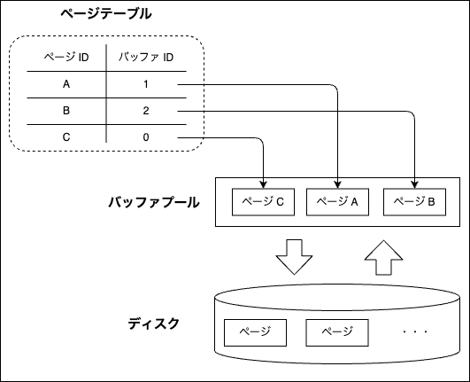
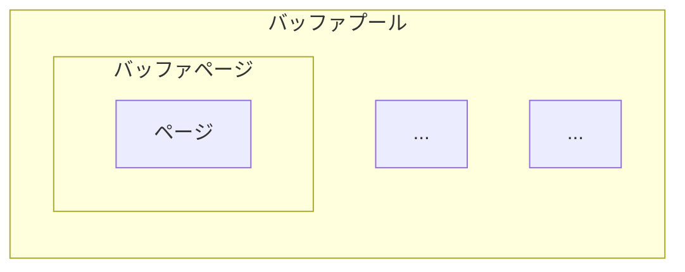

# バッファプール

## 概要

- ディスク I/O は遅く、頻繁に発生するとパフォーマンスが下がるため、バッファプールを用いてディスク I/O を削減する
  - バッファプールはページの内容をメモリ上にキャッシュすることでディスクの遅さを隠蔽する
  - 一度読み込んだページをメモリに保持しておき、それ以降の読み取りではメモリから読み取ることでディスク I/O を削減する
  - 書き込みも同様に、まずバッファプール上のページを書き換え、後でまとめてディスクに書き込む (フラッシュする) ことでディスク I/O を削減する
    - ディスクへのフラッシュは[ページクリーナー](../access/page-cleaner.md)が行う
- 「どのページのデータがバッファプールに入っているか」の対応関係を、ページテーブルで管理する (以下図を参照)
  - ページテーブルにない (= バッファプールにない) 場合はディスクから読む必要がある
- ファイルはテーブルごとに作成されるが、バッファプールはテーブルごとに作成されるわけではないため、結果としてバッファプールには複数のファイルのページが格納されることが多い
- ページの追い出しアルゴリズムには [LRU](./lru.md) を使用

### ファイルシステムのビルトインのキャッシュを利用せず、バッファプールを実装する理由

- RDB の動作を把握している RDB 自身がキャッシュ管理した方が、ファイルシステムにキャッシュ管理させるよりも賢く管理をできるため
  - 例えば LRU アルゴリズムを用いて、最近参照されたページは捨てられにくくし、古く参照されていないページが優先的に捨てられるようにするなど

### バッファプールの内部

- バッファページ
  - ページに `IsDirty` フラグなどを付加した構造体
    - 書き込み時には `IsDirty` フラグを立てることで、書き込んだページを "ダーティーページ" とし、バッファプール内のページとディスクのページに差分があることを示す
    - ダーティーページをバッファプールから捨てる際には、ページをディスクに書き出す必要がある
  - 外部からのページデータへのアクセスは、全てバッファプール経由で行う

- バッファプール
  - 複数のバッファページを格納する
  - バッファプールの大きさは `MINESQL_MAX_BUFFER_SIZE` 環境変数で管理できる

- BufferId
  - バッファプール内の、どの位置にバッファページが格納されているかを表す識別子 (index)
    - 例: バッファプール内の 0 番目のバッファページは BufferId=0, 1 番目のバッファページは BufferId=1 など
  - ページテーブルには、PageId に対応する BufferId が格納されているため、ページテーブルを参照することで、該当のページがバッファプールのどの位置に格納されているかを特定できる

- フラッシュリスト
  - ダーティーページを `IsDirty` フラグが立った順 (古い順) に管理するリスト
  - [ページクリーナー](../access/page-cleaner.md)が古いダーティーページから優先的にフラッシュするために使用する
  - 詳細は[ページクリーナー](../access/page-cleaner.md)を参照

## バッファプールの操作

- バッファプールの大きさは有限であるため、バッファプールの容量に空きがなくなった場合は、いずれかのバッファページを捨てて容量を確保する必要がある
- その際に、捨てるページはディスクに書き出す必要がある
  - 捨てるページを選択するアルゴリズムは [LRU](./lru.md) を使用

### ページのフェッチ

#### 1. 指定された PageId がページテーブルにすでにあるか (=バッファプールにあるか) を確認する

#### 2. 存在する場合はそのページを返す (ディスク I/O は発生しない)

- このとき、LRU アルゴリズムにより、(必要があれば) アクセスされたページの位置を変える
  - 詳細は [LRU](./lru.md) を参照

#### 3. 存在しない場合、ディスクのページをバッファプールに読み込む

- バッファプールに空きがある場合
  - [ディスク](../file/disk.md)を通じてページを読み込み、ページテーブルを更新する
- バッファプールに空きがない場合
  - LRU アルゴリズムで捨てるバッファページを選択する
  - 選択されたバッファページがダーティーな場合は、ページをディスクに書き出す (書き出す前に [REDO ログ](../access/redo.md)を先にフラッシュする)
  - ディスク書き出しによって空いた容量に、ディスクを通じて該当のページを読み込み、ページテーブルを更新する

### ページの追加

バッファプールに空きがある場合は新しいページを追加し、空きがない場合は古いページをディスクに書き込んだ後に、新しいページに置き換える\
具体的には以下のような流れで処理を行う

#### 1. バッファプールに空きがあるかを確認する

- 空きがある場合は、新しいバッファページを追加し、ページテーブルを更新する

#### 2. 空きがない場合、ディスクのページをバッファプールに読み込む

- LRU アルゴリズムで捨てるバッファページを選択する
  - 追い出し対象のバッファページがダーティーページな場合は、ディスクに書き出す

#### 3. ページテーブルを更新する

- 追い出されたページの PageId をページテーブルから削除する
- 新しいページの PageId と BufferId をページテーブルに追加する

_補足_

- LRU アルゴリズムによって追い出し対象の BufferId が払い出され、その BufferId に対応するバッファページがディスクに書き込まれる
- その後、追い出されたページの代わりにバッファプールに乗る新しいページが、バッファページとしてバッファプールに追加される
- このページに対して割り当てられる BufferId は、追い出されたページの BufferId と同じになる

### ページのフラッシュ

- バッファプール内のダーティーページをディスクに書き出す操作
- 全フラッシュと部分フラッシュの 2 種類がある
- いずれの場合も、そのページの Page LSN が [REDO ログ](../access/redo.md)の FlushedLSN より大きい場合、ダーティーページをディスクに書き出す前に [REDO ログバッファ](../access/redo.md)を先にフラッシュする
- これにより、ディスク上のページが REDO ログより新しくなることを防ぎ、クラッシュ時にページを復元できることを保証する

#### 全フラッシュ

サーバーのシャットダウン時 (クラッシュではない) に使用する。バッファプール内の全ダーティーページをディスクに書き出す

1. REDO ログバッファをフラッシュする
2. ページテーブル内の全ダーティーページをディスクに書き出し、`IsDirty` フラグを解除する
3. フラッシュリストをクリアする
4. 全ファイルを Sync してストレージデバイスへの書き込みを保証する

#### 部分フラッシュ

[ページクリーナー](../access/page-cleaner.md)から呼び出される。フラッシュリストの先頭 (最も古いダーティーページ) から指定された件数をフラッシュする。

1. フラッシュリストの先頭から n 件の PageId を取得する (フラッシュリストが空なら何もしない)
2. REDO ログバッファをフラッシュする
3. 各ページについて
   - クリーンページ (フラッシュリストに追加された後にフラッシュされたがフラッシュリストから削除されなかったページ) はフラッシュリストから除外するだけでディスク書き込みしない
   - ダーティーページはディスクに書き出し、`IsDirty` フラグを解除し、フラッシュリストから除外する
4. フラッシュ対象のディスクを Sync してストレージデバイスへの書き込みを保証する
