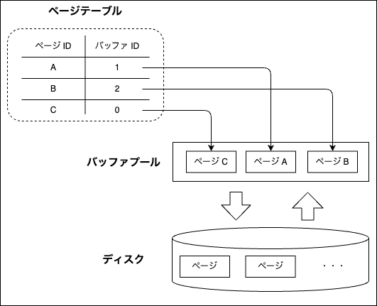
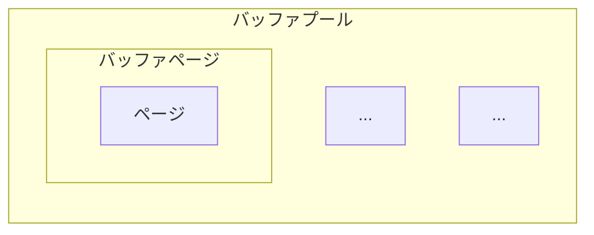

# バッファプール

## 概要

- ディスク I/O は遅く、頻繁に発生するとパフォーマンスが下がるため、バッファプールを用いてディスク I/O を削減する
  - バッファプールはページの内容をメモリ上にキャッシュすることでディスクの遅さを隠蔽する
  - 一度読み込んだページをメモリに保持しておき、それ以降の読み取りではメモリから読み取ることでディスク I/O を削減する
  - 書き込みも同様に、まずバッファプール上のページを書き換え、後でまとめてディスクに書き込む (フラッシュする) ことでディスク I/O を削減する
- 「どのページのデータがバッファプールに入っているか」の対応関係を、ページテーブルで管理する (以下図を参照)
  - ページテーブルにない (= バッファプールにない) 場合はディスクから読む必要がある
- ファイルはテーブルごとに作成されるが、バッファプールはテーブルごとに作成されるわけではないため、結果としてバッファプールには複数のファイルのページが格納されることが多い
- ページの追い出しアルゴリズムには [LRU](./lru.md) を使用

### ファイルシステムのビルトインのキャッシュを利用せず、バッファプールを実装する理由

- RDB の動作を把握している RDB 自身がキャッシュ管理した方が、ファイルシステムにキャッシュ管理させるよりも賢く管理をできるため
  - 例えば LRU アルゴリズムを用いて、最近参照されたページは捨てられにくくし、古く参照されていないページが優先的に捨てられるようにするなど

### バッファプールの内部

```mermaid
graph TD
  subgraph bufferPool[バッファプール]
    direction TB
    subgraph flame[バッファページ]
      page[ページ]
    end
    A[...]
    B[...]
  end
```

- バッファページ
  - ページにダーティーフラグや参照カウントなどを付加した構造体
    - 書き込み時にはダーティーフラグを立てることで、書き込んだページを "ダーティーページ" とし、バッファプール内のページとディスクのページに差分があることを示す
  - 外部からのページデータへのアクセスは、全てバッファプール経由で行う

- Pin (使用中ページの保護)
  - バッファプールから取得したページには参照カウント (Pin) を持たせ、取得時に増やし、利用側が使い終わったときに減らす
  - 参照カウントが 1 以上のページは「使用中」とみなし、追い出し対象から除外する
    - 利用側 (B+Tree の走査など) がページ内のデータを直接参照し続けている間に、そのバッファ位置が別のページで上書きされるとデータが壊れるため、これを防ぐ
  - 追い出し可否は LRU の並び順とは独立した制約であり、LRU が「最近使われていない」と判断したページであっても、使用中であれば追い出さない

- 更新カウンタ
  - 各バッファページに、内容が変更されるたびに増えるカウンタを持たせる
  - ある時点のカウンタ値を覚えておき、後で同じページのカウンタ値と比べることで、その間にページ内容が変更されたかを、内容を読み比べることなく安価に判定できる
  - ラッチを一度手放して取り直す利用側が、手放している間にそのページが変更されたかを確かめるために使う

- ラッチ
  - 各バッファページは、内容を並行アクセスから守るためのラッチを持つ
  - 詳細は [ラッチ](./latch.md)

- バッファプール
  - 複数のバッファページを格納する

- BufferId
  - バッファプール内の、どの位置にバッファページが格納されているかを表す識別子 (index)
    - 例: バッファプール内の 0 番目のバッファページは BufferId=0, 1 番目のバッファページは BufferId=1 など
  - ページテーブルには、PageId に対応する BufferId が格納されているため、ページテーブルを参照することで、該当のページがバッファプールのどの位置に格納されているかを特定できる

- フラッシュリスト
  - ダーティーページを `isDirty` フラグが立った順 (古い順) に管理するリスト
  - 古いダーティーページから優先的にフラッシュする際に使用する

## バッファプールの操作

- バッファプールの大きさは有限であるため、バッファプールの容量に空きがなくなった場合は、いずれかのバッファページを捨てて容量を確保する必要がある
  - 捨てるページを選択するアルゴリズムは [LRU](./lru.md) を使用
- ただし、使用中 (Pin 中) のページとダーティーページは追い出し対象から除外する
  - 使用中のページを追い出すと、参照中のデータが壊れるため
  - ダーティーページを追い出すには先にディスクへ書き出す必要があるが、その書き出しはバッファプールの追い出し経路では行わず、外部のフラッシュ機構に任せる
- 追い出し候補が 1 つも見つからない (全てのページが使用中またはダーティー) 場合は、外部に登録されたフラッシュ依頼先にシグナルを送り、あわせてその操作自身が即時にフラッシュを試みた上で、一定時間待機してから再試行する
  - 依頼を受けてダーティーページがフラッシュされるとダーティー制約が外れ、追い出し可能なページが増えるため、詰まった状態から回復できる
  - 操作自身によるフラッシュは、ラッチを取得できないページをスキップして、取得できた最初のダーティーページ 1 つのクリーン化を試みる
    - 自分が使用中のページの解放を待つことはないため、ラッチを保持したままの操作でも安全に呼び出せる (詳細: [ラッチ - フラッシュとの協調](./latch.md#フラッシュとの協調))
  - 再試行が一定回数を超えても候補が見つからない場合は警告ログを出力する
  - さらに再試行の上限回数に達しても候補が見つからない場合は、追い出し不能としてエラーを返す
    - フラッシュの依頼先が登録されていない、または依頼先が動作していないなど、待機しても回復しないケースで無限に待ち続けるのを防ぐためのフェイルセーフ

### ページのフェッチ

#### 1. 指定された PageId がページテーブルにすでにあるか (=バッファプールにあるか) を確認する

#### 2. 存在する場合はそのページを返す (ディスク I/O は発生しない)

- このとき、LRU アルゴリズムにより、(必要があれば) アクセスされたページの位置を変える
  - 詳細は [LRU](./lru.md) を参照

#### 3. 存在しない場合、ディスクのページをバッファプールに読み込む

- バッファプールに空きがある場合
  - [ディスク](../file/disk.md)を通じてページを読み込み、ページテーブルを更新する
- バッファプールに空きがない場合
  - LRU アルゴリズムで、使用中でもダーティーでもないバッファページの中から捨てる対象を選択する
  - 候補が見つからない場合は外部のフラッシュ依頼先にシグナルを送り、待機・再試行する
  - 空いた容量に、ディスクを通じて該当のページを読み込み、ページテーブルを更新する

### ページの追加

バッファプールに空きがある場合は新しいページを追加し、空きがない場合は使用中でもダーティーでもない古いページを追い出して、新しいページに置き換える\
具体的には以下のような流れで処理を行う

#### 1. バッファプールに空きがあるかを確認する

- 空きがある場合は、新しいバッファページを追加し、ページテーブルを更新する

#### 2. 空きがない場合、追い出し対象を選んで置き換える

- LRU アルゴリズムで、使用中でもダーティーでもないバッファページの中から追い出し対象を選択する
- 候補が見つからない場合は外部のフラッシュ依頼先にシグナルを送り、待機・再試行する

#### 3. ページテーブルを更新する

- 追い出されたページの PageId をページテーブルから削除する
- 新しいページの PageId と BufferId をページテーブルに追加する

_補足_

- 追い出し対象として払い出された BufferId は、使用中でもダーティーでもないことが保証されているため、ディスクへの書き出しなしにそのまま置き換えられる
- 追い出されたページの代わりにバッファプールに乗る新しいページに対して割り当てられる BufferId は、追い出されたページの BufferId と同じになる

### ページのフラッシュ

- バッファプール内のダーティーページをディスクに書き出す操作
- 全フラッシュと部分フラッシュの 2 種類がある
- いずれの種類でも、1 ページずつ以下の流れを完結させてから次のページへ進む
  1. ページの内容をディスクに書き出す
  2. 対象のファイルを Sync してストレージデバイスへの書き込みを保証する
  3. ページをクリーン化する (`isDirty` フラグを解除し、フラッシュリストから除外する)
- ページ単位で完結させることには、あるページの処理がラッチの解放待ちでブロックされても、処理済みのページは順次クリーン化され追い出し可能になる、という進行性の意味がある
- クリーン化は、そのページの内容がディスクに Sync された後にのみ行う (クラッシュ時に「クリーン扱いだが未永続」のページを作らないため)。書き出しまたは Sync に失敗した場合、そのページとそれ以降のページはクリーン化されず、次回フラッシュで再試行される
- 書き出しからクリーン化までの間にページ内容が再変更されていた場合はクリーン化せず、次回フラッシュで再度書き出す (変更の有無は更新カウンタで判定する)

#### 全フラッシュ

サーバーのシャットダウン時 (クラッシュではない) に使用する。バッファプール内の全ダーティーページを上記の流れで 1 ページずつディスクに書き出す

#### 部分フラッシュ

外部のフラッシュ機構から呼び出される。フラッシュリストの先頭 (最も古いダーティーページ) から指定された件数を取得し、上記の流れで 1 ページずつフラッシュする (フラッシュリストが空なら何もしない)

- クリーンページ (フラッシュリストに追加された後にフラッシュされたがフラッシュリストから削除されなかったページ) はフラッシュリストから除外するだけでディスク書き込みしない
