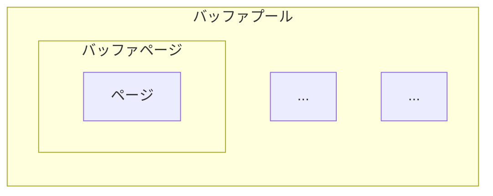

# バッファプール

## 概要

- ディスク I/O は遅く、頻繁に発生するとパフォーマンスが下がるため、バッファプールを用いてディスク I/O を削減する
  - バッファプールはページの内容をメモリ上にキャッシュすることでディスクの遅さを隠蔽する
  - 一度読み込んだページをメモリに保持しておき、それ以降の読み取りではメモリから読み取ることでディスク I/O を削減する
  - 書き込みも同様に、まずバッファプール上のページを書き換え、後でまとめてディスクに書き込むことでディスク I/O を削減する
- 「どのページのデータがバッファプール上のどこに入っているか」の対応関係を、ページテーブルで管理する (以下図を参照)
  - ページテーブルにない = バッファプールにない -> ディスクから読み込む必要がある

### バッファプールの内部

- バッファページ
  - ページに `IsDirty` フィールドなどを付加した構造体
    - 書き込み時には `IsDirty` を true にセットすることで、バッファプール内のページの内容とディスクのページの内容に差分があることを示す
    - バッファプールからページを捨てる際に、`IsDirty` が true のページはディスクに書き出す必要がある

- バッファプール
  - 複数のバッファページを格納する
  - `MaxBufferSize` (バッファプールの最大サイズ)(=所持できる最大のバッファページ数) などのメタデータを持つ

### バッファID

- バッファプール内の、どの位置にバッファページが格納されているかを表す識別子 (index)
  - 例: バッファプール内の 0 番目のバッファページは BufferId(0)、1 番目のバッファページは BufferId(1) など
- ページテーブルには、PageId に対応する BufferId が格納されているため、ページテーブルを参照することで、該当のページがバッファプールのどの位置に格納されているかを特定できる

## ファイルシステムのビルトインのキャッシュを利用せず、バッファプールを実装する理由

- RDBMS の動作を把握している RDBMS 自身がキャッシュ管理した方が、ファイルシステムにキャッシュ管理させるよりも賢く管理をできるため
  - 例えば LRU アルゴリズムを用いて、最近参照されたページは捨てられにくくし、古く参照されていないページが優先的に捨てられるようにするなど

## バッファプールの操作

- バッファプールの大きさは有限であるため、バッファプールに容量の空きがなくなった場合は、いずれかのバッファページを捨てて容量を確保する必要がある
- その際に、捨てるページはディスクに書き出す必要がある
  - 捨てるページを選択するアルゴリズムは [LRU](lru.md)

バッファプール (`BufferPool` struct) は、バッファプールを管理し、主に以下の操作を行う

### ページのフェッチ

該当のページがバッファプールにある場合はそこから、ない場合はディスクからページを読み込むことで、ディスク I/O を削減する  
具体的には以下のような流れで処理を行う

#### 1. 指定された PageId がページテーブルにすでにあるか (=バッファプールにあるか) を確認する

- PageId には FileId と PageNumber が含まれており、どのディスクファイルのどのページかを一意に特定できる

#### 2. 存在する場合はそのページを返す (ディスク I/O は発生しない)

- このとき、追い出しアルゴリズムにページがアクセスされたことを通知する

#### 3. 存在しない場合、ディスクのページをバッファプールに読み込む

- PageId に含まれる FileId を使って、対応するディスクを特定する
- バッファプールに空きがある場合:
  - ディスクを通じてページを読み込み、ページテーブルを更新する
- バッファプールに空きがない場合:
  - LRU アルゴリズムで捨てるバッファページを選択する
  - 選択されたバッファページが `IsDirty` ビットを持っている場合 (バッファプール内のページの内容とディスクのページの内容に差分がある場合) は、該当するディスクを通じてディスクに書き出す
  - ディスク書き出しによって空いた容量に、ディスクを通じて該当のページを読み込み、ページテーブルを更新する

### ページの追加

バッファプールに空きがある場合は新しいページを追加し、空きがない場合は古いページをディスクに書き込んだ後に、新しいページに置き換える  
具体的には以下のような流れで処理を行う

#### 1. バッファプールに空きがあるかを確認する

- 空きがある場合は、新しいバッファページを追加し、ページテーブルを更新する

#### 2. 空きがない場合、ディスクのページをバッファプールに読み込む

- LRU アルゴリズムで捨てるバッファページを選択する
  - 追い出し対象のバッファページが `IsDirty` ビットを持っている場合 (バッファプール内のページの内容とディスクのページの内容に差分がある場合) は、該当するディスクを通じてディスクに書き出す

#### 3. ページテーブルを更新する

- 追い出されたページの PageId をページテーブルから削除する
- 新しいページの PageId とバッファIDをページテーブルに追加する

_補足_

- LRU アルゴリズムによって追い出し対象の `バッファID` が払い出され、そのバッファIDに対応するバッファページがディスクに書き込まれる
- その後、追い出されたページの代わりにバッファプールに乗る新しいページが、バッファページとしてバッファプールに追加される。
- このページに対して割り当てられるバッファIDは、追い出されたページのバッファIDと同じになる

### ページのフラッシュ

- バッファプールのデータは実際にはメモリ上に配置されるが、メモリは揮発性であるため、サーバーのプロセス終了時には、バッファプール内のページの内容をディスクに書き出して永続化する必要がある
  - そのためバッファプール内にある `IsDirty` ビットが true のページを、ディスクに書き出すことで、バッファプール内のページの内容をディスクにフラッシュする

### 複数のディスクの管理

- ディスクはテーブルごとに作成される (詳細: [ディスクの操作](../file/disk.md#ディスクの操作)) が、バッファプールはテーブルごとに作成されるわけではないため、結果としてバッファプールには複数のテーブルのページが格納されることが多い
- そのため、バッファプールでは複数のディスクを管理して、複数のディスクにアクセスできるようにしている
