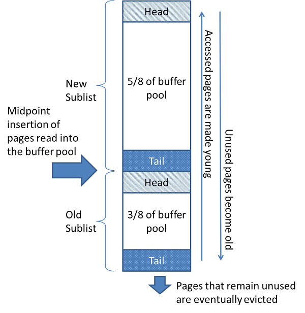

# LRU (Least Recently Used)

## 概要

- LRU は名前の通り、最近最も使われなかったデータをキャッシュから削除するキャッシュアルゴリズム
- MySQL InnoDB でもバッファプールのキャッシュ (ページ追い出し) アルゴリズムに LRU を採用しているが、一般的な (教科書的な) LRU とは異なる
  - 通常の LRU では、新しく読み込んだページがリストの先頭に配置されるため、フルテーブルスキャンなどの一時的な大量読み込みでホットページが追い出されてしまう問題がある
  - InnoDB では、新しいページをリストの途中 (midpoint) に挿入することでこの問題を解決している
- MineSQL でも MySQL と同様にこの改良版の LRU アルゴリズムで実装している

## 通常の LRU との違い

### 通常の LRU

- 新しいページ: リストの先頭に配置
- 追い出し対象のページ: リストの末尾から選択される
- 問題: フルテーブルスキャンで大量のページを読み込むと、頻繁にアクセスされるページ (ホットページ) が末尾に押し出されて追い出される

### InnoDB の LRU

- リストを **New Sublist** (先頭側) と **Old Sublist** (末尾側) に分割する
- 新しいページ: **Midpoint** (Old Sublist の先頭) に配置
- 追い出し対象のページ: リストの末尾 (Old Sublist の末尾) から選択される
- ページの再アクセス: Old Sublist 内のページに再アクセスすると、New Sublist の先頭に昇格する

### フルテーブルスキャンの例

- 通常の LRU の場合

  ```txt
  初期: [hot1, hot2, hot3, ...]
  スキャン後: [scan_n, ..., scan2, scan1, hot1, hot2, ...] ← ホットページが末尾に追いやられる
  ```

- InnoDB の LRU の場合
  - スキャンで読み込まれたページは Old Sublist に配置されるため、New のホットページに影響しない

  ```txt
  初期:
    New: [hot1, hot2, hot3, ...]  Old: [...]

  スキャン後:
    New: [hot1, hot2, hot3, ...]  Old: [scan_n, ..., scan1, ...] ← スキャンページは Old に留まる
  ```

## リストの構造

<figure>
  
  <figcaption>https://dev.mysql.com/doc/refman/8.0/ja/innodb-buffer-pool.html</figcaption>
</figure>

- New Sublist: 全体の 5/8 (再アクセスされたホットなページ)
- Old Sublist: 全体の 3/8 (新規ページや古いページ)

※ 5/8 と 3/8 はそれぞれ New Sublist の**上限**と Old Sublist の**下限**であり、常にこの比率で分割されるわけではない。\
例えば、バッファプールの起動直後は (バッファプールに載る) 全ページが未使用で Old Sublist に属するため、Old Sublist が 100% を占める\
ページが再アクセスされて New Sublist に昇格するにつれて比率が変化し、また New Sublist が上限 (5/8) を超えた場合にはリバランス (後述) で Old Sublist に降格することで比率が維持される

## 動作

### ページのアクセス時

- 新しいページにアクセス: Midpoint に配置
- Old Sublist 内のページにアクセス: New Sublist の先頭に昇格
  - これにより、複数回アクセスされるページは「ホット」とみなされ、追い出されにくくなる
- New Sublist 内のページにアクセス: New Sublist の先頭に昇格

### ページの追い出し時

- リストの末尾 (Old Sublist の末尾) のページを追い出す

### リバランス

- New Sublist が最大長 (全体の 5/8) を超えた場合、New Sublist の末尾のノードを Old Sublist に降格する

## 例

### ディスクから新しいページ X を読み込む場合

```txt
変更前:
New Sublist (5/8)       Old Sublist (3/8)
[A, B, C, D, E]         [F, G, H]
                        ↑ midpoint

変更後:
New Sublist (5/8)       Old Sublist (3/8)
[A, B, C, D, E]         [X, F, G, H]
                        ↑ midpoint (X が Old の先頭に挿入)
```

- X は midpoint に配置される
- A〜E の New Sublist (ホットページ) は影響を受けない
- H が末尾に押し出され、次の追い出し候補になる

### Old Sublist のページ F が再アクセスされた場合

```txt
変更前:
New Sublist (5/8)       Old Sublist (3/8)
[A, B, C, D, E]         [X, F, G, H]

変更後:
New Sublist (5/8)       Old Sublist (3/8)
[F, A, B, C, D]         [E, X, G, H]
                        ↑ midpoint (E が Old に降格)
```

- F が New の先頭に昇格
- New Sublist が最大長を超えるため、末尾 E が Old に降格
