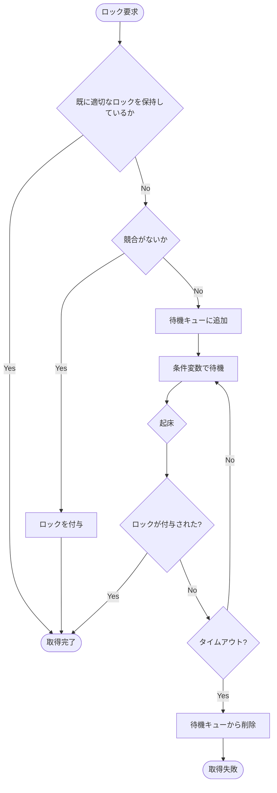

# ロック

## 概要

- ロック (Lock)
  - トランザクションがデータアイテム (レコードなど) に対して取得する論理的な排他制御
  - トランザクションの期間中保持され、COMMIT/ROLLBACK で解放される
- ラッチ (Latch)
  - データ構造 (ページ、はアッシュテーブルなど) への物理的な排他制御
  - OS の Mutex に相当し、クリティカルセッションの間だけ短時間保持される
- ロックには以下の 2 種類がある
  - Shared ロック: 読み取り専用のロックで、複数のトランザクションが同時に取得できる
  - Exclusive ロック: 書き込み用のロックで、1 つのトランザクションしか取得できない
- 読み取りは MVCC によってロックを取得せずに行い、書き込み競合制御にのみロックを使用する
- ロックの保持期間は Strict 2 Phase Lock (Strict 2PL) のルールに従い、トランザクションが COMMIT/ROLLBACK するまで保持する
  - 詳細: ([Strict Two-Phase Locking](../../../about/isolation.md#cascading-abort-を防止するための-strict-two-phase-locking))

### ロックの競合

| - | Shared を要求 | Exclusive を要求 |
| --- | --- | --- |
| 保持者なし | 競合しない | 競合しない |
| Shared のみ保持 | 競合しない | 競合する (待機) |
| Exclusive 保持 | 競合する (待機) | 競合する (待機) |

## ロック取得タイミング

- SELECT は MVCC の Consistent Read により、ロックを取得せずに読み取る
- INSERT はレコードを B+Tree に挿入した後に、レコードに対して排他ロックを取得する
- UPDATE/DELETE は WHERE 句の評価はロックを取得せずに行い、実際に行を更新・削除する際に排他ロックを取得する
- 外部キー制約チェックでは以下のロックを取得する
  - 子テーブルに対する INSERT/UPDATE
    - 参照先が並行する DELETE (または UPDATE) で不整合になることを防ぐために、参照先 (親テーブル) のレコードに対する共有ロックを取得する
  - 親テーブルに対する DELETE/UPDATE
    - 対象行の排他ロックを先に取得してから、参照元 (子テーブル) を検索する
    - 排他ロック保持中に検索するため、並行する INSERT が親行に共有ロックを取得しようとすると待機する (これにより孤立した子行の発生を防ぐ)

## ロックの管理

- レコードごとのロック状態をロックテーブルで管理する
- 各エントリは「現在のロック保持者の一覧」と「待機キュー」で構成される

- 「既に適切なロックを保持しているか」の判定
  - 以下のいずれかに該当する場合は、ロックを再取得する必要がない
    - 既に Exclusive Lock を保持している婆愛
    - 既に Shared Lock を保持していて、Shared Lock を要求している場合

- 「競合がないか」の判定
  - 以下のいずれかに該当する場合は、ロックを即座に付与できる
    - ロックを未保持の場合: 現在のロック保持者と競合せず、かつ待機キューが空
    - Shared -> Exclusive への昇格を要求している場合: 自分が唯一の保持者

待機キューを挟むことで、先に待っているトランザクションを飛ばして取得するのを防ぐ (FIFO 違反を防ぐ)

### ロック待機の仕組み

- ロックが取得できない場合は、待機キューに追加して条件変数で待機する
- 条件変数の Wait は、ラッチ (Mutex) を開放してスレッドをスリープさせる
  - 開放しないと他のスレッドがロックテーブルにアクセスできなくなり、デッドロックの原因になるため
- 条件変数は「何かが変わった」という通知を受け取る仕組みであり、特定のイベントとは紐づかない
  - ロック開放時とタイムアウト発生時の両方で同じ Broadcast が呼ばれる
  - Broadcast で全待機者を起床させるが、何が起きたかは起床した側が自分で判断する
- 起床したスレッドはラッチを再取得し、以下を確認する
  - 自身のロックが付与された -> 処理を再開
  - タイムアウトした -> 待機キューから削除してエラーを返す
  - どちらでもない -> 再び Wait で待機する (spurious wakeup 対策として、必ずループで条件を再チェックする)

### 待機キューからのロック付与

ロック開放時には、以下のルールに従って待機キューの先頭から順にロック付与を試みる

- ロック保持者がいなければ、待機キューの先頭のトランザクションにロックを付与
- Shared が要求された場合は、現在の保持者と競合しなければ付与する (連続する Shared を一度に付与する)
- Exclusive が要求された場合は、保持者が空か、自身が勇逸の保持者 (Shared -> Exclusive の昇格) の場合のみ付与する
- Exclusive の待機者に到達した時点で、それ以降のリクエスト (Shared 含む) は付与しない

最後のルールにより FIFO 順序を保証する。Exclusive を飛ばして後続の Shared を付与すると、Exclusive の待機者が永遠にロックを取得できない可能性がある

### ロック開放時の流れ

トランザクションの COMMIT/ROLLBACK 時に保持しているロックを一括解放する

1. 保持している各行のロックを順に解放する
2. 各行について、ロック解放により競合が解消された待機中のトランザクションにロックを付与する
3. 保持者も待機者もいなくなったエントリはロックテーブルから削除する
4. 条件変数で Broadcast し、待機中のトランザクションを起床させる

#### 例: 待機キュー [S, S, X, S] の場合

| ステップ | 処理 | キュー | 保持者 |
| --- | --- | --- | --- |
| 初期状態 | (保持者なし) | [S, S, X, S] | {} |
| 1 | 先頭の S を付与 | [S, X, S] | {trx1: S} |
| 2 | 次の S も競合しないので付与 | [X, S] | {trx1: S, trx2: S} |
| 3 | X に到達 → 停止 | [X, S] | {trx1: S, trx2: S} |
