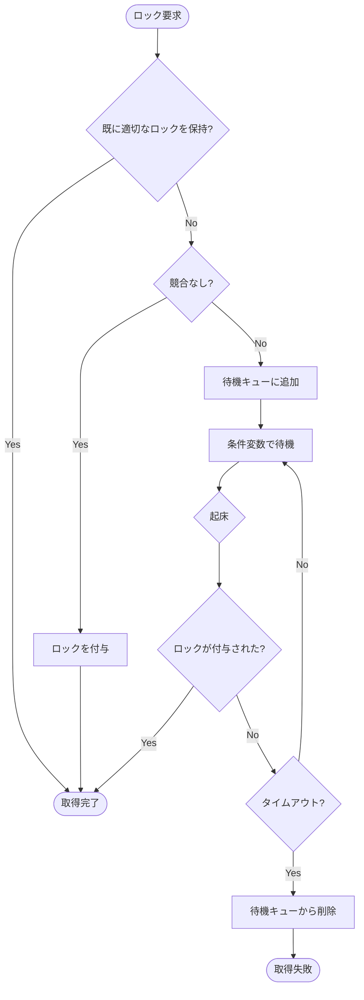

# ロック

## 概要

- ロック (Lock): トランザクションがデータアイテム (行など) に対して取得する論理的な排他制御。トランザクションの期間中保持され、COMMIT/ROLLBACK で解放される
- ラッチ (Latch): データ構造 (ページ、ハッシュテーブルなど) への物理的な排他制御。OS の Mutex に相当し、クリティカルセクションの間だけ短時間保持される
- ロックには、以下の 2 種類がある
  - Shared ロック: 読み取り専用のロックで、複数のトランザクションが同時に取得できる
  - Exclusive ロック: 書き込み用のロックで、1 つのトランザクションしか取得できない
- ロック取得のアルゴリズムには Strict Two-Phase Locking (Strict 2PL) を採用しており、トランザクションが COMMIT/ROLLBACK するまでロックを保持する ([Strict Two-Phase Locking の詳細](../../../about/isolation.md#cascading-abort-を防止するための-strict-two-phase-locking))

### ロックの競合

| | Shared を要求 | Exclusive を要求 |
| --- | --- | --- |
| 保持者なし | 競合しない | 競合しない |
| Shared のみ保持 | 競合しない | 競合する (待機) |
| Exclusive 保持 | 競合する (待機) | 競合する (待機) |

## ロック取得タイミング

- SELECT 時には、先に Shared Lock を取得してからテーブルを読み取る
- UPDATE/DELETE 時には、まず WHERE 句評価のために SELECT が走り、対象行に Shared Lock を取得する。その後、実際に行を更新/削除する前に Exclusive Lock に昇格する

## ロックの管理

- 行ごとのロック状態をロックテーブルで管理する
- 各エントリは「現在のロック保持者の一覧」と「待機キュー」で構成される
- 行はページ ID + スロット番号の組み合わせで一意に識別する

### ロック取得の流れ

- 「既に適切なロックを保持?」の判定: 以下のいずれかに該当する場合は、ロックを再取得する必要がない
  - 既に Exclusive Lock を保持している
  - 既に Shared Lock を保持していて、Shared Lock を要求している場合

- 「競合なし?」の判定: 以下のいずれかに該当する場合は、ロックを即座に付与できる
  - ロックを未保持の場合: 現在のロック保持者と競合せず、かつ待機キューが空
  - Shared → Exclusive への昇格: 自身が唯一の保持者

待機キューが空であることを条件に含めることで、先に待っているトランザクションを飛ばして取得する (FIFO 違反) のを防ぐ

### ロック待機の仕組み

- ロックが取得できない場合は、待機キューに追加して条件変数で待機する
- 条件変数の Wait は、ラッチ (Mutex) を解放してスレッドをスリープさせる。
  - 解放しないと他のスレッドがロックテーブルにアクセスできなくなり、デッドロックの原因になるため
- 条件変数は「何かが変わった」という通知を受け取る仕組みであり、特定のイベントとは紐づかない。Broadcast で全待機者を起床させるが、何が起きたかは起床した側が自分で判断する
  - ロック解放時とタイムアウト発生時の両方で同じ Broadcast が呼ばれる
- 起床したスレッドはラッチを再取得し、以下を確認する
  - 自身のロックが付与された → 処理を再開
  - タイムアウトした → 待機キューから削除してエラーを返す
  - どちらでもない → 再び Wait で待機する (spurious wakeup 対策として、必ずループで条件を再チェックする)

### 待機キューからのロック付与

ロック解放時に、待機キューの先頭から順にロック付与を試みる。以下のルールに従う

- ロック保持者がいなければ、待機キューの先頭のトランザクションにロックを付与
- Shared が要求された場合は、現在の保持者と競合しなければ付与 (連続する Shared を一度に付与)
- Exclusive が要求された場合は、保持者が空か、自身が唯一の保持者 (昇格) の場合のみ付与
- Exclusive の待機者に到達した時点で、それ以降のリクエスト (Shared を含む) は付与しない

最後のルールにより FIFO 順序を保証する。Exclusive を飛ばして後続の Shared を付与すると、Exclusive の待機者が永遠にロックを取得できない (starvation) 可能性がある

### ロック解放の流れ

Strict 2PL に従い、トランザクションの COMMIT/ROLLBACK 時に保持しているロックを一括解放する

1. 保持している各行のロックを順に解放する
2. 各行について、ロック解放により競合が解消された待機中のトランザクションにロックを付与する
3. 保持者も待機者もいなくなったエントリはロックテーブルから削除する
4. 条件変数で Broadcast し、待機中のトランザクションを起床させる (付与されたロックを認識させる)

#### 例: 待機キュー [S, S, X, S] の場合

| ステップ | 処理 | キュー | 保持者 |
| --- | --- | --- | --- |
| 初期状態 | (保持者なし) | [S, S, X, S] | {} |
| 1 | 先頭の S を付与 | [S, X, S] | {trx1: S} |
| 2 | 次の S も競合しないので付与 | [X, S] | {trx1: S, trx2: S} |
| 3 | X に到達 → 停止 | [X, S] | {trx1: S, trx2: S} |

## ロックの昇格

- 同じトランザクションが既に Shared Lock を保持している行に対して Exclusive Lock が必要になる場合がある
  - 例: SELECT で読んだ行を UPDATE する場合
- この場合、以下のルールに従ってロックの昇格を行う
  - 既に Exclusive Lock を保持している場合: 何もしない
  - 既に Shared Lock を保持していて、Shared Lock を要求している場合: 何もしない
  - 既に Shared Lock を保持していて、Exclusive Lock を要求している場合: 自分だけがロック保持者なら昇格可能。他のトランザクションも Shared Lock を保持している場合は待機する
    - 他のトランザクションが読み取り中のデータを書き換えて Non-Repeatable Read が発生するのを防ぐため
