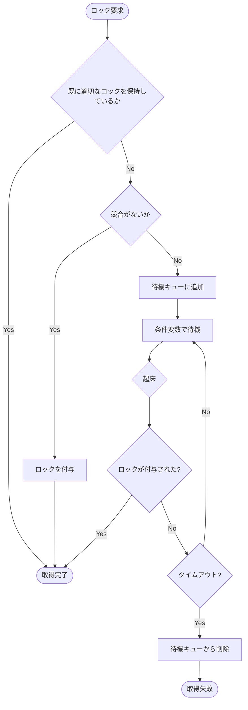

# ロック

## 概要

- ロック (Lock)
  - トランザクションがデータアイテム (レコードなど) に対して取得する論理的な排他制御
  - トランザクションの期間中保持され、COMMIT/ROLLBACK で解放される
- ラッチ (Latch)
  - データ構造 (ページ、ハッシュテーブルなど) への物理的な排他制御
  - OS の Mutex に相当し、クリティカルセクションの間だけ短時間保持される
- ロックには以下の 2 種類がある
  - Shared ロック: 読み取り専用のロックで、複数のトランザクションが同時に取得できる
  - Exclusive ロック: 書き込み用のロックで、1 つのトランザクションしか取得できない
- 読み取りは MVCC によってロックを取得せずに行い、書き込み競合制御にのみロックを使用する
- ロックの保持期間は Strict 2 Phase Lock (Strict 2PL) のルールに従い、トランザクションが COMMIT/ROLLBACK するまで保持する
  - 詳細: [Strict Two-Phase Locking](../../../about/isolation.md#cascading-abort-を防止するための-strict-two-phase-locking)

### ロックの競合

| - | Shared を要求 | Exclusive を要求 |
| --- | --- | --- |
| 保持者なし | 競合しない | 競合しない |
| Shared のみ保持 | 競合しない | 競合する (待機) |
| Exclusive 保持 | 競合する (待機) | 競合する (待機) |

## ロック取得タイミング

- SELECT は MVCC の Consistent Read により、ロックを取得せずに読み取る
- INSERT は挿入対象の行のキーに対して排他ロックを取得する
- UPDATE/DELETE は WHERE 句の評価はロックを取得せずに行い、実際に行を更新・削除する際に排他ロックを取得する
- ユニーク制約付きセカンダリインデックスに対する INSERT / 論理削除では、上記の行キー (セカンダリキー + プライマリキー) 単位のロックに加えて、セカンダリキーのみを識別子としたユニークキー単位の排他ロックを追加で取得する
  - 既存の未コミット論理削除 / 更新と同じセカンダリキーを並行して挿入しようとするケースを直列化するため
  - 異なるプライマリキーをまたいで同じセカンダリキーが衝突するケースでも、追加ロックにより一方が他方の完了を待つ
  - 取得タイミングは「ユニーク制約の重複確認の直前」。Strict 2PL によりトランザクション完了時に解放される
  - 非ユニークインデックスでは追加しない (重複が許容されるため)
- 外部キー制約チェックでは以下のロックを取得する
  - 子テーブルに対する INSERT/UPDATE
    - 参照先が並行する DELETE (または UPDATE) で不整合になることを防ぐために、参照先 (親テーブル) のレコードに対する共有ロックを取得する
  - 親テーブルに対する DELETE/UPDATE
    - 対象行の排他ロックを先に取得してから、参照元 (子テーブル) を検索する
    - 排他ロック保持中に検索するため、並行する INSERT が親行に共有ロックを取得しようとすると待機する (これにより孤立した子行の発生を防ぐ)
    - 参照元 (子テーブル) のセカンダリインデックスを prefix scan した結果の各レコードに、親トランザクションの共有ロックを取得する
    - 共有ロック保持中に同じレコードの状態を再評価する。これにより子側で進行中の論理削除 / 更新が完了するまで親側は待ち、コミット直後の最新状態を観測してから削除可否を判定する
    - Strict 2PL により、親トランザクションの COMMIT/ROLLBACK 時に解放する
    - 範囲ロック (gap lock 相当) は導入しない。並行 INSERT で新しい子行が後から増えるケースは MVCC の Read View で扱う

## ロックの管理

### 行ロックの識別子

- 行ロックは「対象のインデックスのメタページの PageId」と「そのインデックスにおける行のキー」の組で識別する
  - 各 B+Tree は固有のメタページを 1 つ持ち、その PageId は B+Tree を一意に識別する (詳細: [メタページ](../btree/meta-page.md))
  - クラスタ化インデックスでは主キーを、セカンダリインデックスではセカンダリキーと主キーを連結したバイト列を、それぞれその行のキーとして扱う
- 識別子は B+Tree 内でのレコードの物理的な格納位置 (リーフページのページ番号や slot 番号) には依存しない
  - 並行する INSERT で対象行よりキーが小さい新規レコードが先に挿入された結果、対象行が同じリーフページの後ろの slot にずれても、識別子は変わらず同じ論理的な行を指し続ける
- 同じテーブルに属する複数のインデックス (クラスタ化インデックスと複数のセカンダリインデックス) は同じヒープファイルにページが混在して格納されるが、識別子にメタページの PageId が含まれるため、同じバイト列のキーを持っていても別の識別子として扱われる

### ロックテーブル

- 行ロックの識別子ごとのロック状態をロックテーブルで管理する
- 各エントリは「現在のロック保持者の一覧」と「待機キュー」で構成される

```mermaid
flowchart TD
    Start([ロック要求]) --> CheckHeld{既に適切なロックを保持しているか}
    CheckHeld -- "Yes" --> OK([取得完了])
    CheckHeld -- "No" --> CheckGrant{競合がないか}
    CheckGrant -- "Yes" --> Grant[ロックを付与]
    Grant --> OK
    CheckGrant -- "No" --> Enqueue[待機キューに追加]
    Enqueue --> Wait[条件変数で待機]
    Wait --> Wakeup{起床}
    Wakeup --> CheckGranted{ロックが付与された?}
    CheckGranted -- "Yes" --> OK
    CheckGranted -- "No" --> CheckTimeout{タイムアウト?}
    CheckTimeout -- "Yes" --> Remove[待機キューから削除]
    Remove --> Fail([取得失敗])
    CheckTimeout -- "No" --> Wait
```

- 「既に適切なロックを保持しているか」の判定
  - 以下のいずれかに該当する場合は、ロックを再取得する必要がない
    - 既に Exclusive Lock を保持している場合 (Exclusive は Shared を包含するため、Shared の要求も満たす)
    - 既に Shared Lock を保持していて、Shared Lock を要求している場合

- 「競合がないか」の判定
  - 以下のいずれかに該当する場合は、ロックを即座に付与できる
    - ロックを未保持の場合: 現在のロック保持者と競合せず、かつ待機キューが空
    - Shared -> Exclusive への昇格を要求している場合: 自分が唯一の保持者

待機キューを挟むことで、先に待っているトランザクションを飛ばして取得するのを防ぐ (FIFO 違反を防ぐ)

### ロック待機の仕組み

- ロックが取得できない場合は、待機キューに追加して条件変数で待機する
- 条件変数の Wait は、ロックテーブルを保護する内部のラッチ (Mutex) を解放してスレッドをスリープさせる
  - 解放しないと他のスレッドがロックテーブルにアクセスできなくなり、デッドロックの原因になるため
  - これはロックテーブル内部の短時間の排他制御であり、後述する呼び出し側が保持するページのラッチとは別物である
- 条件変数は「何かが変わった」という通知を受け取る仕組みであり、特定のイベントとは紐づかない
  - ロック解放時とタイムアウト発生時の両方で同じ Broadcast が呼ばれる
  - Broadcast で全待機者を起床させるが、何が起きたかは起床した側が自分で判断する
- 起床したスレッドは内部のラッチを再取得し、以下を確認する
  - 自身のロックが付与された -> 処理を再開
  - タイムアウトした -> 待機キューから削除してエラーを返す
  - どちらでもない -> 再び Wait で待機する (spurious wakeup 対策として、必ずループで条件を再チェックする)

### 呼び出し側がページのラッチを保持している場合の 2 段階の待機

- UPDATE/DELETE の Current Read のように、行ロックの要求元が B+Tree のページのラッチを保持した状態でロックを要求することがある
- このとき、ラッチを保持したまま待機に入ると、待機中のトランザクションが保持し続けるそのページに対して、フラッシュや他のページ操作が必要になった別のトランザクションが進めなくなり、デッドロックの原因になる
- これを避けるため、ロック待機を 2 段階に分ける
  1. ロックの即時付与を判定し、付与できなければ待機キューへ登録した上で、いったん制御を呼び出し側に返す
  2. 呼び出し側は保持しているページのラッチを解放してから、改めて待機に入る
- 即時付与の判定と待機キューへの登録は 1 つの内部の排他区間でまとめて行う (原子的に行う)
  - 判定と登録の間に他のトランザクションが割り込むと、待機キューの順序が乱れて FIFO が崩れるため
- 待機に入った後の流れ (条件変数による起床・タイムアウト・spurious wakeup の再チェック) は前述のとおり

### 待機キューからのロック付与

ロック解放時には、以下のルールに従って待機キューの先頭から順にロック付与を試みる

- ロック保持者がいなければ、待機キューの先頭のトランザクションにロックを付与
- Shared が要求された場合は、現在の保持者と競合しなければ付与する (連続する Shared を一度に付与する)
- Exclusive が要求された場合は、保持者が空か、自身が唯一の保持者 (Shared -> Exclusive の昇格) の場合のみ付与する
- Exclusive の待機者に到達した時点で、それ以降のリクエスト (Shared 含む) は付与しない

最後のルールにより FIFO 順序を保証する。Exclusive を飛ばして後続の Shared を付与すると、Exclusive の待機者が永遠にロックを取得できない可能性がある

### ロック解放時の流れ

トランザクションの COMMIT/ROLLBACK 時に保持しているロックを一括解放する

1. 保持している各行のロックを順に解放する
2. 各行について、ロック解放により競合が解消された待機中のトランザクションにロックを付与する
3. 保持者も待機者もいなくなったエントリはロックテーブルから削除する
4. 条件変数で Broadcast し、待機中のトランザクションを起床させる

#### 例: 待機キュー [S, S, X, S] の場合

| ステップ | 処理 | キュー | 保持者 |
| --- | --- | --- | --- |
| 初期状態 | (保持者なし) | [S, S, X, S] | {} |
| 1 | 先頭の S を付与 | [S, X, S] | {trx1: S} |
| 2 | 次の S も競合しないので付与 | [X, S] | {trx1: S, trx2: S} |
| 3 | X に到達 → 停止 | [X, S] | {trx1: S, trx2: S} |
