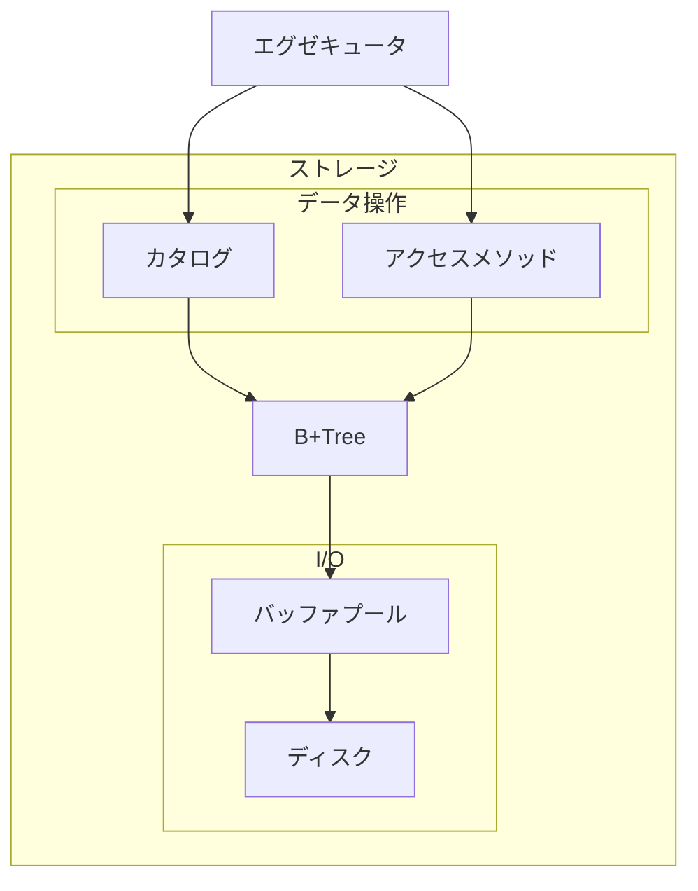

# ストレージ

## 概要

- [ディスク](./disk.md)
- [バッファプール](./bufferpool.md)
- [B+Tree](./b+tree/b+tree.md)
- [アクセスメソッド](./access-method.md)
- [カタログ](./catalog.md)

- エグゼキュータはカタログからテーブル定義を参照し、アクセスメソッドを通じてデータを操作
- カタログとアクセスメソッドはどちらも B+Tree を使ってデータを読み書きする
- B+Tree はバッファプールを介してページを取得・更新する
- バッファプールはページをメモリ上にキャッシュし、必要に応じてディスクと読み書きする
