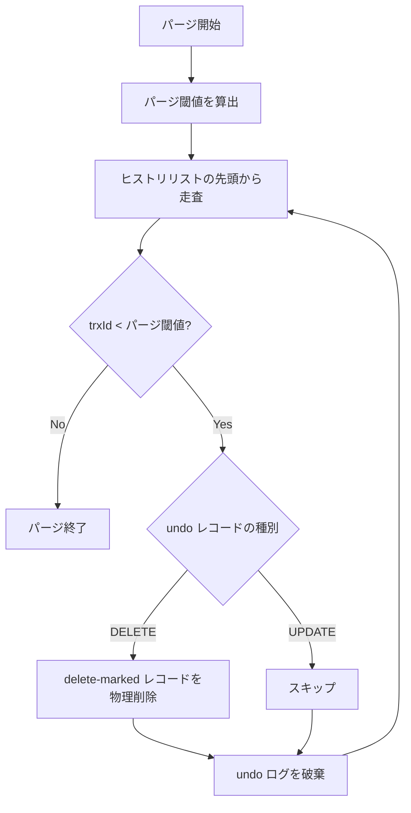

# パージスレッド

## 参考文献

- [InnoDB Multi-Versioning - MySQL 8.0 Reference Manual](https://dev.mysql.com/doc/refman/8.0/en/innodb-multi-versioning.html)
- [Purge Configuration - MySQL 8.0 Reference Manual](https://dev.mysql.com/doc/refman/8.0/en/innodb-purge-configuration.html)
- [The basics of the InnoDB undo logging and history system](https://blog.jcole.us/2014/04/16/the-basics-of-the-innodb-undo-logging-and-history-system/) - ヒストリリスト、パージの仕組み、UNDO ログのライフサイクル

## 概要

パージは、MVCC で不要になったデータをバックグラウンドで回収する処理。以下の 2 つの責務を持つ

1. delete-marked レコードの物理削除 (クラスタ化インデックス + セカンダリインデックス)
2. 不要になった UPDATE/DELETE の undo ログの破棄

> InnoDB does not physically remove a row from the database immediately when you delete it with an SQL statement. A row and its index records are only physically removed when InnoDB discards the undo log record written for the deletion. This removal operation, which only occurs after the row is no longer required for multi-version concurrency control (MVCC) or rollback, is called a purge.\
> --- [Purge Configuration](https://dev.mysql.com/doc/refman/8.0/en/innodb-purge-configuration.html)

### パージが必要な理由

- DELETE で行を削除しても、他のトランザクションの Consistent Read がまだその行を見ている可能性がある。そのため即座に物理削除せず、deleteMark を設定するだけに留めている
- UPDATE/DELETE の undo ログも同様に、他のトランザクションが undo チェーンを辿って旧バージョンを復元するのに必要なため、即座には破棄できない
- パージがなければ、delete-marked レコードと undo ログが蓄積し続け、ディスク容量を浪費する

※ INSERT の undo ログはコミット時に即座に破棄される (パージスレッドは関与しない)\
INSERT で作られた行に旧バージョンは存在しないため、他のトランザクションが参照することがない

> Insert undo log records are needed only in transaction rollback. They can be discarded as soon as the transaction commits.\
> Update undo log records are used also in consistent reads, but they can be discarded only after there is no transaction present for which InnoDB has assigned a snapshot that in a consistent read could require the information in the update undo log record to build an earlier version of a database row.\
> --- [InnoDB Multi-Versioning](https://dev.mysql.com/doc/refman/8.0/en/innodb-multi-versioning.html)

### 実行タイミング

パージはバックグラウンドの goroutine で定期的に実行する

InnoDB ではパージスレッド数やバッチサイズを設定変数で制御するが、MineSQL では単一スレッドで定期実行するシンプルな実装とする

## パージ可否の判定

### パージ閾値

- パージ可否は「パージ閾値 (purge limit)」によって判定する
- パージ閾値は、全アクティブ ReadView の `mUpLimitId` の最小値
- 可否の判定は以下の通り
  - undo レコードの trxId がパージ閾値より小さい → パージ可能 (どの ReadView からも参照されない)
  - undo レコードの trxId がパージ閾値以上 → パージ不可 (いずれかの ReadView から参照される可能性がある)
  - アクティブな ReadView が 1 つも存在しない場合 → コミット済みの undo レコードはすべてパージ可能

```text
例: アクティブな ReadView が 2 つ (mUpLimitId=5 と mUpLimitId=10)

パージ閾値 = min(5, 10) = 5

trxId=3 の undo レコード → 3 < 5 → パージ可能
trxId=5 の undo レコード → 5 >= 5 → パージ不可
trxId=8 の undo レコード → 8 >= 5 → パージ不可
```

### delete-marked レコードの物理削除条件

delete-marked レコードの物理削除も同じパージ閾値で判定する

- 行の `lastModified` がパージ閾値より小さい場合のみ物理削除可能
  - パージ閾値以上の場合、他の ReadView がまだその行の削除前バージョンを見ている可能性があるため、物理削除できない

## パージの対象

### 1. クラスタ化インデックスの delete-marked レコード

- deleteMark=1 かつ `lastModified` がパージ閾値より小さいレコードを B+Tree から物理削除する

### 2. セカンダリインデックスの delete-marked レコード

- セカンダリインデックスは in-place 更新されない。UPDATE 時は旧レコードが delete-marked され、新レコードが挿入される。パージ時にこの delete-marked レコードを物理削除する

> Unlike clustered index records, secondary index records do not contain hidden system columns nor are they updated in-place.\
> When a secondary index column is updated, old secondary index records are delete-marked, new records are inserted, and delete-marked records are eventually purged.\
> --- [InnoDB Multi-Versioning](https://dev.mysql.com/doc/refman/8.0/en/innodb-multi-versioning.html)

### 3. UPDATE/DELETE の undo ログ

- 上記の物理削除が完了した後、対応する undo ログを破棄する

## パージの処理フロー

コミット済みトランザクションの undo ログはヒストリリスト (History list) と呼ばれるリストでコミット順に管理される

> Purge runs on a periodic schedule. It parses and processes undo log pages from the history list, which is a list of undo log pages for committed transactions that is maintained by the InnoDB transaction system. Purge frees the undo log pages from the history list after processing them.\
> --- [Purge Configuration](https://dev.mysql.com/doc/refman/8.0/en/innodb-purge-configuration.html)

<div />

> As each transaction is committed, its history is linked into this global history list in transaction serialization (commit) order.\
> --- [The basics of the InnoDB undo logging and history system](https://blog.jcole.us/2014/04/16/the-basics-of-the-innodb-undo-logging-and-history-system/)

パージの処理フローは以下の通り:

1. パージ閾値を算出する (全アクティブ ReadView の `mUpLimitId` の最小値)
2. ヒストリリストを古い順に走査する
3. 各 undo レコードについて:
   - trxId がパージ閾値以上であれば走査を終了 (これ以降はすべてパージ不可)
   - DELETE の undo レコードの場合: 対応する行の deleteMark が設定されていれば、クラスタ化インデックスとセカンダリインデックスから物理削除する
   - UPDATE の undo レコードの場合: 物理削除は不要 (行自体はまだ有効)
4. 処理済みの undo ログを破棄する


