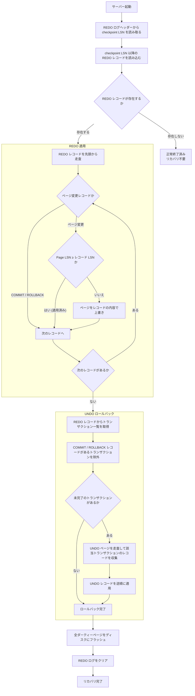

# クラッシュリカバリ

## 概要

- 異常終了時、バッファプール上のダーティーページはディスクに反映されていない可能性がある
- クラッシュリカバリは、異常終了後の再起動時にディスク上のデータを整合性のある状態に復元する処理
- REDO ログの適用でコミット済みの変更を復元し、UNDO ログの適用で未完了の変更を取り消す
- [チェックポイント](../access/checkpoint.md) LSN を起点とすることで、走査範囲を限定する

## リカバリの流れ

