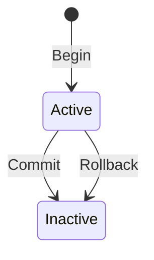

# トランザクション

## 参考文献

- [Isolation (分離レベル)](../../../about/isolation.md)
- [Durability (永続性)](../../../about/durability.md)

## 概要

- トランザクションは、データベースに対する複数の操作を 1 つの論理的な単位として扱うための仕組み
  - ACID 特性 (Atomicity / Consistency / Isolation / Durability) を実現するための基盤
- 1 つのトランザクションは「トランザクション ID」で一意に識別される
- トランザクション ID は、トランザクション開始時に単調増加で払い出される

## トランザクションのライフサイクル

トランザクションは以下の 3 つの状態を取り、状態遷移は Begin / Commit / Rollback の各操作で行われる

- Active: トランザクションが進行中の状態
- Inactive: トランザクションが完了 (コミットまたはロールバック) した状態
  - 完了後もトランザクションの情報 (ID) は、[パージ](../access/purge.md)が必要かどうかを判定するためにしばらく保持される

### Begin (トランザクション開始)

1. 新しいトランザクション ID を払い出す
2. アクティブトランザクション一覧に当該トランザクションを Active 状態として登録する

トランザクション開始時点では、[ReadView](../access/mvcc.md#readview) は作成されない (後述)

### Commit (コミット)

1. Redo ログに Commit レコードを追加する
2. ログバッファをディスクにフラッシュする (fsync を含む)
3. 保持している全ロックを解放する
4. INSERT 用の Undo ログレコードを破棄する
5. アクティブトランザクション一覧から当該トランザクションを Inactive 状態へ遷移させる

ステップ 2 のフラッシュ完了時点で、当該トランザクションの変更内容がディスクに永続化される ([Durability](../../../about/durability.md) の保証境界)

INSERT 用 Undo ログを即時破棄できる根拠は[MVCC: Undo ログの寿命](../access/mvcc.md#undo-ログの寿命)を参照

### Rollback (ロールバック)

1. Redo ログに Rollback レコードを追加する (ディスクへのフラッシュは行わない)
2. 当該トランザクションが書き込んだ Undo ログレコードを、操作順の逆順 (LIFO) で適用してバッファプール上のデータページを元に戻す
3. 保持している全ロックを解放する
4. Undo ログレコードを全て破棄する
5. アクティブトランザクション一覧から当該トランザクションを Inactive 状態へ遷移させる

ロールバック中のデータページ書き戻しに対しては、専用の Redo レコード (CLR: Compensation Log Record) は記録しない。Rollback レコードもログバッファに追加されるのみでフラッシュされない。リカバリ時には、Redo ログ上に COMMIT または ROLLBACK が記録されているかどうかでトランザクションの完了/未完了を判定する (詳細は[クラッシュリカバリ](../access/crash-recovery.md))

## アクティブトランザクション一覧

- 現在進行中のトランザクションを管理するための一覧
- 用途:
  - ReadView 作成時に「自分以外のアクティブなトランザクション ID 集合」を取得するため
  - パージ可否判定で「最古の ReadView」を求めるため

## ReadView の作成

- ReadView はトランザクションごとに 1 つだけ作成され、以降の検索 (Consistent Read) で同じ ReadView を使い回す ([REPEATABLE READ](../../../about/isolation.md) の実現)
- 作成時点で「自分以外のアクティブなトランザクション ID の集合」と「次に払い出されるトランザクション ID」をスナップショットとして記録する
- 現状の実装では ReadView は明示的に作成された場合のみ存在する (検索経路への配線は未実装)。SELECT 経路と ReadView の連携については[MVCC](../access/mvcc.md) を参照

## 他コンポーネントとの関係

トランザクションは、ストレージ層の複数コンポーネントを横断する概念。各コンポーネントとの責務分担は以下のとおり

| コンポーネント | トランザクションとの関わり |
| --- | --- |
| [ロック](../lock/lock.md) | 書き込み操作で行ロックを取得し、COMMIT または ROLLBACK のタイミングで一括解放する ([Strict 2PL](../../../about/isolation.md#cascading-abort-を防止するための-strict-two-phase-locking)) |
| [Redo ログ](../log/redo.md) | データ変更ごとに Redo レコードを追加。COMMIT 時にフラッシュして永続化を保証する |
| [Undo ログ](../log/undo.md) | データ変更前の状態を Undo レコードとして記録。ROLLBACK 時の元の状態への復元、および MVCC のバージョンチェーンの構築に使用する |
| [MVCC](../access/mvcc.md) | ReadView を介した可視性判定により、書き込み中のトランザクションを待たずに過去の一貫したスナップショットを読める |
| [パージ](../access/purge.md) | コミット済みかつどの ReadView からも参照されなくなった Undo ログを回収する |

## ロック取得と解放のタイミング

トランザクションが保持するロックの取得と解放には、Strict 2PL に基づく以下の制約がある

- ロックはトランザクションのライフサイクル中に随時取得される (例: 書き込み操作の B+Tree 操作内)
- 一度取得したロックは、トランザクションの COMMIT または ROLLBACK までに解放されない (Strict 2PL の不変条件)
- COMMIT または ROLLBACK 時に、保持中の全ロックを一括解放する

ロックの低レベル API は[ロックマネージャ](../lock/lock.md)が提供する。ロックマネージャ自体は COMMIT/ROLLBACK の概念を持たず、解放タイミングの決定はトランザクションを管理する側 (本ドキュメントの主体) が責任を持つ

## Undo ログの寿命とトランザクション完了

トランザクション完了時の Undo ログレコードの扱いは、種別ごとに異なる

| 種別 | COMMIT 時 | ROLLBACK 時 |
| --- | --- | --- |
| INSERT | 即破棄 (他トランザクションが Undo チェーンを辿る必要がないため) | 全破棄 |
| UPDATE / DELETE | パージで回収されるまで保持 | 全破棄 |

UPDATE / DELETE の Undo レコードを残す理由は、他のトランザクションの ReadView から[バージョンチェーン](../access/mvcc.md#バージョンチェーン)を辿るために必要だから。回収のタイミングについては[パージ](../access/purge.md)を参照

## クラッシュ時のトランザクション扱い

クラッシュ後の再起動 (クラッシュリカバリ) では、Redo ログを使ってトランザクションの完了状態を判定する

- COMMIT レコードが Redo ログに到達しているトランザクション: コミット済みとして扱い、その変更を Redo 適用で復元する
- ROLLBACK レコードが Redo ログに到達しているトランザクション: ロールバック済みとして扱う
- いずれも到達していないトランザクション (= 未完了): クラッシュ時点で進行中だったとみなし、Undo ログを逆順に適用してロールバックする

詳細は[クラッシュリカバリ](../access/crash-recovery.md)を参照
