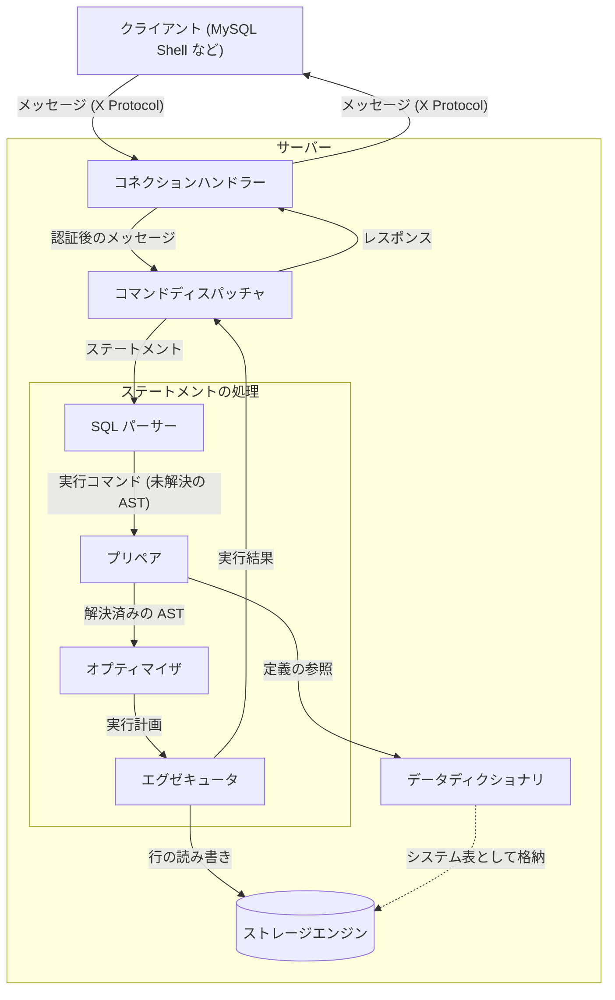

# MineSQL 仕様

## 全体像

クライアントからのメッセージは次の順に流れる

※プロトコル (X Protocol) は図の箱ではなく、クライアントとサーバーの間で交わすメッセージの規約で、コネクションハンドラーとコマンドディスパッチャが使う

## モジュール

| モジュール | 何をするか | 仕様の場所 |
| --- | --- | --- |
| プロトコル | クライアントとサーバーの間で交わすメッセージの形式と流れの規約 (X Protocol) | [protocol/](./protocol/README.md) |
| コネクションハンドラー | 接続の受付から認証、セッションの確立と切断まで | [connection/](./connection/README.md) |
| コマンドディスパッチャ | メッセージの種別ごとの振り分けと、実行結果のレスポンスとしての返送 | [dispatcher/](./dispatcher/README.md) |
| SQL パーサー | ステートメントの文字列から AST を作り、実行コマンドに包む | [parser/](./parser/README.md) |
| データディクショナリ | スキーマ・テーブル・列・インデックスの定義の保持 | `dictionary/` |
| プリペア | 名前解決と型決定、権限の検査 | `prepare/` |
| オプティマイザ | 実行計画の選択 | `optimizer/` |
| エグゼキュータ | 実行計画の実行と結果の返送 | `executor/` |
| ストレージエンジン | 行とインデックスの永続化、トランザクション、ロック、ログ | `storage/` |

- SQL パーサーからエグゼキュータまで (ステートメントの処理) を「SQL 層」と総称する
