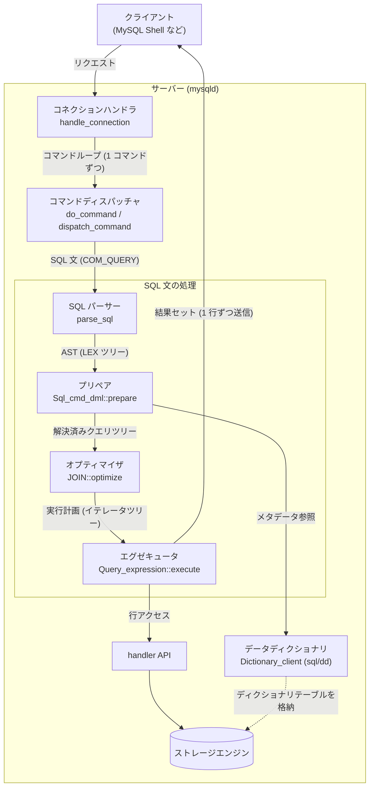
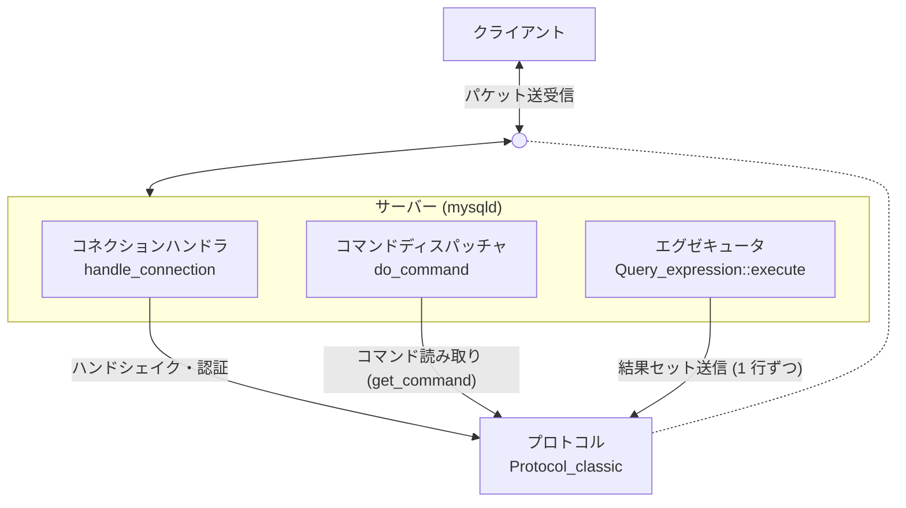

# MineSQL 仕様

## メイン機能

- プロトコル
- コネクションハンドラー
- コマンドディスパッチャ
- SQL パーサー
- プリペア
- オプティマイザ
- エグゼキュータ
- データディクショナリ
- ストレージエンジン

### 全体像

### プロトコル

#### 機能

- MySQL クライアント/サーバープロトコルの実装
  - クライアントとの間で送受信するパケットの読み書き (フレーミング) を担う
  - 接続確立時のハンドシェイクパケットの送信
  - コマンドパケットの読み取り (先頭 1 バイトのコマンドコードの取り出し)
  - 実行結果の送信 (OK / ERR / EOF パケットと、カラム定義 + 行データからなる結果セット)
- 横断ドメイン
  - コネクションハンドラー (ハンドシェイク)・コマンドディスパッチャ (コマンド読み取り)・エグゼキュータ (行送信) がそれぞれこのドメインを利用する

#### 命名の由来

- MySQL の公式用語 (MySQL Client/Server Protocol)
  - ソースコード上も `Protocol` / `Protocol_classic` クラスがこの役割を担っているため

#### 参考

- [`sql/protocol_classic.cc`](https://github.com/mysql/mysql-server/blob/8.4/sql/protocol_classic.cc) (`Protocol_classic::get_command`, `net_send_ok`, `net_send_error`, `net_send_eof`)
- [`sql-common/net_serv.cc`](https://github.com/mysql/mysql-server/blob/8.4/sql-common/net_serv.cc) (パケットの低レベル読み書き)
- [`sql/auth/sql_authentication.cc`](https://github.com/mysql/mysql-server/blob/8.4/sql/auth/sql_authentication.cc) (`send_server_handshake_packet`)

### コネクションハンドラー

#### 機能

- ネットワーク接続
  - クライアントからの TCP 接続を受け付け、接続ごとの実行コンテキストを用意する
  - 1 接続につき 1 OS スレッドを割り当てる (thread-per-connection)
  - 接続が切れるまでコマンドループを回し、要求を 1 コマンドずつコマンドディスパッチャに渡す
- ユーザー認証
  - 接続確立時にハンドシェイクと認証を行う
- 権限管理
  - このユーザーがこのホストから接続してよいかを判定する
  - SQL 文単位の権限チェックは担当しない (プリペアの責務)

#### 命名の由来

- MySQL のソースコードで接続受け付けを担うクラスが `Connection_handler` であり (スレッド割り当て方式ごとに `Per_thread_connection_handler` などの実装がある)、ディレクトリ名も `sql/conn_handler/` であるため

#### 参考

- [MySQL Connection Handling and Scaling](https://dev.mysql.com/blog-archive/mysql-connection-handling-and-scaling/)
- [`sql/conn_handler/connection_handler_per_thread.cc`](https://github.com/mysql/mysql-server/blob/8.4/sql/conn_handler/connection_handler_per_thread.cc) (`handle_connection`)
- [`sql/sql_connect.cc`](https://github.com/mysql/mysql-server/blob/8.4/sql/sql_connect.cc) (`thd_prepare_connection` → `check_connection` → `acl_authenticate`)

### コマンドディスパッチャ

#### 機能

- コマンドの読み取りと振り分け
  - `do_command` がネットワークからコマンド 1 個分のパケットを読み取り、`dispatch_command` が種別ごとに分岐する
    - 種別 (= コマンドの種類) はパケットの先頭 1 バイトに入っているコマンドコードのことで、`enum_server_command` に定義されている (SQL 文の実行は `COM_QUERY`、他に `COM_PING`、`COM_QUIT`、`COM_STMT_PREPARE` など)
  - MySQL プロトコルでは、接続確立後のクライアントの要求はすべて「コマンド」として送られる
- コネクションハンドラと SQL パーサーの仲介
  - SQL 文の実行 (`COM_QUERY`) は数あるコマンドの 1 種別にすぎず、この場合のみ SQL パーサー以降の処理に入る
  - コネクションハンドラと SQL パーサーは直接つながっておらず、このモジュールが間を仲介する

#### 命名の由来

- 振り分けを行う MySQL の関数名 `dispatch_command` から
  - プロトコル上の要求単位が「コマンド」であり、それを種別ごとに振り分ける (dispatch する) 役割のため

#### 参考

- [`sql/sql_parse.cc`](https://github.com/mysql/mysql-server/blob/8.4/sql/sql_parse.cc) (`do_command`, `dispatch_command`)
- [`include/my_command.h`](https://github.com/mysql/mysql-server/blob/8.4/include/my_command.h) (`enum_server_command`)

### SQL パーサー

#### 機能

- SQL 文の構文解析
  - SQL 文字列を字句解析・構文解析し、AST (抽象構文木) を構築する
  - 文法は yacc/bison 形式の `sql/sql_yacc.yy` に定義されており、`parse_sql` がパーサーを起動して LEX ツリー (`LEX` / `Query_block` などからなる内部表現) を構築する
  - この段階で確定するのは「構文として正しいか」だけで、テーブルやカラムが実在するかの検査は行わない (それはプリペアの役割)

#### 命名の由来

- コンパイラ一般の用語 (parser)
  - MySQL でも `parse_sql` / `THD::sql_parser` という名前が使われているため

#### 参考

- [`sql/sql_yacc.yy`](https://github.com/mysql/mysql-server/blob/8.4/sql/sql_yacc.yy)
- [`sql/sql_parse.cc`](https://github.com/mysql/mysql-server/blob/8.4/sql/sql_parse.cc) (`parse_sql`)

### プリペア

#### 機能

- AST の意味解析と束縛
  - パーサーが構築した AST を意味解析し、実行可能な形に束縛する
  - テーブル・ビューを開く (ビューの展開を含む)
  - SQL 文中のテーブル名・カラム名を実際のメタデータに解決する (名前解決)
  - 式の型解決と SQL 文単位の権限チェックを行う
  - サブクエリ・derived table を変換する (マージするか実体化するか)
- 存在検査
  - 「テーブルが存在しない」「カラムが存在しない」といったエラーはパーサーではなくこの段階で検出される

#### 命名の由来

- MySQL の該当メソッド名 `Sql_cmd_dml::prepare` / `Query_block::prepare` から
  - プリペアドステートメントの `PREPARE` で行われる工程と同一であり、通常のクエリでも実行のたびに同じ prepare が呼ばれるため

#### 参考

- [`sql/sql_select.cc`](https://github.com/mysql/mysql-server/blob/8.4/sql/sql_select.cc) (`Sql_cmd_dml::prepare`)
- [`sql/sql_resolver.cc`](https://github.com/mysql/mysql-server/blob/8.4/sql/sql_resolver.cc) (`Query_block::prepare`)

### オプティマイザ

#### 機能

- 実行計画の作成
  - プリペア済みのクエリツリーから、最も低コストと推定される実行計画を作る
  - `JOIN::optimize` は以下の段階を踏む:
    1. 論理変換 (外部結合から内部結合への変換、等価・定数伝播、パーティションプルーニングなど)
    2. コストベース最適化 (テーブルの結合順序とアクセスパスの選択)
    3. 結合順序決定後の最適化 (WHERE / 結合条件からのテーブル条件生成、ORDER BY / DISTINCT の最適化)
    4. 実行準備 (アクセス関数の設定、GROUP BY / ソート用一時テーブルの準備)
  - クエリブロックごとに `JOIN` オブジェクトが作られ、テーブルが 1 個だけの SELECT も「N = 1 の結合」として同じ経路を通る

#### 命名の由来

- RDB 一般の用語 (optimizer)
  - MySQL でもソースファイル名が `sql/sql_optimizer.cc` であるため

#### 参考

- [`sql/sql_optimizer.cc`](https://github.com/mysql/mysql-server/blob/8.4/sql/sql_optimizer.cc) (`JOIN::optimize` の doc コメントに最適化フェーズの一覧がある)

### エグゼキュータ

#### 機能

- 実行計画の実行
  - 実行計画に従って (ストレージエンジンにアクセスし) 処理を実行する
  - テーブルスキャン・インデックススキャン・結合・ソートなどの操作がそれぞれ `RowIterator` インターフェースを実装したイテレータとして表現され、実行計画はそのイテレータのツリーになっている
  - ルートイテレータの `Read()` を繰り返し呼び、1 行取得するたびにその行をクライアントへ送信する (結果セットをサーバー側に溜め込まない)
- ストレージエンジンへのアクセス
  - 行の読み書き自体はイテレータが handler API (例: テーブルスキャンなら `ha_rnd_next`) を通してストレージエンジンに依頼する

#### 命名の由来

- RDB 一般の用語 (executor)。MySQL のソース上の対応は `Query_expression::execute` と `sql/iterators/` 配下のイテレータ群

#### 参考

- [`sql/sql_union.cc`](https://github.com/mysql/mysql-server/blob/8.4/sql/sql_union.cc) (`Query_expression::execute`, `ExecuteIteratorQuery`)
- [`sql/iterators/row_iterator.h`](https://github.com/mysql/mysql-server/blob/8.4/sql/iterators/row_iterator.h) (`RowIterator`)

### データディクショナリ

#### 機能

- メタデータの管理
  - テーブル・カラム・インデックスなどの定義 (メタデータ) を永続化し、プリペアの名前解決などから参照させる
  - ディクショナリテーブル自体が InnoDB 上のテーブルとして格納される (テーブル定義に `ENGINE=INNODB` が指定されている)
  - メタデータオブジェクトの取得はキャッシュ (`sql/dd/cache/` の `Dictionary_client`) を経由する
- DDL の実行
  - CREATE TABLE (SELECT 部を伴わないもの) はパーサーを通った後、オプティマイザ・エグゼキュータを通らず `Sql_cmd_create_table::execute` → `mysql_create_table` が直接処理する

#### 命名の由来

- MySQL の公式用語 (data dictionary)
  - ソースコード上も `sql/dd/` ディレクトリ (namespace `dd`) が該当するため

#### 参考

- [`sql/dd/impl/tables/`](https://github.com/mysql/mysql-server/tree/8.4/sql/dd/impl/tables) (ディクショナリテーブルの定義: `tables.h`, `columns.h`, `indexes.h` など)
- [`sql/dd/cache/dictionary_client.h`](https://github.com/mysql/mysql-server/blob/8.4/sql/dd/cache/dictionary_client.h) (`Dictionary_client`)
- [`sql/dd/impl/types/object_table_impl.cc`](https://github.com/mysql/mysql-server/blob/8.4/sql/dd/impl/types/object_table_impl.cc) (`ENGINE=INNODB` 指定)
- [`sql/sql_cmd_ddl_table.cc`](https://github.com/mysql/mysql-server/blob/8.4/sql/sql_cmd_ddl_table.cc) (`Sql_cmd_create_table::execute`)

### ストレージエンジン

#### 機能

- 行データの永続化と読み書き。以下の要素を含む:
  - ディスク
  - バッファプール
  - ログ
    - Redo ログ
    - Undo ログ
  - トランザクション
  - ロック
- サーバー層との分離 (プラガブルストレージエンジン方式)
  - サーバー層 (パーサー〜エグゼキュータ) とストレージエンジンは handler API (`handler` クラス・`handlerton` 構造体) で分離されている
  - エグゼキュータは handler のメソッドを呼ぶだけで、行の物理配置・インデックス構造や上記の要素はエンジン側が実装する
  - デフォルトエンジンの InnoDB は `storage/innobase/` にあり、`ha_innobase` クラスが handler API を実装している

#### 命名の由来

- MySQL の公式用語 (storage engine)。`storage/` ディレクトリ配下には InnoDB のほか MyISAM、CSV、ARCHIVE などのエンジンが並び、差し替え可能な構造になっているため

#### 参考

- [`sql/handler.h`](https://github.com/mysql/mysql-server/blob/8.4/sql/handler.h) (`handler`, `handlerton`)
- [`storage/innobase/handler/ha_innodb.h`](https://github.com/mysql/mysql-server/blob/8.4/storage/innobase/handler/ha_innodb.h) (`ha_innobase`)
