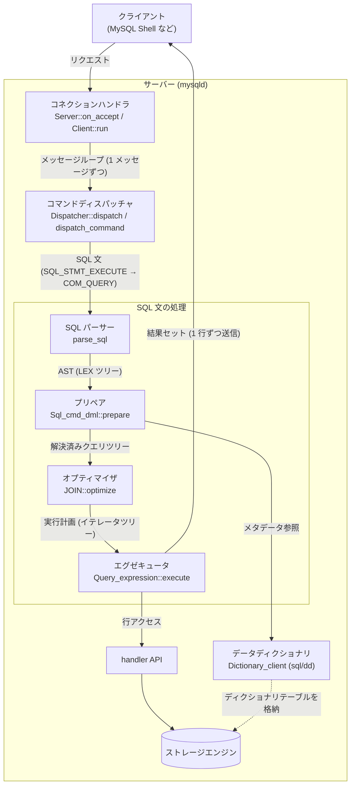
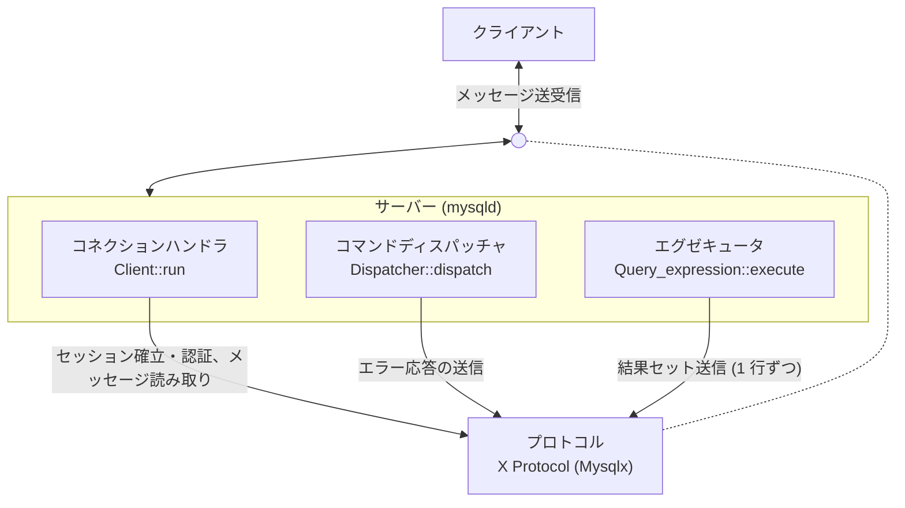

# MineSQL 仕様

## メイン機能

- プロトコル
- コネクションハンドラー
- コマンドディスパッチャ
- SQL パーサー
- データディクショナリ
- プリペア
- オプティマイザ
- エグゼキュータ
- ストレージエンジン

### 全体像

### プロトコル

#### 機能

- X Protocol (protobuf ベースのクライアント/サーバープロトコル) の実装
  - クライアントとの間で送受信するメッセージの読み書き (フレーミング) を担う
  - メッセージは「4 バイトの長さ (リトルエンディアン) + 1 バイトのメッセージ種別 + protobuf でエンコードされたペイロード」で構成される
  - メッセージシーケンスは常にクライアント側のメッセージ (`Mysqlx.ClientMessages`) から始まる
  - セッション確立時は capability の交換 (`CON_CAPABILITIES_GET` / `CON_CAPABILITIES_SET`) と SASL 認証 (`SESS_AUTHENTICATE_START` / `SESS_AUTHENTICATE_CONTINUE`) を行う
    - 認証メカニズムは `MYSQL41` / `PLAIN` / `SHA256_MEMORY` の 3 種
  - SQL 文の実行要求は `SQL_STMT_EXECUTE` メッセージで送られる
  - 実行結果はカラム定義 (`ColumnMetaData`) + 行データ (`Row`) + 終端 (`FetchDone`, `StmtExecuteOk`) の列で送信され、エラーは `Error` メッセージで通知される
- 横断ドメイン
  - コネクションハンドラー (セッション確立・認証とメッセージ読み取り)・コマンドディスパッチャ (エラー応答の送信)・エグゼキュータ (行送信) がそれぞれこのドメインを利用する

#### 命名の由来

- MySQL の公式用語 (X Protocol)
  - ソースコード上も X Plugin (`plugin/x/`) がこのプロトコルを実装しており、protobuf メッセージ定義の namespace も `Mysqlx` であるため

#### 参考

- [`plugin/x/protocol/protobuf/mysqlx.proto`](https://github.com/mysql/mysql-server/blob/8.4/plugin/x/protocol/protobuf/mysqlx.proto) (メッセージ構造の定義と `ClientMessages` / `ServerMessages` の種別一覧)
- [`plugin/x/protocol/protobuf/`](https://github.com/mysql/mysql-server/tree/8.4/plugin/x/protocol/protobuf) (`mysqlx_session.proto`, `mysqlx_sql.proto`, `mysqlx_resultset.proto` などメッセージ定義一式)
- [`plugin/x/src/ngs/protocol_encoder.h`](https://github.com/mysql/mysql-server/blob/8.4/plugin/x/src/ngs/protocol_encoder.h) / [`plugin/x/src/ngs/protocol_decoder.cc`](https://github.com/mysql/mysql-server/blob/8.4/plugin/x/src/ngs/protocol_decoder.cc) (メッセージのエンコード / デコード実装)
- [`plugin/x/src/server/authentication_container.cc`](https://github.com/mysql/mysql-server/blob/8.4/plugin/x/src/server/authentication_container.cc) (認証メカニズムの登録)

### コネクションハンドラー

#### 機能

- ネットワーク接続
  - クライアントからの TCP 接続 (デフォルトポート 33060) / Unix ソケット接続を受け付け、接続ごとにクライアントオブジェクト (`Client`) を用意する
  - 接続ごとのメッセージループ (`Client::run`) をタスクとしてワーカースレッドプール (`ngs::Scheduler_dynamic`) に投入する
  - 接続が切れるまでメッセージを 1 つずつ読み取り、コマンドディスパッチャに渡す
- ユーザー認証
  - セッション確立時に capability の交換と SASL 認証を行う (メッセージの詳細はプロトコルの項を参照)
  - アカウントの検証は `mysql.user` への内部クエリで行い、ユーザー名とホストの組で照合する
- 権限管理
  - このユーザーがこのホストから接続してよいかを判定する
  - SQL 文単位の権限チェックは担当しない (プリペアの責務)

#### 命名の由来

- 接続の受け付けと接続ごとの処理を担う役割の一般名
  - X Protocol の接続受付は X Plugin 内の `Server::on_accept` が担い、接続ごとの処理は `Client` クラスが担う
  - classic protocol 側で同じ役割を担う MySQL のクラス名が `Connection_handler` (`sql/conn_handler/`) であるため

#### 参考

- [`plugin/x/src/server/server.cc`](https://github.com/mysql/mysql-server/blob/8.4/plugin/x/src/server/server.cc) (`Server::on_accept`)
- [`plugin/x/src/client.cc`](https://github.com/mysql/mysql-server/blob/8.4/plugin/x/src/client.cc) (`Client::run`, `read_one_message_and_dispatch`)
- [`plugin/x/src/ngs/scheduler.h`](https://github.com/mysql/mysql-server/blob/8.4/plugin/x/src/ngs/scheduler.h) (`Scheduler_dynamic`)
- [`plugin/x/src/io/xpl_listener_tcp.cc`](https://github.com/mysql/mysql-server/blob/8.4/plugin/x/src/io/xpl_listener_tcp.cc) (`Listener_tcp`)
- [`plugin/x/src/account_verification_handler.cc`](https://github.com/mysql/mysql-server/blob/8.4/plugin/x/src/account_verification_handler.cc) (`mysql.user` への認証クエリ)

### コマンドディスパッチャ

#### 機能

- メッセージの振り分け
  - コネクションハンドラが読み取ったメッセージを、種別 (`Mysqlx.ClientMessages`) ごとに `Dispatcher::dispatch` が分岐する
  - X Protocol では、接続確立後のクライアントの要求はすべて Mysqlx メッセージとして送られる
- 内部コマンドへの変換
  - SQL 文の実行要求 (`SQL_STMT_EXECUTE`) はサーバー内部のコマンド `COM_QUERY` に変換され、`dispatch_command` が種別ごとに分岐して SQL パーサー以降の処理に入る
  - 内部コマンドの種別は `enum_server_command` に定義されている (`COM_QUERY` のほか `COM_INIT_DB`、`COM_RESET_CONNECTION` など)
- コネクションハンドラと SQL パーサーの仲介
  - SQL 文の実行要求は数あるメッセージの 1 種別にすぎず、この場合のみ SQL パーサー以降の処理に入る
  - コネクションハンドラと SQL パーサーは直接つながっておらず、このモジュールが間を仲介する

#### 命名の由来

- 振り分けを行う MySQL の関数・クラス名から (メッセージの振り分けが `Dispatcher`、内部コマンドの振り分けが `dispatch_command`)
  - 要求を種別ごとに振り分ける (dispatch する) 役割のため

#### 参考

- [`plugin/x/src/xpl_dispatcher.cc`](https://github.com/mysql/mysql-server/blob/8.4/plugin/x/src/xpl_dispatcher.cc) (`Dispatcher::dispatch`)
- [`plugin/x/src/sql_data_context.cc`](https://github.com/mysql/mysql-server/blob/8.4/plugin/x/src/sql_data_context.cc) (`command_service_run_command` による `COM_QUERY` 実行)
- [`sql/srv_session.cc`](https://github.com/mysql/mysql-server/blob/8.4/sql/srv_session.cc) (サービス経由のコマンド実行が `dispatch_command` に到達する)
- [`sql/sql_parse.cc`](https://github.com/mysql/mysql-server/blob/8.4/sql/sql_parse.cc) (`dispatch_command`)
- [`include/my_command.h`](https://github.com/mysql/mysql-server/blob/8.4/include/my_command.h) (`enum_server_command`)

### SQL パーサー

#### 機能

- SQL 文の構文解析
  - SQL 文字列を字句解析・構文解析し、AST (抽象構文木) を構築する
  - 文法は yacc/bison 形式の `sql/sql_yacc.yy` に定義されており、`parse_sql` がパーサーを起動して LEX ツリー (`LEX` / `Query_block` などからなる内部表現) を構築する
  - この段階で確定するのは「構文として正しいか」だけで、テーブルやカラムが実在するかの検査は行わない (それはプリペアの役割)

#### 命名の由来

- コンパイラ一般の用語 (parser)
  - MySQL でも `parse_sql` / `THD::sql_parser` という名前が使われているため

#### 参考

- [`sql/sql_yacc.yy`](https://github.com/mysql/mysql-server/blob/8.4/sql/sql_yacc.yy)
- [`sql/sql_parse.cc`](https://github.com/mysql/mysql-server/blob/8.4/sql/sql_parse.cc) (`parse_sql`)

### データディクショナリ

#### 機能

- メタデータの管理
  - テーブル・カラム・インデックスなどの定義 (メタデータ) を永続化し、プリペアの名前解決などから参照させる
  - ディクショナリテーブル自体が InnoDB 上のテーブルとして格納される (テーブル定義に `ENGINE=INNODB` が指定されている)
  - メタデータオブジェクトの取得はキャッシュ (`sql/dd/cache/` の `Dictionary_client`) を経由する
- DDL の実行
  - CREATE TABLE (SELECT 部を伴わないもの) はパーサーを通った後、オプティマイザ・エグゼキュータを通らず `Sql_cmd_create_table::execute` → `mysql_create_table` が直接処理する

#### 命名の由来

- MySQL の公式用語 (data dictionary)
  - ソースコード上も `sql/dd/` ディレクトリ (namespace `dd`) が該当するため

#### 参考

- [`sql/dd/impl/tables/`](https://github.com/mysql/mysql-server/tree/8.4/sql/dd/impl/tables) (ディクショナリテーブルの定義: `tables.h`, `columns.h`, `indexes.h` など)
- [`sql/dd/cache/dictionary_client.h`](https://github.com/mysql/mysql-server/blob/8.4/sql/dd/cache/dictionary_client.h) (`Dictionary_client`)
- [`sql/dd/impl/types/object_table_impl.cc`](https://github.com/mysql/mysql-server/blob/8.4/sql/dd/impl/types/object_table_impl.cc) (`ENGINE=INNODB` 指定)
- [`sql/sql_cmd_ddl_table.cc`](https://github.com/mysql/mysql-server/blob/8.4/sql/sql_cmd_ddl_table.cc) (`Sql_cmd_create_table::execute`)

### プリペア

#### 機能

- AST の意味解析と束縛
  - パーサーが構築した AST を意味解析し、実行可能な形に束縛する
  - テーブル・ビューを開く (ビューの展開を含む)
  - SQL 文中のテーブル名・カラム名を実際のメタデータに解決する (名前解決)
  - 式の型解決と SQL 文単位の権限チェックを行う
  - サブクエリ・derived table を変換する (マージするか実体化するか)
- 存在検査
  - 「テーブルが存在しない」「カラムが存在しない」といったエラーはパーサーではなくこの段階で検出される

#### 命名の由来

- MySQL の該当メソッド名 `Sql_cmd_dml::prepare` / `Query_block::prepare` から
  - プリペアドステートメントの `PREPARE` で行われる工程と同一であり、通常のクエリでも実行のたびに同じ prepare が呼ばれるため

#### 参考

- [`sql/sql_select.cc`](https://github.com/mysql/mysql-server/blob/8.4/sql/sql_select.cc) (`Sql_cmd_dml::prepare`)
- [`sql/sql_resolver.cc`](https://github.com/mysql/mysql-server/blob/8.4/sql/sql_resolver.cc) (`Query_block::prepare`)

### オプティマイザ

#### 機能

- 実行計画の作成
  - プリペア済みのクエリツリーから、最も低コストと推定される実行計画を作る
  - `JOIN::optimize` は以下の段階を踏む:
    1. 論理変換 (外部結合から内部結合への変換、等価・定数伝播、パーティションプルーニングなど)
    2. コストベース最適化 (テーブルの結合順序とアクセスパスの選択)
    3. 結合順序決定後の最適化 (WHERE / 結合条件からのテーブル条件生成、ORDER BY / DISTINCT の最適化)
    4. 実行準備 (アクセス関数の設定、GROUP BY / ソート用一時テーブルの準備)
  - クエリブロックごとに `JOIN` オブジェクトが作られ、テーブルが 1 個だけの SELECT も「N = 1 の結合」として同じ経路を通る

#### 命名の由来

- RDB 一般の用語 (optimizer)
  - MySQL でもソースファイル名が `sql/sql_optimizer.cc` であるため

#### 参考

- [`sql/sql_optimizer.cc`](https://github.com/mysql/mysql-server/blob/8.4/sql/sql_optimizer.cc) (`JOIN::optimize` の doc コメントに最適化フェーズの一覧がある)

### エグゼキュータ

#### 機能

- 実行計画の実行
  - 実行計画に従って (ストレージエンジンにアクセスし) 処理を実行する
  - テーブルスキャン・インデックススキャン・結合・ソートなどの操作がそれぞれ `RowIterator` インターフェースを実装したイテレータとして表現され、実行計画はそのイテレータのツリーになっている
  - ルートイテレータの `Read()` を繰り返し呼び、1 行取得するたびにその行をクライアントへ送信する (結果セットをサーバー側に溜め込まない)
- ストレージエンジンへのアクセス
  - 行の読み書き自体はイテレータが handler API (例: テーブルスキャンなら `ha_rnd_next`) を通してストレージエンジンに依頼する

#### 命名の由来

- RDB 一般の用語 (executor)
  - MySQL のソース上の対応は `Query_expression::execute` と `sql/iterators/` 配下のイテレータ群

#### 参考

- [`sql/sql_union.cc`](https://github.com/mysql/mysql-server/blob/8.4/sql/sql_union.cc) (`Query_expression::execute`, `ExecuteIteratorQuery`)
- [`sql/iterators/row_iterator.h`](https://github.com/mysql/mysql-server/blob/8.4/sql/iterators/row_iterator.h) (`RowIterator`)

### ストレージエンジン

#### 機能

- 行データの永続化と読み書き
  - ディスク
  - バッファプール
  - ログ
    - Redo ログ
    - Undo ログ
  - トランザクション
  - ロック
- サーバー層との分離 (プラガブルストレージエンジン方式)
  - サーバー層 (パーサー〜エグゼキュータ) とストレージエンジンは handler API (`handler` クラス・`handlerton` 構造体) で分離されている
  - エグゼキュータは handler のメソッドを呼ぶだけで、行の物理配置・インデックス構造や上記の要素はエンジン側が実装する
  - デフォルトエンジンの InnoDB は `storage/innobase/` にあり、`ha_innobase` クラスが handler API を実装している

#### 命名の由来

- MySQL の公式用語 (storage engine)
  - `storage/` ディレクトリ配下には InnoDB のほか MyISAM、CSV、ARCHIVE などのエンジンが並び、差し替え可能な構造になっている

#### 参考

- [`sql/handler.h`](https://github.com/mysql/mysql-server/blob/8.4/sql/handler.h) (`handler`, `handlerton`)
- [`storage/innobase/handler/ha_innodb.h`](https://github.com/mysql/mysql-server/blob/8.4/storage/innobase/handler/ha_innodb.h) (`ha_innobase`)
