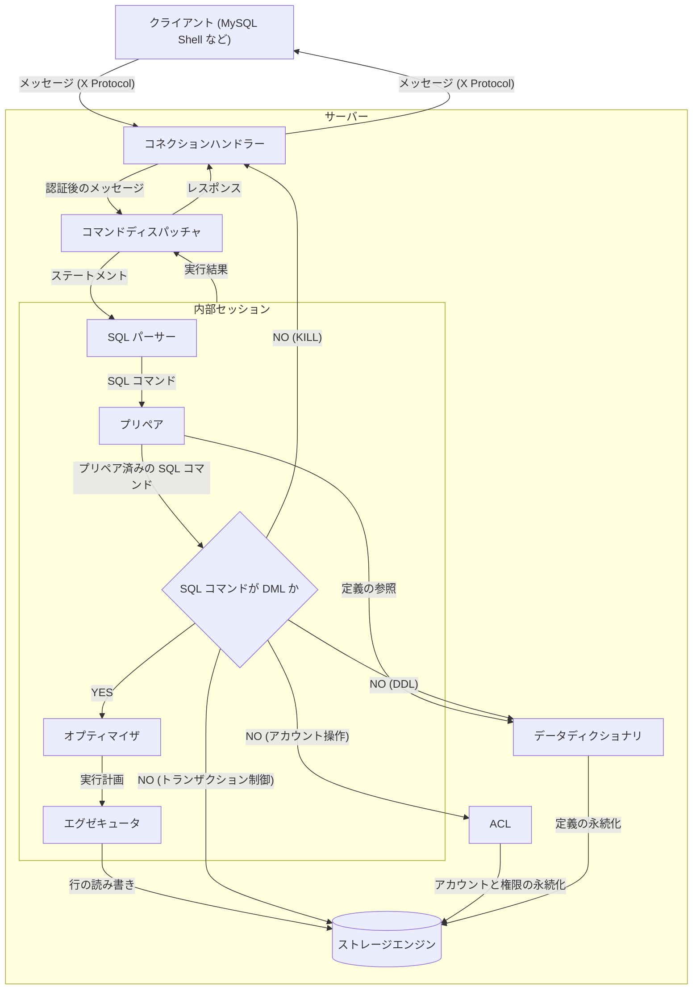

# MineSQL 仕様

## 全体像

```mermaid
flowchart TB
    client["クライアント (MySQL Shell など)"]

    subgraph server["サーバー"]
        conn["コネクションハンドラー"]
        dispatcher["コマンドディスパッチャ"]

        subgraph session["内部セッション"]
            parser["SQL パーサー"]
            prepare["プリペア"]
            exec{"SQL コマンドが DML か"}
            optimizer["オプティマイザ"]
            executor["エグゼキュータ"]
        end

        dict["データディクショナリ"]
        acl["ACL"]
        engine[("ストレージエンジン")]
    end

    client -->|"メッセージ (X Protocol)"| conn
    conn -->|"認証後のメッセージ"| dispatcher
    dispatcher -->|"ステートメント"| parser
    parser -->|"SQL コマンド"| prepare
    prepare -->|"定義の参照"| dict
    prepare -->|"プリペア済みの SQL コマンド"| exec
    exec -- "YES" --> optimizer
    optimizer -->|"実行計画"| executor
    executor -->|"行の読み書き"| engine
    exec -- "NO (DDL)" --> dict
    exec -- "NO (トランザクション制御)" --> engine
    exec -- "NO (KILL)" --> conn
    exec -- "NO (アカウント操作)" --> acl
    acl -->|"アカウントと権限の永続化"| engine
    session -->|"実行結果"| dispatcher
    dispatcher -->|"レスポンス"| conn
    conn -->|"メッセージ (X Protocol)"| client
    dict -->|"定義の永続化"| engine
```

## モジュール

| モジュール | 役割 | 仕様 |
| --- | --- | --- |
| プロトコル | クライアントとサーバーの間で交わすメッセージの形式や処理に関する規約を定める | [protocol/](./protocol/README.md) |
| コネクションハンドラー | 接続を受け付けて認証し、セッションの確立および切断をする | [connection/](./connection/README.md) |
| コマンドディスパッチャ | 認証済みのセッションが受け取ったリクエストを、適切なハンドラに振り分ける | [dispatcher/](./dispatcher/README.md) |
| 内部セッション | 受け取ったステートメントを SQL パーサーで解析し、プリペアしてから実行する。 また、その実行に必要なセッションの状態を保持する | [session/](./session/README.md) |
| SQL パーサー | ステートメントを解析し、SQL コマンドを作る | [parser/](./parser/README.md) |
| データディクショナリ | スキーマ、テーブル、カラム、インデックスなどの定義を、ストレージエンジンに永続化する | [dictionary/](./dictionary/README.md) |
| ACL | アカウントと権限に関する情報をストレージエンジンに永続化する。 また、どのステートメントにどの権限が要るかを定める | [acl/](./acl/README.md) |
| プリペア | SQL コマンドを実行の前に検査し、名前や型などを解決する | [prepare/](./prepare/README.md) |
| オプティマイザ | ステートメントの実行計画を立てる | `optimizer/` |
| エグゼキュータ | 実行計画に沿ってクエリを実行する | `executor/` |
| ストレージエンジン | データを永続化し、トランザクション、ロック、ログなどを管理する | `storage/` |
