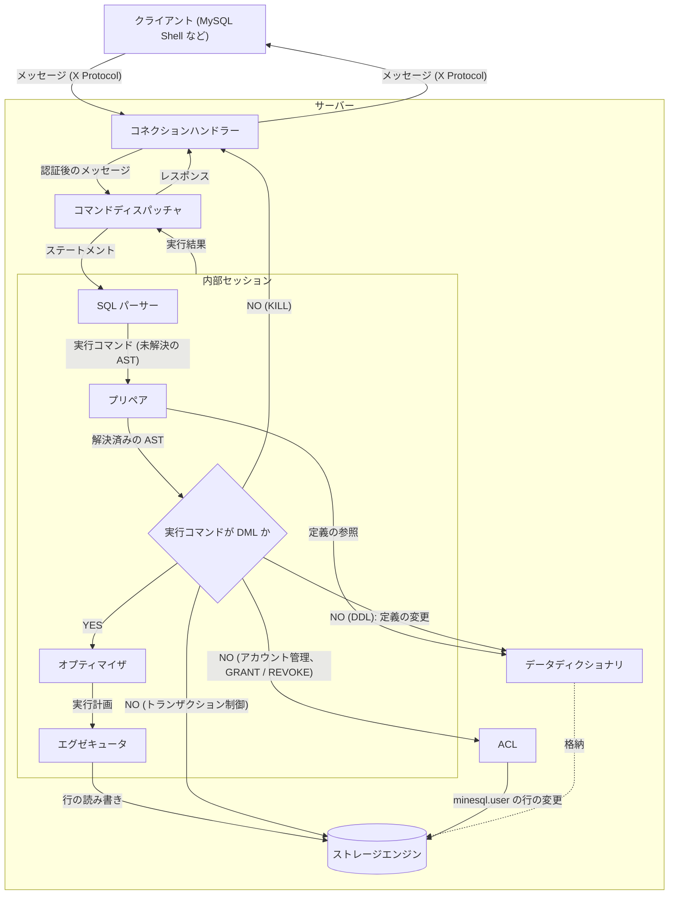

# MineSQL 仕様

## 全体像

クライアントからのメッセージは次の順に流れる

```mermaid
flowchart TB
    client["クライアント (MySQL Shell など)"]

    subgraph server["サーバー"]
        conn["コネクションハンドラー"]
        dispatcher["コマンドディスパッチャ"]

        subgraph session["内部セッション"]
            parser["SQL パーサー"]
            prepare["プリペア"]
            exec{"実行コマンドが DML か"}
            optimizer["オプティマイザ"]
            executor["エグゼキュータ"]
        end

        dict["データディクショナリ"]
        acl["ACL"]
        engine[("ストレージエンジン")]
    end

    client -->|"メッセージ (X Protocol)"| conn
    conn -->|"認証後のメッセージ"| dispatcher
    dispatcher -->|"ステートメント"| parser
    parser -->|"実行コマンド (未解決の AST)"| prepare
    prepare -->|"定義の参照"| dict
    prepare -->|"解決済みの AST"| exec
    exec -- "YES" --> optimizer
    optimizer -->|"実行計画"| executor
    executor -->|"行の読み書き"| engine
    exec -- "NO (DDL): 定義の変更" --> dict
    exec -- "NO (トランザクション制御)" --> engine
    exec -- "NO (KILL)" --> conn
    exec -- "NO (アカウント管理、GRANT / REVOKE)" --> acl
    acl -->|"minesql.user の行の変更"| engine
    session -->|"実行結果"| dispatcher
    dispatcher -->|"レスポンス"| conn
    conn -->|"メッセージ (X Protocol)"| client
    dict -.->|"格納"| engine
```

※プロトコル (X Protocol) は、クライアントとサーバーの間で交わすメッセージの規約で、コネクションハンドラーとコマンドディスパッチャが使う

## モジュール

| モジュール | 何をするか | 仕様の場所 |
| --- | --- | --- |
| プロトコル | クライアントとサーバーの間で交わすメッセージの形式と流れの規約 (X Protocol) | [protocol/](./protocol/README.md) |
| コネクションハンドラー | 接続の受付から認証、セッションの確立と切断まで | [connection/](./connection/README.md) |
| コマンドディスパッチャ | メッセージの種別ごとの振り分けと、実行結果のレスポンスとしての返送 | [dispatcher/](./dispatcher/README.md) |
| 内部セッション | ステートメントの実行の入口 (パーサー → プリペアの操作 → 実行の操作) と、セッションごとの実行の文脈 | [session/](./session/README.md) |
| SQL パーサー | ステートメントの文字列から AST を作り、実行コマンドに包む | [parser/](./parser/README.md) |
| データディクショナリ | スキーマ・テーブル・カラム・インデックスの定義の保持 | [dictionary/](./dictionary/README.md) |
| ACL | アカウントと全体権限の保持、アカウント管理ステートメントと `GRANT` / `REVOKE` の実行、権限の検査の規則 | [acl/](./acl/README.md) |
| プリペア | 名前解決と型決定、権限の検査 | [prepare/](./prepare/README.md) |
| オプティマイザ | 実行計画の選択 | `optimizer/` |
| エグゼキュータ | 実行計画の実行と結果の返送 | `executor/` |
| ストレージエンジン | 行とインデックスの永続化、トランザクション、ロック、ログ | `storage/` |

