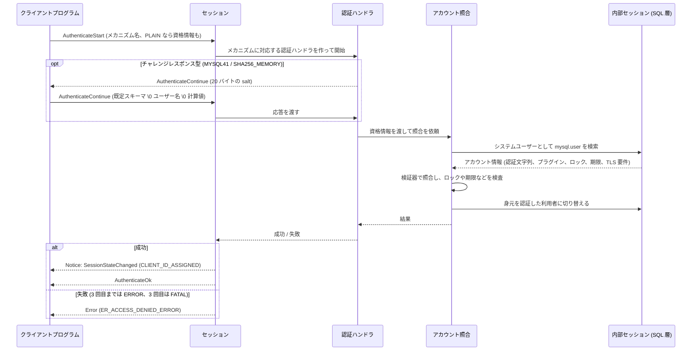

# 認証 (X Plugin)

- コネクションハンドラーのうち、接続をセッションとして使える状態にする「認証」の部分の仕様
  - 接続の状態遷移と、認証メッセージがセッションに届くまでの経路は [connection_handler.md](./connection_handler.md) を参照
  - メッセージの形式 (`AuthenticateStart` / `AuthenticateContinue` / `AuthenticateOk`) は [protocol/message_spec.md の認証](../protocol/message_spec.md#認証-セッション確立) を参照
- 認証は MySQL でも接続処理の一部として (接続ごとのスレッド上で、セッション確立の段階で) 実行されるが、メカニズムの中身は状態管理とは別の部品が担うため、文書を分けている

## 要件

- `AuthenticateStart` で指定された認証メカニズム (`MYSQL41` / `PLAIN` / `SHA256_MEMORY`) で認証し、成功なら `AuthenticateOk`、失敗なら `Error` (`ER_ACCESS_DENIED_ERROR`) を返す
- 使えるメカニズムは接続の種類で変わる
  - 安全でない接続 (TLS なしの TCP): `MYSQL41` と `SHA256_MEMORY`
  - 安全な接続 (TLS または Unix ソケット): 上記に加えて `PLAIN`
  - 対応しないメカニズム名 (安全でない接続での `PLAIN` を含む) は FATAL の `Error` (`ER_NOT_SUPPORTED_AUTH_MODE`) で、接続は閉じられる
  - 参照:
    - [authentication_container.cc のメカニズム登録](https://github.com/mysql/mysql-server/blob/aa461240270d809bcac336483b886b3d1789d4d9/plugin/x/src/server/authentication_container.cc#L37-L46)
    - [get_auth_handler の接続種別による絞り込み](https://github.com/mysql/mysql-server/blob/aa461240270d809bcac336483b886b3d1789d4d9/plugin/x/src/server/authentication_container.cc#L49-L68)
    - [session.cc の未対応メカニズムの応答](https://github.com/mysql/mysql-server/blob/aa461240270d809bcac336483b886b3d1789d4d9/plugin/x/src/session.cc#L155-L162)
- 成功時は `SessionStateChanged` (`CLIENT_ID_ASSIGNED`) の Notice を送ってから `AuthenticateOk` を返し、セッションが利用可能になる
  - 参照:
    - [session.cc の on_auth_success](https://github.com/mysql/mysql-server/blob/aa461240270d809bcac336483b886b3d1789d4d9/plugin/x/src/session.cc#L204-L214)
- 失敗は 1 セッションにつき 3 回まで試せる
  - 3 回目の失敗の `Error` は FATAL になり、サーバーは認証を打ち切って接続を閉じる (途中で別のメカニズムに切り替えて試すことはできる)
  - 参照:
    - [session.cc の on_auth_failure_impl](https://github.com/mysql/mysql-server/blob/aa461240270d809bcac336483b886b3d1789d4d9/plugin/x/src/session.cc#L222-L247)
    - [session.h の k_max_auth_attempts](https://github.com/mysql/mysql-server/blob/aa461240270d809bcac336483b886b3d1789d4d9/plugin/x/src/session.h#L125)
- 認証に成功した接続は、その利用者としてコマンドを実行する (内部セッションの身元がその利用者になる)
- パスワードそのものを送るのは `PLAIN` だけで、`MYSQL41` と `SHA256_MEMORY` はサーバーが送った salt とパスワードから計算した値を送る (安全でない接続で平文のパスワードが流れない)

## 責務

### 担うこと

- メカニズムの選択と、メカニズムごとのやり取りの進行 (チャレンジの生成、応答の受け取り)
- 資格情報 (既定スキーマ、ユーザー名、パスワードまたはその計算値) の取り出しと、アカウント情報との照合
- 成功時の内部セッションの身元の確定 (どの利用者として SQL を実行するか)
- 失敗回数の管理と、上限に達したときの打ち切り

### 担わないこと

- 認証メッセージの受け渡しと接続の状態遷移 -> [connection_handler.md](./connection_handler.md)
- アカウントの作成・変更・削除 -> 対象外 ([issue #120](https://github.com/ren-yamanashi/minesql/issues/120) の「アカウント作成 (初期アカウントのみサポート)」)
- 認証後の権限の検査 -> SQL 層の責務

## 構成要素

- 認証ハンドラ (Authentication): `AuthenticateStart` のたびにメカニズムに対応するものが 1 つ作られ、成功または失敗で消える
  - 3 つのメカニズムは 2 種類の実装に対応する
    - チャレンジレスポンス型 (`MYSQL41`、`SHA256_MEMORY`): サーバーが 20 バイトの salt を送り、クライアントはパスワードのハッシュと salt から計算した値を返す
    - 1 往復型 (`PLAIN`): クライアントが最初のメッセージに資格情報をそのまま入れる
  - 参照:
    - [auth_challenge_response.h の Sasl_challenge_response_auth (やり取りの説明)](https://github.com/mysql/mysql-server/blob/aa461240270d809bcac336483b886b3d1789d4d9/plugin/x/src/auth_challenge_response.h#L42-L68)
    - [auth_plain.cc の Sasl_plain_auth](https://github.com/mysql/mysql-server/blob/aa461240270d809bcac336483b886b3d1789d4d9/plugin/x/src/auth_plain.cc#L49-L62)
- 認証ハンドラの一覧 (Authentication_container): サーバーに 1 つ、メカニズム名と接続の種類 (安全かどうか) から認証ハンドラを作る
- アカウント照合 (Account_verification_handler): 資格情報を「既定スキーマ \0 ユーザー名 \0 パスワード (または計算値)」に分解し、アカウント情報を取り出して照合する
  - 照合の計算はアカウントの認証プラグインの種類ごとの検証器が行う (`mysql_native_password` 用、`caching_sha2_password` 用、キャッシュ用など)
  - アカウント情報は内部セッションで `mysql.user` を検索して取る (認証文字列、プラグイン名、ロック状態、パスワードの期限、TLS の要件)
  - 参照:
    - [account_verification_handler.cc の authenticate (資格情報の分解)](https://github.com/mysql/mysql-server/blob/aa461240270d809bcac336483b886b3d1789d4d9/plugin/x/src/account_verification_handler.cc#L39-L70)
    - [verify_account (照合と各種の検査)](https://github.com/mysql/mysql-server/blob/aa461240270d809bcac336483b886b3d1789d4d9/plugin/x/src/account_verification_handler.cc#L125-L181)
    - [get_account_record (mysql.user の検索)](https://github.com/mysql/mysql-server/blob/aa461240270d809bcac336483b886b3d1789d4d9/plugin/x/src/account_verification_handler.cc#L183-L244)
- SHA256 パスワードキャッシュ: サーバーに 1 つ、`SHA256_MEMORY` の照合に使う値 (パスワードの SHA256 の SHA256) を利用者ごとに保持する
  - 値が入るのは、その利用者が平文で照合できるメカニズム (`PLAIN` など) で一度成功したとき
  - 資格情報の変更・アカウントの改名や削除・`FLUSH PRIVILEGES` で消える (SQL 層の監査イベントを受けて消す)
  - したがって `SHA256_MEMORY` は「平文の認証を一度通した後の 2 回目以降」を速く安全にするためのメカニズムで、キャッシュが空なら失敗する
  - 参照:
    - [cache_based_verification.cc の照合](https://github.com/mysql/mysql-server/blob/aa461240270d809bcac336483b886b3d1789d4d9/plugin/x/src/cache_based_verification.cc#L70-L91)
    - [sha2_plain_verification.cc の成功時のキャッシュ登録](https://github.com/mysql/mysql-server/blob/aa461240270d809bcac336483b886b3d1789d4d9/plugin/x/src/sha2_plain_verification.cc#L81-L85)
    - [module_cache.cc のキャッシュの消去](https://github.com/mysql/mysql-server/blob/aa461240270d809bcac336483b886b3d1789d4d9/plugin/x/src/module_cache.cc#L82-L96)
- 内部セッションの身元 (security context): 照合の間はシステムユーザー (`mysql.session`@`localhost`) として動き、成功したら認証した利用者に切り替え、既定スキーマの指定があればそれも設定する
  - 参照:
    - [sql_data_context.cc の authenticate_internal](https://github.com/mysql/mysql-server/blob/aa461240270d809bcac336483b886b3d1789d4d9/plugin/x/src/sql_data_context.cc#L257-L300)
    - [switch_to_user](https://github.com/mysql/mysql-server/blob/aa461240270d809bcac336483b886b3d1789d4d9/plugin/x/src/sql_data_context.cc#L445-L499)

## 処理の流れ

- メカニズムごとの違い
  - `MYSQL41`: salt に対する応答は `mysql_native_password` の方式 (SHA1 に基づく) で計算し、`mysql.user` の認証文字列と突き合わせる
  - `SHA256_MEMORY`: 応答は SHA256 に基づいて計算し、`mysql.user` ではなく SHA256 パスワードキャッシュの値と突き合わせる
  - `PLAIN`: 最初のメッセージの資格情報 (パスワードは平文) を、アカウントの認証プラグインに応じた検証器で突き合わせ、成功したら SHA256 パスワードキャッシュにも登録する
- 照合の検査項目 (MySQL): パスワードの一致のほかに、アカウントのロック、パスワードの期限切れ (期限切れは接続を許すが SQL を制限する「サンドボックス」になりうる)、TLS の要件 (`require_secure_transport` とアカウントの `ssl_type`) を見る

## minesql での判断 (2026-09-12 確定)

- 認証メカニズムは `MYSQL41` / `PLAIN` / `SHA256_MEMORY` の 3 つを実装する
  - 理由 1: 8.4 の既定 (`caching_sha2_password` のアカウント) では、3 つは独立した選択肢ではなく 1 組の仕組みになっている
    - `PLAIN` は安全な接続でパスワードそのものを照合し、成功時に SHA256 パスワードキャッシュを埋める
    - `SHA256_MEMORY` はどの接続でも使えるが、照合先がキャッシュなので `PLAIN` で一度成功した後にしか通らない
    - `MYSQL41` は `mysql_native_password` のアカウント専用で、`caching_sha2_password` のアカウントには常に access denied を返す
  - 理由 2: 公式クライアントの自動選択は、安全でない接続で `SHA256_MEMORY` → `MYSQL41` の順に試す
    - `MYSQL41` がないとクライアントは MySQL と違う応答 (未対応メカニズムの FATAL) を受ける
    - チャレンジレスポンスの実装は `SHA256_MEMORY` と共通なので、`MYSQL41` を持つ追加の手間は照合器 1 つ分
  - 帰結: TCP からの初回のログインは「Unix ソケットで `PLAIN` → 以後は TCP で `SHA256_MEMORY`」という MySQL 8.4 と同じ手順になる (TLS は対象外のまま)
- 認証プラグインは `caching_sha2_password` だけを持つ
  - 理由: 8.4 の既定であり、`mysql_native_password` は 8.4 で既定無効 (プラグインの flags が `PLUGIN_OPT_DEFAULT_OFF`)、`sha256_password` は非推奨のため
  - 認証文字列は `$A$005$` + 20 バイトの salt + ダイジェスト (SHA256 を 5000 回反復) の形式
  - `SHA256_MEMORY` の応答は `XOR(SHA256(password), SHA256(SHA256(SHA256(password)) + nonce))` で、サーバーはキャッシュにある `SHA256(SHA256(password))` からこれを検証する
  - 参照:
    - [mysql_native_password.cc のプラグイン宣言](https://github.com/mysql/mysql-server/blob/aa461240270d809bcac336483b886b3d1789d4d9/sql/auth/mysql_native_password.cc#L327-L343)
    - [sha2_plain_verification.cc の認証文字列の分解](https://github.com/mysql/mysql-server/blob/aa461240270d809bcac336483b886b3d1789d4d9/plugin/x/src/sha2_plain_verification.cc#L55-L80)
    - [i_sha2_password_common.h の scramble の形式](https://github.com/mysql/mysql-server/blob/aa461240270d809bcac336483b886b3d1789d4d9/sql/auth/i_sha2_password_common.h#L96-L97)
- 照合は MySQL と同じく SQL 層に問い合わせて行う
  - 認証側は内部セッションの身元をシステムユーザーにして、システムスキーマ `mysql` の `user` 表を SELECT し、認証文字列とプラグイン名を取る
  - 照合の計算は認証側で行い、成功したら SQL 層の API で内部セッションの身元を利用者に切り替える
  - 理由: 本でアカウントの仕組みを示すため (システム表が普通の表であること、サーバー自身が SQL 層の利用者になること、身元の切り替えが SQL 層の状態であること、起動時に自分でシステム表を作ること)
  - MySQL の ACL キャッシュ (user@host のパターン照合と権限の判定に使うメモリ上の表) は持たない
    - 権限を入れるときの拡張点で、そのときにホストのパターン照合もそこへ移す
  - 検討した代替: データディクショナリの利用者情報を直接引く案
    - 実装は小さいが、上記の仕組みが本に現れないため採らなかった
- 検査項目はパスワードの一致だけ
  - ロック、パスワードの期限、`offline_mode`、TLS 要件は、アカウント管理・サーバーモード・TLS の機能に付随する検査なので持たない
- アカウントは初期アカウントのみ (issue #120) で、ホストは `%` 固定 (パターン照合は ACL キャッシュと一緒に入れる)
- 前提と依存
  - スキーマを持つこと ([ideology.md](../ideology.md) の「目的とスコープ」) と、起動時の bootstrap でシステム表 `mysql.user` と初期アカウントを作ること
  - 認証が SQL の実行経路 (パーサー → プリペア → 実行 → ストレージ) に依存するため、本の順序では SQL が動いてから認証を入れる (MySQL 自身も同じ依存を持つ)

## 層ごとの分担

認証ハンドラとアカウント照合は独立した層ではなく、コネクションハンドラー (connection/) の中でセッションが使う部品 (MySQL でも X Plugin の中にある)

| 層 | 認証で担うこと |
| --- | --- |
| コネクションハンドラー: 接続とセッション | 認証メッセージの受け渡し、接続とセッションの状態遷移、失敗回数の管理と打ち切り |
| コネクションハンドラー: 認証ハンドラとアカウント照合 (この文書) | メカニズムの進行 (salt の生成と応答の受け取り)、資格情報の分解、照合の計算、SHA256 パスワードキャッシュの更新 |
| SQL 層 (内部セッション) | システムユーザーとしての `mysql.user` の SELECT の実行、利用者への身元の切り替えと既定スキーマの設定 |
| データディクショナリとストレージ | システムスキーマ `mysql` と `user` 表の保持 (普通の表として)、起動時の bootstrap |
