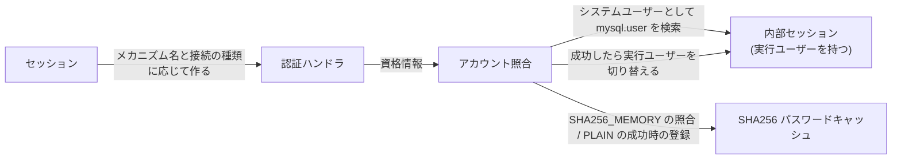
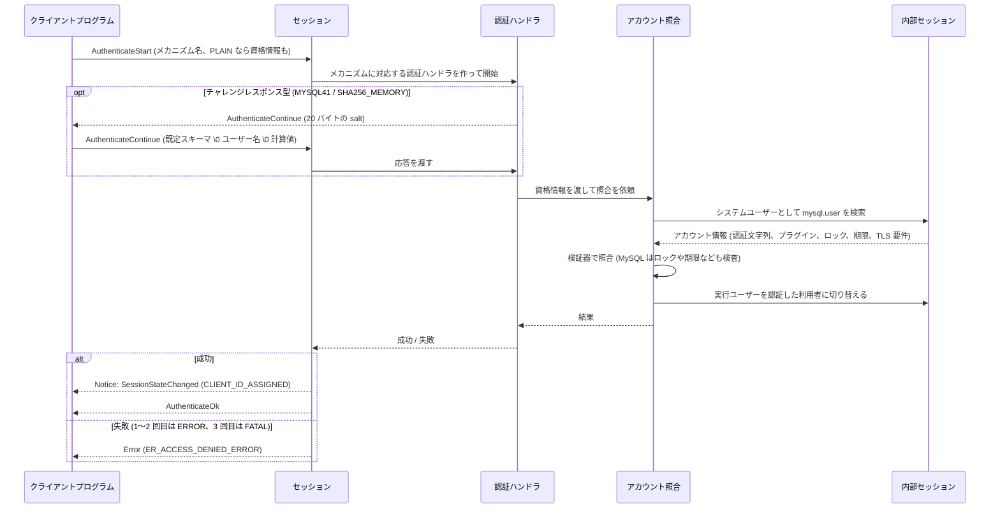

# 認証 (X Plugin)

- コネクションハンドラーのうち、接続をセッションとして使える状態にする「認証」の部分の仕様
  - 接続の状態遷移と、認証メッセージがセッションに届くまでの経路は [connection_handler.md](./connection_handler.md) を参照
  - メッセージの形式 (`AuthenticateStart` / `AuthenticateContinue` / `AuthenticateOk`) は [protocol/message_spec.md の認証](../protocol/message_spec.md#認証-セッション確立) を参照
- 認証は MySQL でも接続処理の一部として (接続ごとのスレッド上で、セッション確立の段階で) 実行されるが、認証メカニズムの中身は状態管理とは別の部品が担うため、文書を分けている
- 本文の主張に対応する MySQL のソースは [authentication_spec.md の「論理モデルの主張とソースの対応」](./reference/authentication_spec.md#論理モデルの主張とソースの対応) にまとめる

## 責務

- 認証メカニズムの選択と、メカニズムごとのやり取りの進行 (チャレンジの生成、応答の受け取り)
- 資格情報 (既定スキーマ、ユーザー名、パスワードまたはその計算値) の取り出しと、アカウント情報との照合
- 成功時の内部セッションの実行ユーザーの確定 (どの利用者として SQL を実行するか)
- 失敗回数の管理と、上限に達したときの打ち切り

## 構成要素

認証に関わる構成要素は 4 つで、セッション ([connection_handler.md](./connection_handler.md)) がこれらを使って認証を進める

- 認証ハンドラ: 認証メカニズム 1 つ分のやり取り (チャレンジの生成、応答の受け取り) を進める
- アカウント照合: 資格情報をアカウント情報と突き合わせ、成功したら実行ユーザーを切り替える
- SHA256 パスワードキャッシュ: `SHA256_MEMORY` の照合に使う値を利用者ごとに保持する (全ての接続で共有)
- 内部セッションの実行ユーザー: 内部セッションが SQL を実行するときの利用者で、照合の間はシステムユーザー、成功後は認証した利用者になる

### 認証ハンドラ (Authentication)

- `AuthenticateStart` で指定された認証メカニズムに対応するものが 1 つ作られ、成功または失敗で消える
- 認証メカニズムは `MYSQL41` / `PLAIN` / `SHA256_MEMORY` の 3 つ ([SDR-0015](../sdr/0015.認証の方式.md))
- 3 つのメカニズムは 2 種類の実装に対応する
  - チャレンジレスポンス型 (`MYSQL41`、`SHA256_MEMORY`): サーバーが 20 バイトの salt を送り、クライアントはパスワードのハッシュと salt から計算した値を返す
  - 1 往復型 (`PLAIN`): クライアントが最初のメッセージに資格情報をそのまま入れる
- パスワードそのものを送るのは `PLAIN` だけで、`MYSQL41` と `SHA256_MEMORY` はサーバーが送った salt とパスワードから計算した値を送る (安全でない接続で平文のパスワードが流れない)
- 作れる認証メカニズムは接続の種類 (安全かどうか) で決まり、同じ一覧が capability `authentication.mechanisms` でクライアントに通知される
  - 安全でない接続 (TLS なしの TCP): `MYSQL41` と `SHA256_MEMORY`
  - 安全な接続 (TLS または Unix ソケット): 上記に加えて `PLAIN`
  - 一覧にないメカニズム名 (安全でない接続での `PLAIN` を含む) は FATAL の `Error` (`ER_NOT_SUPPORTED_AUTH_MODE`) で、接続は閉じられる

### アカウント照合 (Account_verification_handler)

- 資格情報を「既定スキーマ \0 ユーザー名 \0 パスワード (または計算値)」に分解し、アカウント情報を取り出して照合する (`\0` は NUL 文字)
- 照合の計算はアカウントの認証プラグインの種類ごとの検証器が行う (`mysql_native_password` 用、`caching_sha2_password` 用、キャッシュ用など)
- アカウント情報はシステムスキーマ `mysql` の `user` 表に置き、内部セッションで検索して取る (MineSQL の行は認証文字列と全体権限を持ち、MySQL はさらにプラグイン名、ロック状態、パスワードの期限、TLS の要件を持つ)
  - この表と初期アカウントは起動時の bootstrap で作る ([SDR-0014](../sdr/0014.スキーマを持つ.md))
  - アカウントはアカウント管理ステートメント (`CREATE USER` / `ALTER USER` / `DROP USER`) で増減し、ホストは `%` のみ (user@host のパターン照合は行わない、[SDR-0017](../sdr/0017.アカウント管理ステートメントを対象に含める.md))
  - MySQL が user@host のパターン照合と権限の読み出しに使う ACL キャッシュ (起動時に `mysql.user` をメモリに読み込んだもの) は持たず、認証のたびに表を引く ([SDR-0015](../sdr/0015.認証の方式.md))
- アカウントの認証プラグインは `caching_sha2_password` のみで、認証文字列は `$A$005$` + 20 バイトの salt + ダイジェスト (SHA256 を 5000 回反復) の形式

### SHA256 パスワードキャッシュ (SHA256_password_cache)

- `SHA256_MEMORY` の照合に使う値 (パスワードの SHA256 の SHA256) を利用者ごとに保持し、全ての接続で共有する
- 値が入るのは、その利用者が平文で照合できるメカニズム (`PLAIN` など) で一度成功したとき
- 資格情報の変更 (`ALTER USER ... IDENTIFIED BY`) とアカウントの削除 (`DROP USER`) で、その利用者のエントリが消える ([SDR-0017](../sdr/0017.アカウント管理ステートメントを対象に含める.md))
  - MySQL ではさらに改名と `FLUSH PRIVILEGES` でも消え、SQL 層の監査イベントを受けて消す
  - MineSQL は監査の枠組みを持たず、アカウント管理ステートメントの実行時に直接消す
- 永続化しないので、サーバーの再起動で空になる
- したがって `SHA256_MEMORY` は「平文の認証を一度通した後の 2 回目以降」を速く安全にするためのメカニズムで、キャッシュが空なら失敗する

### 内部セッションの実行ユーザー (security context)

- 照合の間はシステムユーザー (`mysql.session`@`localhost`) として動き、成功したら認証した利用者に切り替える
- 既定スキーマの指定があればそれも設定し、同じ行の全体権限を実行ユーザーに載せる ([SDR-0018](../sdr/0018.権限は全体権限だけを持つ.md))

## 処理の流れ

- 成功時は `SessionStateChanged` (`CLIENT_ID_ASSIGNED`) の Notice を送ってから `AuthenticateOk` を返し、セッションが利用可能になる
  - 認証に成功した接続は、その利用者としてコマンドを実行する (内部セッションの実行ユーザーがその利用者になる)
- 失敗は 1 セッションにつき 3 回まで
  - 3 回目の失敗の `Error` は FATAL になり、サーバーは認証を打ち切って接続を閉じる (途中で別のメカニズムに切り替えて試すことはできる)
  - セッションを閉じた / リセットした後は新しいセッションになるため、回数は 0 から数え直す
- 認証メカニズムごとの違い
  - `MYSQL41`: salt に対する応答は `mysql_native_password` の方式 (SHA1 に基づく) で計算し、`mysql.user` の認証文字列と突き合わせる
    - `caching_sha2_password` のアカウントとは照合が成り立たないため、チャレンジを返したうえで access denied になる (MySQL と同じ応答)
  - `SHA256_MEMORY`: 応答は `XOR(SHA256(password), SHA256(SHA256(SHA256(password)) + nonce))` で、`mysql.user` ではなく SHA256 パスワードキャッシュの値 (`SHA256(SHA256(password))`) と突き合わせる
  - `PLAIN`: 最初のメッセージの資格情報 (パスワードは平文) を、アカウントの認証プラグインに応じた検証器で突き合わせ、成功したら SHA256 パスワードキャッシュにも登録する
    - キャッシュに同じ値のエントリがあれば、認証文字列との照合を省いて成功にする
- 接続の種類との組み合わせ: TLS なしの TCP では `PLAIN` を使えないため、TLS 接続か Unix ソケットで一度 `PLAIN` を通したあとに `SHA256_MEMORY` で認証する (MySQL 8.4 の既定と同じ手順)
- 照合の検査項目はパスワードの一致だけ ([SDR-0015](../sdr/0015.認証の方式.md))
  - MySQL はさらに、アカウントのロック、パスワードの期限切れ (期限切れは接続を許すが SQL を制限する「サンドボックス」になりうる)、`offline_mode` 中の非 SUPER ユーザー、TLS の要件 (`require_secure_transport` とアカウントの `ssl_type`) を検査する

## 層ごとの分担

認証ハンドラとアカウント照合は独立したモジュールではなく、コネクションハンドラーの中でセッションが使う部品 (MySQL でも X Plugin の中にある)

| 層 | 認証で担うこと |
| --- | --- |
| コネクションハンドラー (接続とセッション) | 認証メッセージの受け渡し、接続とセッションの状態遷移、失敗回数の管理と打ち切り |
| コネクションハンドラー (認証ハンドラとアカウント照合、この文書) | 認証メカニズムの進行 (salt の生成と応答の受け取り)、資格情報の分解、照合の計算、SHA256 パスワードキャッシュの更新、成功時の実行ユーザーの切り替えと既定スキーマの設定、全体権限の実行ユーザーへの載せ込み |
| SQL パーサーからエグゼキュータまで | システムユーザーとして実行する `mysql.user` の SELECT (通常のステートメントと同じ経路) |
| プリペア | ステートメントごとの権限の検査 (名前解決の前) |
| エグゼキュータ | アカウント管理ステートメントと `GRANT` / `REVOKE` の実行 (`mysql.user` への行の書き込みとキャッシュのエントリの削除) |
| データディクショナリ | システムスキーマ `mysql` と `user` 表の定義の保持 |
| ストレージエンジン | `user` 表の行の永続化 (普通の表として) |

## 要件

- `sha256_password` のアカウントに対する X Plugin の認証 ([WL#9271](https://dev.mysql.com/worklog/task/?id=9271))
  - 機能要件
    - 利用者は、新しい接続時またはセッションのリセット時に、`sha256_password` で識別される MySQL Server のアカウントに対して `PLAIN` メソッドによる認証を開始できなければならない
  - 認証全般に関する要件
    - `sha256_password` で識別される MySQL アカウントに対する認証は、ハッシュアルゴリズムがそのユーザーに関連づけられたものと同じハッシュを生成しない場合、失敗しなければならない
    - `sha256_password` で識別される MySQL アカウントに対する認証は、ユーザーがロックされている場合、失敗しなければならない
    - `sha256_password` で識別される MySQL アカウントに対する認証は、ユーザーが `super` 権限を持たず、かつサーバーがオフラインモードで動作している場合、失敗しなければならない
    - `sha256_password` で識別される MySQL アカウントに対する認証は、パスワードが期限切れで、クライアントがそれに対応しておらず、かつサーバーのシステム変数 `disconnect_on_expired_password` が `true` の場合、失敗しなければならない
    - `sha256_password` で識別される MySQL アカウントに対する認証は、そのアカウントに設定された `ssl/tls` オプションが満たされない場合、失敗しなければならない
    - `sha256_password` で識別される MySQL アカウントに対する認証は、上記のいずれの失敗条件にも該当しない場合、成功しなければならない
    - 認証が成功した場合、パスワードが期限切れのアカウントを使っていることを、`Notice` で利用者に知らせる必要がある

- メモリ上の SHA256 ストレージに対するチャレンジ / レスポンス認証 ([WL#10992](https://dev.mysql.com/worklog/task/?id=10992))
  - 認証資格情報のキャッシュ
    - キャッシュの無効化が機能しない場合、`SHA256_MEMORY` による認証は失敗しなければならない
    - 安全な接続上の `PLAIN` による認証は、ユーザーアカウントと SHA256(SHA256(password)) をメモリ上の sha256 キャッシュに保存しなければならない
    - 安全な接続上の `PLAIN` による認証は、そのユーザーアカウントが同じ SHA256(SHA256(password)) ですでにキャッシュに存在すれば成功する
    - `SHA256_MEMORY` による認証は、ユーザーアカウントと sha256(password) が sha256 キャッシュのエントリに一致すれば成功しなければならない
    - `SHA256_MEMORY` による認証は、安全でない接続と安全な接続の両方で動作しなければならない
    - `SHA256_MEMORY` による認証は、接続が安全でなく、かつアカウントに何らかの tls_option が設定されている場合、失敗しなければならない
  - プロトコル実装の要件
    - サーバーは、認証の失敗の後に接続を閉じてはならない
    - サーバーは、複数回の認証の失敗の後に接続を閉じなければならない
    - サーバーは、Connection::Reset 時に失敗した認証のリセットに対応しなければならない
  - エッジケース
    - SQL を通じてキャッシュの内容にアクセスする方法が存在してはならない
    - キャッシュの内容を永続化してはならない
  - キャッシュの無効化
    - `DROP USER` は、キャッシュされたエントリを無効化しなければならない
    - `SET PASSWORD` は、キャッシュ内のそのユーザーのエントリを無効化しなければならない
    - `ALTER USER` は、キャッシュ内のそのユーザーのエントリを無効化しなければならない
    - `RENAME USER` は、キャッシュ内の古いエントリと、存在しうる新しいエントリを無効化しなければならない
    - `IDENTIFIED` を伴う `GRANT` は、キャッシュ内のそのユーザーのエントリを無効化しなければならない
    - `FLUSH PRIVILEGES` は、キャッシュ内のすべてのエントリを無効化する
  - libmysqlxclient
    - libmysqlxclient は、`SHA256_MEMORY` 認証メソッドに対応しなければならない

- アカウントの認証プラグイン `caching_sha2_password` ([WL#9591](https://dev.mysql.com/worklog/task/?id=9591))
  - キャッシュの仕組みを使ってより高速に認証を行う、新しい認証プラグインを導入しなければならない
    - サーバー側の認証プラグイン `caching_sha2_password` を導入しなければならない
    - クライアント側の認証プラグイン `caching_sha2_password` を導入しなければならない
  - 新しいプラグインは、ハッシュ化したパスワードを `mysql.user` の `authentication_string` カラムに保存しなければならない
    - `sha256_password` プラグインと同様の手法を使うべきである
  - 新しいプラグインは、より高速な認証のために、ハッシュ化したパスワードを保持するメモリ上のキャッシュを維持すべきである
  - プラグインは、次の 2 つの方法による認証に対応しなければならない
    - 高速認証: 複数回の SHA256 ハッシュとセッション単位の salt を使ってスクランブルを生成する
    - 高コストな認証: 平文のパスワードをサーバーに渡す
  - 新しい監査クラス `MYSQL_AUDIT_AUTHENTICATION_CLASS` を導入しなければならない
    - 次のサブクラスのイベントを導入すべきである: `MYSQL_AUDIT_AUTHENTICATION_FLUSH`、`MYSQL_AUDIT_AUTHENTICATION_AUTHID_CREATE`、`MYSQL_AUDIT_AUTHENTICATION_CREDENTIAL_CHANGE`、`MYSQL_AUDIT_AUTHENTICATION_AUTHID_RENAME`、`MYSQL_AUDIT_AUTHENTICATION_AUTHID_DROP`
  - サーバーは、上記のイベントを次のように監査プラグインへ通知しなければならない
    - `MYSQL_AUDIT_AUTHENTICATION_FLUSH`: `FLUSH PRIVILEGES` の場合
    - `MYSQL_AUDIT_AUTHENTICATION_AUTHID_CREATE`: ユーザー / ロールの作成 (`CREATE [IF NOT EXISTS] USER` / `CREATE [IF NOT EXISTS] ROLE`) の場合
    - `MYSQL_AUDIT_AUTHENTICATION_CREDENTIAL_CHANGE`: `ALTER USER [IF EXISTS]` / `SET PASSWORD` / `GRANT` による資格情報の変更の場合
    - `MYSQL_AUDIT_AUTHENTICATION_AUTHID_RENAME`: `RENAME USER` の場合
    - `MYSQL_AUDIT_AUTHENTICATION_AUTHID_DROP`: `DROP USER [IF EXISTS]` の場合
  - `caching_sha2_password` が作るキャッシュの消去を担う、新しい監査プラグイン `sha2_cache_cleaner` を導入しなければならない
    - `FLUSH PRIVILEGES` の場合、`caching_sha2_password` のキャッシュを消去しなければならない
    - `caching_sha2_password` を使うユーザーのキャッシュエントリは、次のいずれかのステートメントがそのユーザーに関わる場合に削除しなければならない: `ALTER USER [IF EXISTS]` による資格情報の変更、`SET PASSWORD`、`RENAME USER`、`GRANT` による資格情報の変更、`DROP USER [IF EXISTS]` によるアカウントの削除
  - libmysql に、新しい boolean オプション `MYSQL_OPT_GET_SERVER_PUBLIC_KEY` を導入しなければならない (`caching_sha2_password` の認証処理の一部として、サーバーから RSA 公開鍵を受け取りたいというクライアントの希望を示すため)
    - このオプションの既定値は false であるべきである (つまり、既定ではクライアントはサーバーに公開鍵を求めない)
  - 高コストな認証の場合、サーバーとクライアントの間の接続は次のいずれかの性質を持たなければならない
    - 接続の種類がソケット、共有メモリ、または TLS であること
    - サーバーとクライアントが RSA 鍵ペアによるパスワードの交換に対応していること
  - 非機能要件: アップグレードの一部として、既存のユーザーアカウントを caching_sha2 認証プラグインを使うように変更してはならない

### 認証メカニズムとアカウントの認証プラグインの対応について

- 認証メカニズムは X Protocol 側の「やり取りの仕方」、認証プラグインはアカウント側の「パスワードの保存形式と照合の仕方」で、成り立つ組み合わせは決まっている
- [WL#9271](https://dev.mysql.com/worklog/task/?id=9271) の時点の対応は次の表のとおりで、`PLAIN` は TLS を有効にした接続、または Unix ソケット接続でだけ使える
  - [WL#9271](https://dev.mysql.com/worklog/task/?id=9271) は、`PLAIN` が安全な接続を要求するため、システム変数 `require_secure_transport` を考慮する必要がないとしている

| X Plugin の認証メカニズム | アカウントの認証プラグイン | TLS の要否 |
| --- | --- | --- |
| `PLAIN` | `mysql_native_password` | 要 |
| `PLAIN` | `sha256_password` | 要 |
| `MYSQL41` | `mysql_native_password` | 不要 |

- [WL#10992](https://dev.mysql.com/worklog/task/?id=10992) で加わった `SHA256_MEMORY` は、アカウントの認証プラグインによらず、TLS の有無によらず、キャッシュで照合する
- `caching_sha2_password` のアカウントには、SSL 接続では `PLAIN`、非 SSL 接続では `SHA256_MEMORY` で認証する (MySQL 8.4 のマニュアル)
  - `caching_sha2_password` 自身が持つ認証キャッシュは X Plugin と共有されず、X Plugin は `SHA256_MEMORY` のために独自のキャッシュを持つ
  - 非 SSL の X Protocol 接続で認証する前に、そのアカウントは一度 SSL の X Protocol 接続で認証し、X Plugin のキャッシュにパスワードを供給しておく必要がある

## MineSQL での対応範囲

[要件](#要件) のうち、MineSQL が満たすものと満たさないもの。判断の理由は SDR の列の記録を参照

| 種類 | 要件 | MineSQL | SDR |
| --- | --- | --- | --- |
| `sha256_password` のアカウント | `PLAIN` 認証 | 該当なし (`caching_sha2_password` のアカウントへの `PLAIN` 認証は満たす) | [0015](../sdr/0015.認証の方式.md) |
| 認証全般 | ハッシュが一致しなければ失敗、いずれの失敗条件にも該当しなければ成功 | 満たす | [0015](../sdr/0015.認証の方式.md) |
| 認証全般 | ロック、オフラインモード、パスワードの期限、`ssl/tls` オプションによる失敗と、期限切れの `Notice` | 満たさない | [0015](../sdr/0015.認証の方式.md) |
| 認証資格情報のキャッシュ | 安全な接続上の `PLAIN` の成功でキャッシュに保存する、一致するエントリがあれば `PLAIN` は成功する、`SHA256_MEMORY` はキャッシュのエントリと一致すれば成功する、`SHA256_MEMORY` は安全でない接続でも安全な接続でも動作する | 満たす | [0015](../sdr/0015.認証の方式.md)、[0016](../sdr/0016.TLS接続を実装する.md) |
| 認証資格情報のキャッシュ | 無効化が機能しない場合の失敗 | 該当なし (無効化を止める手段を持たない) |  |
| 認証資格情報のキャッシュ | 安全でない接続で tls_option のあるアカウントの失敗 | 満たさない | [0015](../sdr/0015.認証の方式.md) |
| プロトコル実装 | 1 回の失敗で接続を閉じない、複数回の失敗で閉じる、リセット時に失敗回数を戻す | 満たす |  |
| エッジケース | SQL からキャッシュにアクセスできない、キャッシュを永続化しない | 満たす |  |
| キャッシュの無効化 | `DROP USER` / `ALTER USER` | 満たす | [0017](../sdr/0017.アカウント管理ステートメントを対象に含める.md) |
| キャッシュの無効化 | `SET PASSWORD` / `RENAME USER` / `IDENTIFIED` を伴う `GRANT` / `FLUSH PRIVILEGES` | 該当なし | [0017](../sdr/0017.アカウント管理ステートメントを対象に含める.md) |
| libmysqlxclient | `SHA256_MEMORY` への対応 | 該当なし | [0001](../sdr/0001.実装対象はXProtocolに従うサーバー.md) |
| `caching_sha2_password` プラグイン | サーバー側の `caching_sha2_password`、`authentication_string` へのハッシュの保存 (`sha256_password` と同様の手法)、高コストな認証 (平文) | 満たす | [0015](../sdr/0015.認証の方式.md) |
| `caching_sha2_password` プラグイン | クライアント側の `caching_sha2_password`、`MYSQL_OPT_GET_SERVER_PUBLIC_KEY`、RSA 鍵ペアによるパスワードの交換 | 該当なし | [0001](../sdr/0001.実装対象はXProtocolに従うサーバー.md) |
| `caching_sha2_password` プラグイン | メモリ上のキャッシュと高速認証 (スクランブル) | 該当なし |  |
| `caching_sha2_password` プラグイン | 監査クラスと監査イベント、`sha2_cache_cleaner` | 該当なし | [0017](../sdr/0017.アカウント管理ステートメントを対象に含める.md) |
| `caching_sha2_password` プラグイン | アップグレード時にアカウントを変更しない | 該当なし |  |

## 参考資料

- [WL#9271: Mysqlx authentication of users using SHA256-auth-plugin](https://dev.mysql.com/worklog/task/?id=9271)
  - `sha256_password` のアカウントへの対応と、認証全般の検査項目 (ロック、オフラインモード、期限、TLS 要件)
- [WL#10992: xplugin: sha256 challenge response against in-memory sha256-storage](https://dev.mysql.com/worklog/task/?id=10992)
  - `SHA256_MEMORY` と SHA256 パスワードキャッシュの設計文書
  - High Level Specification に応答の計算式とキャッシュの無効化の規則がある
- [WL#9591: Caching sha2 authentication plugin](https://dev.mysql.com/worklog/task/?id=9591)
  - `caching_sha2_password` の設計文書
  - 認証文字列の形式 (`$A$005$` + salt + ダイジェスト) とスクランブルの計算式がある
- [WL#11057: Make caching_sha2_password default authentication mechanism](https://dev.mysql.com/worklog/task/?id=11057)
  - `caching_sha2_password` が既定の認証プラグインになった経緯
- [MySQL 8.4 Reference Manual: Using X Plugin with the Caching SHA-2 Authentication Plugin](https://dev.mysql.com/doc/refman/8.4/en/x-plugin-sha2-cache-plugin.html)
- [mysqlx-protocol-authentication.dox](https://github.com/mysql/mysql-server/blob/aa461240270d809bcac336483b886b3d1789d4d9/plugin/x/protocol/doc/mysqlx-protocol-authentication.dox)
  - 3 つのメカニズムのやり取りと応答の計算式
