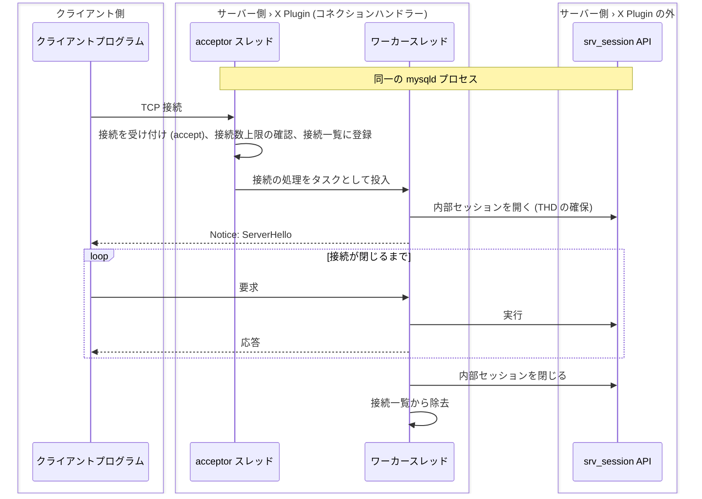
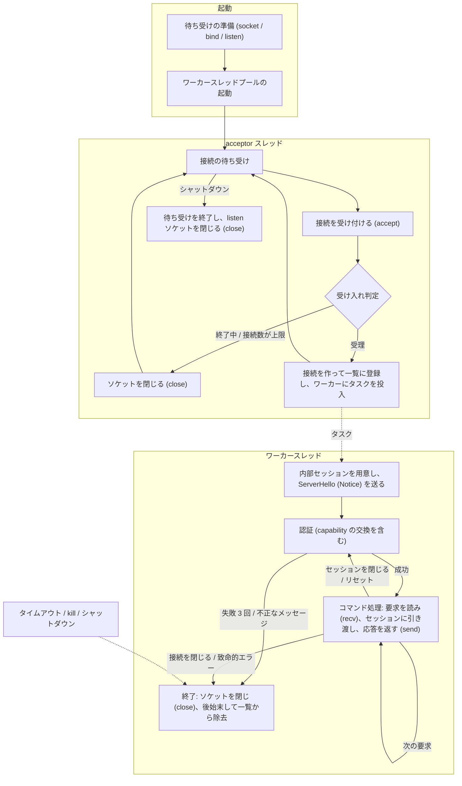
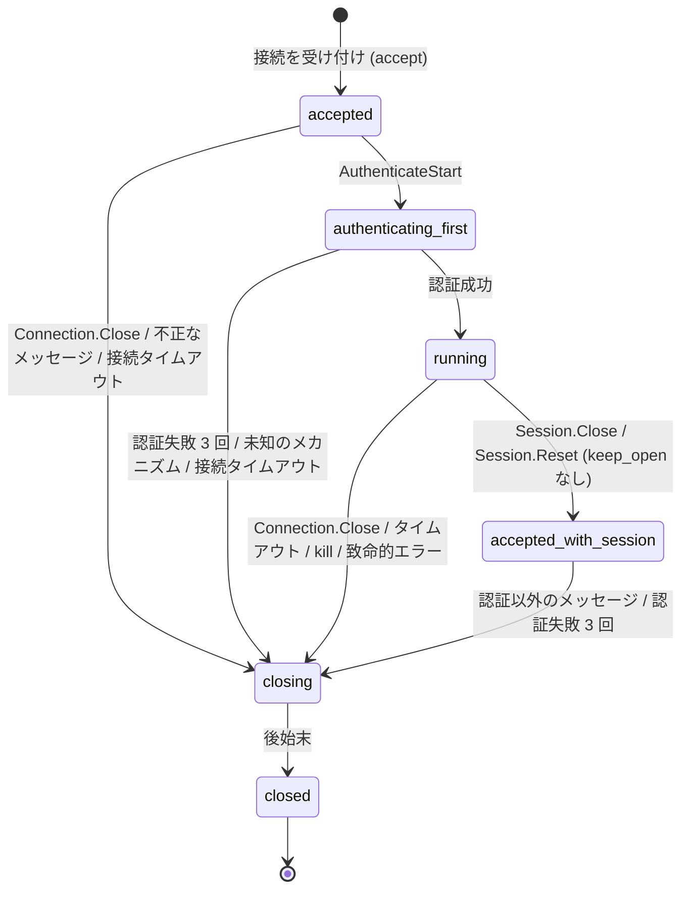

# コネクションハンドラー (X Plugin)

- X Plugin (位置づけは [X プロトコル](../protocol/x_protocol.md) 参照) のうち、接続の受付からセッションの確立・切断までを担う部分の仕様
- メッセージの形式と通信の流れは [specification/protocol/](../protocol/README.md) を参照
- コネクションハンドラーはサーバーの一部として動き、クライアントとの接点 (接続の受付、認証の進行、メッセージの読み書き) を担う

## 責務

### 担うこと

- listen ソケットの準備と接続の受付 (TCP / Unix ソケット)
- 接続数の上限管理と拒否
- 接続ごとの処理スレッドの割り当て (ワーカースレッドプール)
- 接続の状態管理 (受付 → 認証 → 稼働 → 終了) と、認証前に受け付けるメッセージの制限
- 接続に紐づくセッションの生成・再生成 (接続受付時と、セッションを閉じた / リセットしたとき)
- タイムアウト監視 (接続確立・アイドル・読み取り・書き込み) と強制切断 (kill、シャットダウン)
- 接続・セッション・スレッドに関する状態変数の更新

### 担わないこと

- 認証メカニズムの中身 (チャレンジの生成、`mysql.user` との照合) -> セッションが認証ハンドラに委譲する
- コマンド (SQL 実行、CRUD、管理コマンド) の実行 -> セッションのディスパッチャが受け取り、サーバーの SQL 層に委ねる
- メッセージの形式と順序の規則は -> [プロトコル](../protocol/README.md) にて定義

## 構成要素

状態と寿命を持ち、コネクションハンドラーの振る舞いの主体となるもの

- サーバー (Server): X Plugin 内に 1 つ
  - 接続を受け入れるかどうかを決め、受け入れた接続の全体を把握する (接続数の上限判定、kill、シャットダウン時の一斉通知はこの把握に基づく)
  - 起動から終了までの稼働状態を持ち、終了中は新しい接続を受け入れない
  - 参照:
    - [server.h の State](https://github.com/mysql/mysql-server/blob/aa461240270d809bcac336483b886b3d1789d4d9/plugin/x/src/server/server.h#L72-L77)
    - [接続一覧 (client_list.cc)](https://github.com/mysql/mysql-server/blob/aa461240270d809bcac336483b886b3d1789d4d9/plugin/x/src/ngs/client_list.cc#L48-L88)
- 接続 (Client): 受け付けた接続 1 本につき 1 つ生まれ、接続が閉じると消える
  - X Plugin はこれを Client と呼ぶ (ソース上で connection と呼ばれるのは、この下にあるソケットの抽象)
  - 接続上のバイト列をフレームとして読み書きし、接続の状態 (受付済み → 認証中 → 稼働中 → 終了) を管理する
  - 認証前のメッセージは自分で処理し、認証後はセッションに引き渡す
  - 常に 1 つのセッションを伴い、セッションが閉じられたら次のセッションを用意する
  - 参照:
    - [server_factory.cc の create_client](https://github.com/mysql/mysql-server/blob/aa461240270d809bcac336483b886b3d1789d4d9/plugin/x/src/server/server_factory.cc#L36-L52)
- セッション (Session): 接続の受付時に用意され、認証を経て利用可能になり、閉じられるまで続く
  - 認証の進行を管理し、成功した利用者の身元を確定する
  - その利用者としてコマンドを実行するための状態 (セッション変数、ユーザー変数、一時テーブルなど) を保持し、コマンドをディスパッチャに引き渡す
  - サーバーの内部セッションと 1 対 1 に対応し、生成と破棄のタイミングを共にする
    - 内部セッションとは、利用者の身元と実行状態 (セッション変数、一時テーブルなど) を持ち、その利用者として SQL を実行する SQL 層側の場 (実装上は THD にあたり、プラグイン向けの srv_session サービスで開閉する)
  - 参照:
    - [sql_data_context.cc の init](https://github.com/mysql/mysql-server/blob/aa461240270d809bcac336483b886b3d1789d4d9/plugin/x/src/sql_data_context.cc#L93-L125)

## スレッドモデル

構成要素の処理を実行するスレッドは 2 種類ある

- acceptor スレッド (スケジューラ名 `network`): listen ソケットのイベントループを回し、accept とタイマー (接続タイムアウトの監視、終了したワーカーの回収) を処理する
  - 参照:
    - [server_builder.cc](https://github.com/mysql/mysql-server/blob/aa461240270d809bcac336483b886b3d1789d4d9/plugin/x/src/server/builder/server_builder.cc#L99-L100)
    - [socket_events.cc の loop](https://github.com/mysql/mysql-server/blob/aa461240270d809bcac336483b886b3d1789d4d9/plugin/x/src/ngs/socket_events.cc#L171)
- ワーカースレッド (スケジューラ名 `work`): 接続 1 本の処理全体 (受付後の初期化から切断まで) を 1 つのタスクとして実行する
  - タスクは接続が閉じるまで終わらないため、接続 1 本がワーカースレッド 1 本を接続中ずっと占有する (thread-per-connection)
  - スレッドは同時接続数に応じて増減する動的なプールから割り当てられ、「プール」が効くのは切断後のアイドルスレッドを次の接続に再利用する局面 (classic protocol の thread cache に相当する役割)
  - したがって同時接続数の上限を決めるのは `mysqlx_max_connections` であり、`mysqlx_min_worker_threads` はスレッド数の上限ではない (増減の規則は [詳細仕様](./connection_handler_spec.md#ワーカースレッドプール) を参照)
  - 参照:
    - [server_builder.cc](https://github.com/mysql/mysql-server/blob/aa461240270d809bcac336483b886b3d1789d4d9/plugin/x/src/server/builder/server_builder.cc#L51-L53)
    - [client.cc の run](https://github.com/mysql/mysql-server/blob/aa461240270d809bcac336483b886b3d1789d4d9/plugin/x/src/client.cc#L606-L641)

## 処理の流れ

起動から終了までの全体像

## 接続とセッションの状態遷移

- 接続 (Client) の状態
  - 受付済み (`accepted`): accept 直後で、capability の交換と認証の開始だけを受け付ける
  - 初回認証中 (`authenticating_first`): 認証のやり取りをセッションに転送している
  - 稼働中 (`running`): 認証済みで、コマンドをセッションに引き渡す
  - 再認証待ち (`accepted_with_session`): セッションを閉じた後の状態で、接続属性の設定と認証だけを受け付ける
  - 終了中 (`closing`) → 終了 (`closed`): ソケットを閉じ、後始末をして接続一覧から消える
- セッションの状態
  - 認証中 (`authenticating`): 認証メッセージだけを受け付ける
  - 利用可能 (`ready`): コマンドを受け付ける
  - 終了中 (`closing`)
- 状態を動かす出来事
  - クライアントからのメッセージ: 認証の開始と成功、セッションを閉じる / リセットする、接続を閉じる
  - サーバー側の判断: タイムアウト、kill、シャットダウン、致命的エラー
  - どの経路も最終的には終了中 (`closing`) に合流し、後始末は 1 箇所で行われる
- 参照:
  - [interface/client.h の State](https://github.com/mysql/mysql-server/blob/aa461240270d809bcac336483b886b3d1789d4d9/plugin/x/src/interface/client.h#L54-L62)
  - [interface/session.h の State](https://github.com/mysql/mysql-server/blob/aa461240270d809bcac336483b886b3d1789d4d9/plugin/x/src/interface/session.h#L49-L56)

(各状態での具体的な処理は [コネクションハンドラーの詳細仕様 - 接続のライフサイクル](./connection_handler_spec.md#接続のライフサイクル) を参照)

## タイムアウトと上限の種類

コネクションハンドラーが守る境界は次の 5 種類 (具体的な条件と既定値は [コネクションハンドラーの詳細仕様 - タイムアウトと強制切断](./connection_handler_spec.md#タイムアウトと強制切断) を参照)

- 接続確立の上限: 接続してから認証を終えるまでの時間に上限を設け、未認証の接続がスレッドを占有し続けるのを防ぐ
- アイドルの上限: 次の要求を待つ時間に上限を設け、放置された接続を回収する (対話的な接続には別の上限を使う)
- 読み書きの上限: 1 メッセージの途中で止まった相手を切る (読み取りと書き込みで別々)
- メッセージ長の上限: 過大なフレームを受け付けない
- 接続数の上限: 同時接続数が上限に達したら受け付けない

強制的に接続を閉じる経路は kill (管理コマンドによる他の接続の切断、または自分自身の切断) とサーバーのシャットダウンの 2 つで、いずれも終了中 (`closing`) への遷移に合流する

## 参考資料

- [WL#8338: X Plugin](https://dev.mysql.com/worklog/task/?id=8338)
- [MySQL Connection Handling and Scaling](https://dev.mysql.com/blog-archive/mysql-connection-handling-and-scaling/)
- [MySQL 8.4 Reference Manual: Connection Interfaces](https://dev.mysql.com/doc/refman/8.4/en/connection-interfaces.html)
- [MySQL 8.4 Reference Manual: X Plugin](https://dev.mysql.com/doc/refman/8.4/en/x-plugin.html)
