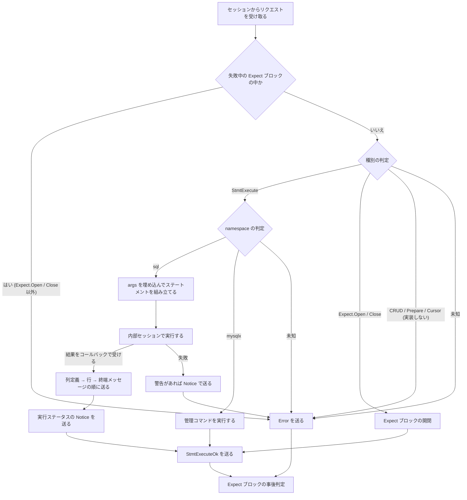

# コマンドディスパッチャ (X Plugin)

- X Plugin のうち、認証済みのセッションが受け取ったリクエストを種別ごとのハンドラに振り分け、SQL 層に実行を委ねて、レスポンスの列を終端メッセージまで送り返す部分の仕様
- 要件は [x_plugin.md](../connection/x_plugin.md) の「クエリ / DML インターフェース」「SQL インターフェース」「リザルトセット・インターフェース」の項を参照

## 責務

### 担うこと

- リクエストメッセージの種別の判定と、ハンドラへの振り分け
- `StmtExecute` の namespace (`sql` / `mysqlx`) の解決と、パラメータ (`args`) を埋め込んだステートメントの組み立て
- SQL 層 (内部セッション) への実行の委譲と、実行結果の受け取り
- 受け取った結果のプロトコルメッセージへの変換と、生成された順に送るストリーミング
- 実行ステータス (Affected Rows、Last Insert ID、サーバーからのメッセージ、警告) の Notice としての送出
- 1 つのリクエストに対するレスポンスの列の終端メッセージ (`StmtExecuteOk` または `Error`) の送出
- エラーの深刻度の決定 (シーケンスだけを中断する `ERROR` と、接続を閉じる `FATAL`)
- Expect ブロックによる、パイプラインされたリクエストの条件付き実行
- 未知の種別、未知の namespace、未知の管理コマンドへのレスポンス
- 実行に関する状態変数の更新

### 担わないこと

- ドキュメントモデル (CRUD メッセージ、コレクション系の管理コマンド) と、プロトコルのプリペアドステートメント・カーソル
  - 実装しないため、未対応のメッセージとしてエラーを返す ([SDR-0002](../sdr/0002.ドキュメントモデルは実装しない.md)、[SDR-0003](../sdr/0003.プロトコルのプリペアドステートメントとカーソルは実装しない.md))

## 構成要素

いずれもセッションに属し、セッションとライフサイクルを共有する

- 仕組み
  - ディスパッチャ (Dispatcher): リクエストを受け取り、Expect ブロックの判定を挟んでハンドラへ渡し、失敗したら `Error` を送る
  - ハンドラ: リクエストの種別ごとに 1 つあり、その種別の処理を行う
    - SQL ステートメントの処理: `StmtExecute` を受け、namespace に応じて SQL の実行か管理コマンドの実行に分ける
    - 管理コマンドの処理: コマンド名を引き、引数を検証して実行する
    - Expect ブロックの処理: `Expect.Open` / `Expect.Close` でブロックを開閉する
  - 内部セッション: SQL 層がセッションごとに持つ実行の文脈 (定義は [connection_handler.md のセッション](../connection/connection_handler.md#セッション-session) を参照)
    - ディスパッチャはここにステートメントの実行を依頼し、結果をコールバックで受け取る
  - デリゲート: 実行 1 回につき 1 つ作られ、SQL 層からのコールバック (列定義、行、完了、エラー) を受けてプロトコルのメッセージに変換して送る
  - Expect スタック: 開いている Expect ブロックの入れ子
- MineSQL での仕様
  - 内部セッションへの依頼は、ステートメントを SQL パーサーに渡し、返った実行コマンドのプリペアと実行を呼ぶだけで、classic のコマンド層 (`COM_QUERY` への変換) を介さない ([SDR-0006](../sdr/0006.classicのCOMコマンド層は作らない.md))

## 実行モデル

- ワーカースレッド上で、1 セッションにつき同時に 1 つのリクエストだけを同期的に処理する
  - パイプラインで先に届いたリクエストは受信側に溜まり、前のリクエストのレスポンスを送り終えてから順に処理される
  - したがってレスポンスの順序はリクエストの順序と一致する
  - パイプライン化が省くのは往復の待ちであって、並列化ではない
- 結果は溜め込まずに流す
  - 列定義は全列が揃った時点でまとめて送り、行は 1 行できるたびに送る
  - 長いリザルトセットの送信中も、行を送るたびに接続の生存と kill を確認する
- 警告だけは例外で、SQL 層の実行が終わるまで取り出せないため、警告がある場合は実行ステータスの Notice と終端メッセージをまとめて実行後に送る

## 処理の流れ

リクエストを 1 つ受け取ってから終端メッセージを送るまでの流れ

## ディスパッチャが保証する規則

protocol/ の [メッセージのやり取りの規則](../protocol/communication_flow.md#メッセージのやり取りの規則) を、サーバー側で守る立場から言い直したもの

- 1 つのリクエストには必ず 1 つの終端メッセージを返す (`StmtExecuteOk` または `Error`)
  - リクエストが失敗した場合も、Expect ブロックで拒否された場合も、終端メッセージは `Error` になる
- レスポンスの列はリクエストの順に返す (同時に 1 リクエストしか処理しないため自然に成り立つ)
- リザルトセットの列定義、行、`FetchDone`、Notice、終端メッセージの順序は [protocol/](../protocol) に記載した規則どおりに送る
  - 警告の Notice はリザルトセットの後、実行ステータスの Notice の前にまとめて送る
- エラーの深刻度
  - SQL の実行エラー、未知の種別、未知の namespace、管理コマンドの引数エラー、Expect ブロックの失敗は `ERROR` で、セッションは継続する
  - 実行中に内部セッションが KILL された場合と、SQL 層との連携そのものに失敗した場合は `FATAL` で、セッションを閉じる

## Expect ブロック

- 仕組み
  - 目的: パイプラインで送ったリクエストのうち、先行するリクエストが失敗したら後続を実行せずに失敗させる
    - これにより、クライアントはレスポンスを待たずに依存関係のあるリクエストを送れる
  - ブロックはセッションごとのスタックで管理され、入れ子にできる
    - 内側のブロックは既定で外側の条件を引き継ぐ
  - 条件 `no_error` を持つブロック内でリクエストが失敗すると、そのブロックは失敗状態になり、`Expect.Close` までのすべてのリクエストと `Close` 自身が `Error` になる
  - 条件を持たないブロックは失敗を吸収し、外側の `no_error` ブロックまで失敗を伝えない
- MineSQL での仕様
  - 実装する条件は `no_error` のみ ([SDR-0004](../sdr/0004.Expectブロックを実装する.md))

## 管理コマンド

- 仕組み
  - `StmtExecute` の namespace `mysqlx` で、SQL ではなくコマンド名と名前付き引数を送る経路
  - レスポンスは SQL ステートメントと同じ形 (リザルトセットがあれば列定義 → 行 → `FetchDone`、最後に `StmtExecuteOk`) で返す
  - `list_clients` と `kill_client` の対象は、`SUPER` を持つアカウントなら全ての接続、それ以外は同じアカウントの接続に限られる
- MineSQL での仕様
  - 実装するのは接続と Notice に関する 6 つ: `ping`、`list_clients`、`kill_client`、`enable_notices`、`disable_notices`、`list_notices` ([SDR-0005](../sdr/0005.管理コマンドは接続系とNotice系の6つを実装する.md))
  - `SUPER` に相当する権限を持たないため、`list_clients` と `kill_client` の対象は常に同じアカウントの接続だけ ([SDR-0018](../sdr/0018.権限は全体権限だけを持つ.md))
