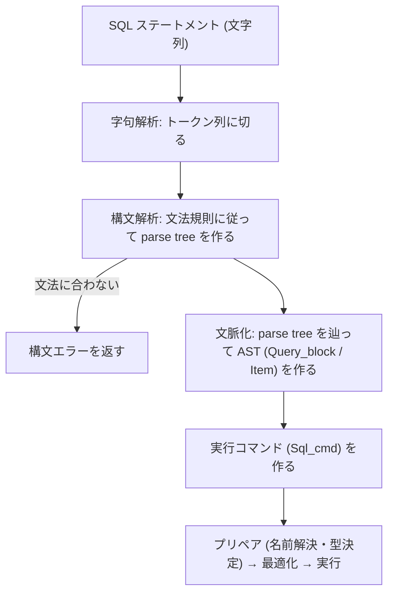
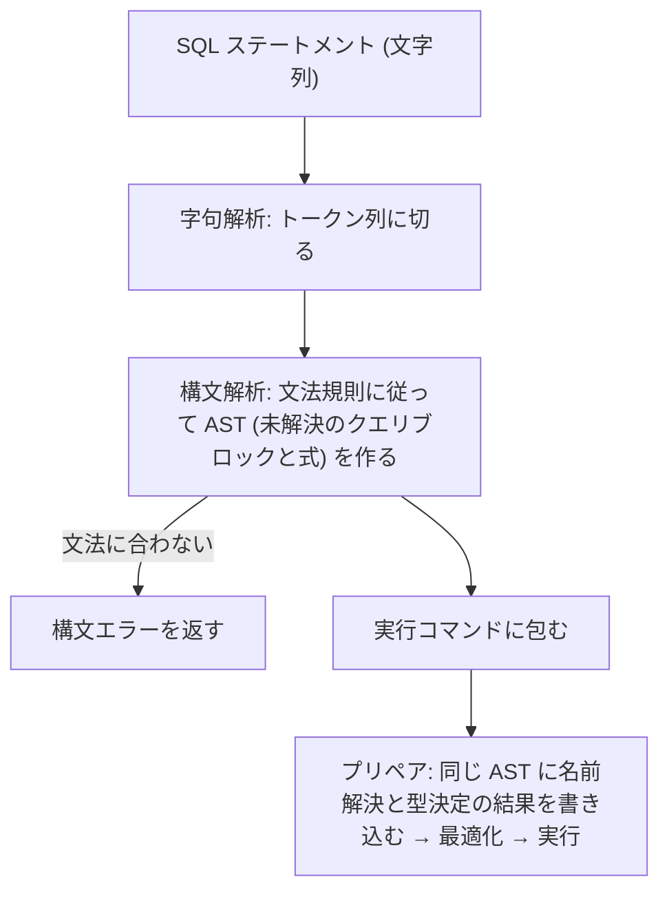

# SQL パーサー

- SQL 層の入口として、SQL ステートメントの文字列を受け取り、次の段階 (プリペア = 名前解決と型決定) が扱える Tree に変換する部分の仕様
- ディスパッチャがステートメントを SQL 層に渡すまでは [dispatcher/](../dispatcher/README.md) を参照

## 責務

### 担うこと

- 字句解析: ステートメントの文字列をトークン (キーワード、識別子、リテラル、記号) の列に切る
- 構文解析: トークン列が文法に合っているかを判定し、合っていれば構造を表す Tree を作る (MySQL では parse tree、minesql では句の単位の AST)
  - 構文上の同義語 (`<>` と `!=`、`JOIN` と `INNER JOIN` など) はここで吸収し、同じトークン・同じノードにする
- 構文エラーの報告: 文法に合わない入力に対して、位置を含むエラーを返す
- MySQL ではさらに、文脈化 (parse tree を辿ってクエリ式・クエリブロック・式の Tree からなる AST を組み立てる) と実行コマンド (`Sql_cmd`) の生成までを `parse_sql` の中で行う
  - minesql のパーサーは文脈化を行わず、AST をステートメント種別ごとの実行コマンドに包んで返す ([minesql での段階の切り方](#minesql-での段階の切り方) を参照)

### 担わないこと

- 名前解決と型の決定 (テーブルや列が存在するか、式の型は何か) と、そのためのデータディクショナリの参照
  - プリペアの段階 (`prepare/`) で行うため
- クエリの変換 (`FROM a, b` を結合として扱う、`IN` を `OR` に展開するなど、意味を扱う書き換え)
  - プリペアと最適化の段階で行うため
- 実行計画の選択と実行
  - 最適化と実行の段階 (`optimizer/`、`executor/`) で行うため
- ステートメントの受け取りと結果の返送
  - ディスパッチャが行うため ([dispatcher/](../dispatcher/README.md))

## 構成要素

- 字句解析器 (lexer): 入力の文字列と読み取り位置を持ち、求められるたびに次のトークンを 1 つ返す
  - キーワードと識別子の区別はキーワード表で行う
  - MySQL では手書きで、Bison が生成した構文解析器から呼ばれる
  - 参照:
    - [sql_lex.cc の my_sql_parser_lex / lex_one_token](https://github.com/mysql/mysql-server/blob/aa461240270d809bcac336483b886b3d1789d4d9/sql/sql_lex.cc#L1367-L1436)
    - [sql_lex.h の Lex_input_stream](https://github.com/mysql/mysql-server/blob/aa461240270d809bcac336483b886b3d1789d4d9/sql/sql_lex.h#L3296-L3303)
    - [lex.h のキーワード表](https://github.com/mysql/mysql-server/blob/aa461240270d809bcac336483b886b3d1789d4d9/sql/lex.h)
- 構文解析器 (parser): 文法規則の集合で、トークン列から parse tree を組み立てる
  - MySQL では Bison の LALR(1) 文法 (`sql_yacc.yy`、約 18,000 行) から生成される
  - 参照:
    - [sql_yacc.yy の宣言部](https://github.com/mysql/mysql-server/blob/aa461240270d809bcac336483b886b3d1789d4d9/sql/sql_yacc.yy#L553-L567)
    - [start_entry / sql_statement 規則](https://github.com/mysql/mysql-server/blob/aa461240270d809bcac336483b886b3d1789d4d9/sql/sql_yacc.yy#L2301-L2347)
- parse tree (MySQL のみ): 構文解析の出力で、ステートメントの構造をそのまま写した一時的な Tree
  - 文脈に依存しない (作る時点でテーブルやセッションの状態を見ない)
  - minesql はこれを持たず、構文解析の出力を直接 AST にする ([minesql での段階の切り方](#minesql-での段階の切り方) を参照)
  - 各ノードは `contextualize` を持ち、根のノードは実行コマンドを作る `make_cmd` を持つ
  - 参照:
    - [parse_tree_node_base.h の Parse_tree_node_tmpl](https://github.com/mysql/mysql-server/blob/aa461240270d809bcac336483b886b3d1789d4d9/sql/parse_tree_node_base.h#L231-L330)
    - [parse_tree_nodes.h の Parse_tree_root](https://github.com/mysql/mysql-server/blob/aa461240270d809bcac336483b886b3d1789d4d9/sql/parse_tree_nodes.h#L162-L175)
    - [PT_select_stmt](https://github.com/mysql/mysql-server/blob/aa461240270d809bcac336483b886b3d1789d4d9/sql/parse_tree_nodes.h#L1880)
- AST (名前解決に進める状態の Tree): MySQL では文脈化の出力、minesql では構文解析の出力で、プリペア・最適化・実行の各段階が同じ構造を使う
  - クエリ式 (`Query_expression`)、クエリブロック (`Query_block`)、式の Tree (`Item`) からなり、`LEX` を根とする
  - 参照:
    - [sql_lex.h の Query_expression](https://github.com/mysql/mysql-server/blob/aa461240270d809bcac336483b886b3d1789d4d9/sql/sql_lex.h#L626)
    - [Query_block](https://github.com/mysql/mysql-server/blob/aa461240270d809bcac336483b886b3d1789d4d9/sql/sql_lex.h#L1167)
    - [item.h の Item](https://github.com/mysql/mysql-server/blob/aa461240270d809bcac336483b886b3d1789d4d9/sql/item.h#L936)
- 実行コマンド (`Sql_cmd`): ステートメント 1 つのプリペアと実行の手順を表すオブジェクト
  - minesql でもパーサーの出口で AST を包んで作り、SQL 層の入口は `prepare` → `execute` を呼ぶだけにする (種別の switch を持たない)
  - 参照:
    - [parse_tree_nodes.cc の PT_select_stmt::make_cmd](https://github.com/mysql/mysql-server/blob/aa461240270d809bcac336483b886b3d1789d4d9/sql/parse_tree_nodes.cc#L761-L806)

## 処理の流れ

- MySQL の流れ

- minesql の流れ (文脈化を持たず、構文解析が AST を直接作る)

- MySQL では、ディスパッチャから渡されたステートメントを `dispatch_sql_command` が受け、`parse_sql` が字句解析から実行コマンドの生成までを行い、`mysql_execute_command` が実行コマンドを実行する
  - 参照:
    - [sql_parse.cc の dispatch_sql_command](https://github.com/mysql/mysql-server/blob/aa461240270d809bcac336483b886b3d1789d4d9/sql/sql_parse.cc#L5275)
    - [parse_sql](https://github.com/mysql/mysql-server/blob/aa461240270d809bcac336483b886b3d1789d4d9/sql/sql_parse.cc#L7098)
    - [mysql_execute_command](https://github.com/mysql/mysql-server/blob/aa461240270d809bcac336483b886b3d1789d4d9/sql/sql_parse.cc#L2909)

## MySQL の設計の要点

構文解析と文脈化を分けているのは、5.7 から 8.0 にかけて行われたパーサーの作り直しの結果で、動機は次の通り

- 旧設計の制約: 文法規則にアクションが埋め込まれ、トークンを認識するたびに `LEX` を直接書き換えていた
  - Bison が生成するのはボトムアップ (LALR(1)) の構文解析器だが、旧文法は規則の先頭や途中にアクションを置き、子要素を読む前に親側の文脈を作る「トップダウン風」の書き方になっていた
  - アクションが文脈 (それまでに何を読んだか、セッションの状態) に依存し、文法の衝突が多く、拡張と修正が難しかった
  - パーサーが「後の実行の判断」まで下しており、字句・構文の処理と意味の処理が混ざっていた
- 新設計による解消: パーサーは文脈に依存しない parse tree を出すだけにし、文脈に依存する処理は文脈化の段階に寄せた
  - parse tree はただのオブジェクトの Tree なので、保存・復元・デバッグが容易になった
  - 文法が単純になり衝突が減り、構文エラーの位置も正確になった
- 参照:
  - [SQL parser refactoring in 5.7.4 LAB release](https://dev.mysql.com/blog-archive/sql-parser-refactoring-in-5-7-4-lab-release/)
  - [WL#6707: Refactor MySQL server parser to build the AST in a natural "bottom-up" way](https://dev.mysql.com/worklog/task/?id=6707)
  - [MySQL 8.0: Refactoring and Improving the Parser](https://dev.mysql.com/blog-archive/mysql-8-0-labs-refactoring-and-improving-the-parser/)

## minesql で対応する構文の方針

- 対応するステートメント (SELECT / INSERT / UPDATE / DELETE / CREATE TABLE / トランザクション制御など) は、MySQL の構文規則にできるだけ従う
  - ステートメントの規則: `sql_yacc.yy` の対応する規則を写す
    - 参照:
      - [select_stmt](https://github.com/mysql/mysql-server/blob/aa461240270d809bcac336483b886b3d1789d4d9/sql/sql_yacc.yy#L9672)、[query_expression](https://github.com/mysql/mysql-server/blob/aa461240270d809bcac336483b886b3d1789d4d9/sql/sql_yacc.yy#L9769)、[query_primary](https://github.com/mysql/mysql-server/blob/aa461240270d809bcac336483b886b3d1789d4d9/sql/sql_yacc.yy#L9831)
      - [insert_stmt](https://github.com/mysql/mysql-server/blob/aa461240270d809bcac336483b886b3d1789d4d9/sql/sql_yacc.yy#L13064)、[update_stmt](https://github.com/mysql/mysql-server/blob/aa461240270d809bcac336483b886b3d1789d4d9/sql/sql_yacc.yy#L13389)、[delete_stmt](https://github.com/mysql/mysql-server/blob/aa461240270d809bcac336483b886b3d1789d4d9/sql/sql_yacc.yy#L13445)
      - [create_table_stmt](https://github.com/mysql/mysql-server/blob/aa461240270d809bcac336483b886b3d1789d4d9/sql/sql_yacc.yy#L3217)
      - [begin_stmt / commit / rollback](https://github.com/mysql/mysql-server/blob/aa461240270d809bcac336483b886b3d1789d4d9/sql/sql_yacc.yy#L17255-L17299)
  - 式の階層と演算子の優先順位: `expr` → `bool_pri` → `predicate` → `bit_expr` → `simple_expr` の規則と、`%left` / `%right` の優先順位宣言を写す
    - 参照:
      - [式の規則](https://github.com/mysql/mysql-server/blob/aa461240270d809bcac336483b886b3d1789d4d9/sql/sql_yacc.yy#L10077-L10351)
      - [優先順位の宣言](https://github.com/mysql/mysql-server/blob/aa461240270d809bcac336483b886b3d1789d4d9/sql/sql_yacc.yy#L1479-L1515)
  - 字句規則: 識別子と引用、文字列・数値リテラル、コメントの規則と、キーワードのうち識別子としても使える語の一覧
    - 参照:
      - [ident_keyword](https://github.com/mysql/mysql-server/blob/aa461240270d809bcac336483b886b3d1789d4d9/sql/sql_yacc.yy#L15217)、[ident_keywords_unambiguous](https://github.com/mysql/mysql-server/blob/aa461240270d809bcac336483b886b3d1789d4d9/sql/sql_yacc.yy#L15311)
- 従わないもの
  - 実装しない機能に付随する構文 (`INTO OUTFILE`、インデックスヒント、オプティマイザヒント、パーティション句、ウィンドウ関数、CTE など) は受理せず、構文エラーにする
  - 後方互換のためだけの別表記 (例: 既定の `sql_mode` で `||` を OR と読む挙動) は採用しない
- サブクエリは対応しないため、式の位置に `(SELECT ...)` を書くと構文エラーになる (MySQL は受理するので、ここは応答が異なる)
- 従わなかった構文は、詳細仕様 ([sql_parser_spec.md](./reference/sql_parser_spec.md)) にステートメントごとの表 (写した規則 / 採用した選択肢 / 外した選択肢と理由) として記録する

## minesql での段階の切り方

- minesql のパーサーは「ステートメントの文字列 → AST」までを担い、MySQL の文脈化に相当する段階を持たない
  - AST は句の単位で構成する (SELECT なら選択リスト / FROM / WHERE / ORDER BY / LIMIT を持つノード)
    - 構文規則の形をそのまま写した Tree を別に持たない
  - AST は MySQL の `Query_block` / `Item` に相当する構造を、未解決の状態で作ったもの (2026-09-12 確定)
    - プリペアは同じノードに解決結果 (列への束縛、型) を書き込み、最適化と実行も同じ構造を使う (MySQL のプリペア以降と同じ形)
    - パーサーは解決結果の欄に一切書かず、未解決の印のまま返す
    - 解決済みかどうかは明示的な印で表し、最適化と実行は解決済みのノードだけを受け取る
  - パーサーの出口は、AST をステートメント種別ごとの実行コマンド (MySQL の `Sql_cmd` 相当で、`prepare` と `execute` の入口を持つ) に包んだもの (2026-09-12 確定)
    - 種別から実行コマンドへの対応は還元された文法規則だけで決まり、文脈もデータディクショナリも読まない
    - SQL 層の入口は実行コマンドを受け取って `prepare` → `execute` を呼ぶだけで、MySQL の `mysql_execute_command` にある種別の switch は持たない
  - 名前解決・型決定・データディクショナリの参照・クエリの変換は、プリペア以降の責務
- 理由
  - MySQL の parse tree と文脈化は、生まれる時点で周囲 (所属するクエリブロック、外側のクエリ、文中の位置) を必要とする旧来の構造と、内側から外側へ進むボトムアップ解析の順序との衝突を解くためのもので、minesql の構造は周囲を知らずに作れるため不要 (サブクエリがなく 1 文に 1 クエリブロック、セッションに依存する作り分けもない)
  - サブクエリや HAVING を後から入れる場合も、「ノードは周囲を知らずに作れる」「周囲に依存する判断はプリペアで行う」の 2 つを守れば、文法とプリペアの追加で済む
  - 文法規則の末尾のアクションで句の単位の AST を直接作れるため、組み替えの段階が不要
  - パーサーがデータディクショナリやセッションを読むと、同じ文字列から異なる AST が出る (文脈依存) 設計に戻る
- パーサーが守る性質
  - 文脈に依存しない: データディクショナリ・セッション・自分の途中状態を読まず、同じ文字列からは常に同じ AST を返す (判定基準: パーサーの関数にデータディクショナリやセッションが引数として現れない)
  - 子が揃ってから親を作る: 各解析関数は子を解析した戻り値からノードを作って返し、共有状態への破壊的更新で Tree を育てない
- 実装手段
  - 字句解析器は手書き (MySQL と同じ)
    - キーワード表と、識別子として使える語の扱いはここに置く
  - 構文解析器は goyacc で文法ファイルから生成する LALR(1) パーサー (MySQL の Bison と同系)
    - 文法ファイルは `sql_yacc.yy` の対応する規則を写し、規則末尾のアクションで AST ノードを作る
    - 演算子の優先順位は `sql_yacc.yy` の `%left` / `%right` 宣言を転記する
    - 衝突は 0 を維持する (`%expect` を使わない)
  - 構文エラーの文言は MySQL 形式 (`… near '…' at line N`) に合わせる
  - 生成コードはリポジトリに含め、`go generate` で再生成する

## エラー

- 構文エラーはステートメント単位で報告され、セッションは継続する (ディスパッチャの深刻度では `ERROR`)
- 名前解決の失敗 (存在しないテーブルや列) は構文エラーではなく、プリペアの段階のエラーになる
