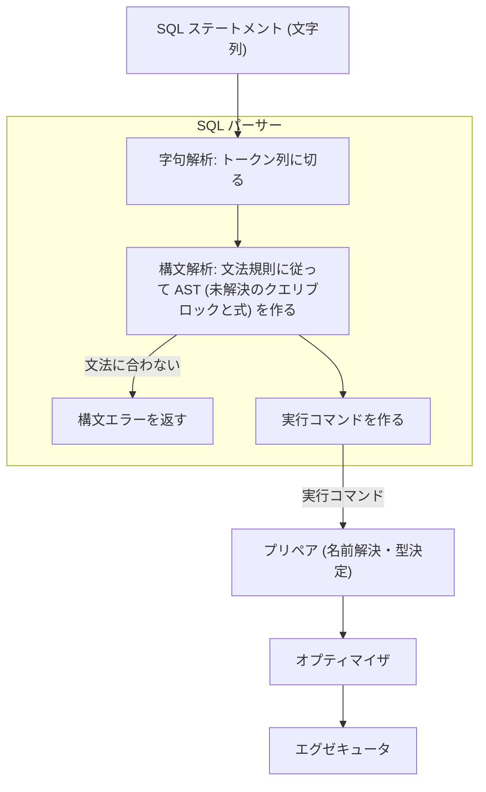
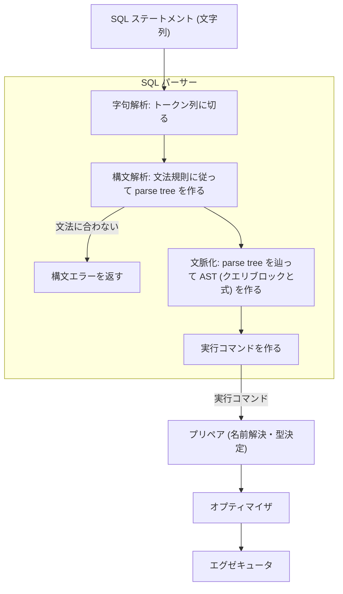

# SQL パーサー

- SQL 層の入口として、ステートメントの文字列を受け取り、プリペア以降の段階が扱える形 (AST を持つ実行コマンド) に変換する部分の仕様

## 責務

### 担うこと

- 字句解析: ステートメントの文字列をトークン (キーワード、識別子、リテラル、記号) の列に切る
- 構文解析: トークン列が文法に合っているかを判定し、合っていれば句の単位の AST (未解決のクエリブロックと式) を作る
  - 構文上の同義語 (`<>` と `!=`、`JOIN` と `INNER JOIN` など) はここで吸収し、同じトークン・同じノードにする
- 構文エラーの報告: 文法に合わない入力に対して、位置を含むエラーを返す
- 実行コマンドの生成: 認識したステートメントの種別に対応する実行コマンドを作り、AST を持たせて返す (パーサーが返すのは AST そのものではなく実行コマンド)

## 構成要素

- 字句解析器 (lexer): 入力の文字列と読み取り位置を持ち、求められるたびに次のトークンを 1 つ返す
  - キーワードと識別子の区別はキーワード表で行う
- 構文解析器 (parser): 文法規則の集合で、トークン列から AST を組み立てる
  - 文法に合わない入力には構文エラーを返す
- AST: 構文解析の出力で、句の単位で構成した未解決のクエリブロックと式
  - 未解決とは、書かれた名前 (表名、列名) がどの表・どの列を指すか、式の値の型が何か、がまだ決まっていない状態のこと
  - プリペアが同じノードに解決結果を書き込み、オプティマイザとエグゼキュータも同じ構造を使う
- 実行コマンド (Sql_cmd): ステートメント 1 つのプリペアと実行の操作を持つオブジェクトで、パーサーがステートメントの種別に対応するものを作り、AST を持たせて返す
  - 例: `SELECT name FROM users WHERE id = 1` からは、次のような SELECT 用の実行コマンドができる

    ```text
    実行コマンド (SELECT)
      AST:
        select list: [name]
        FROM:        [users]
        WHERE:       id = 1
    ```

  - 例: `CREATE TABLE users (id INT, name VARCHAR(20))` からは、表の定義を持つ CREATE TABLE 用の実行コマンドができる

    ```text
    実行コマンド (CREATE TABLE)
      表の定義: users (id INT, name VARCHAR(20))
    ```

## 処理の流れ


```mermaid
flowchart TD
    A["SQL ステートメント (文字列)"]
    subgraph parser ["SQL パーサー"]
        L["字句解析: トークン列に切る"] --> P["構文解析: 文法規則に従って AST (未解決のクエリブロックと式) を作る"]
        P -- "文法に合わない" --> E["構文エラーを返す"]
        P --> S["実行コマンドを作る"]
    end
    A --> L
    S -->|"実行コマンド"| PR["プリペア (名前解決・型決定)"]
    PR --> O["オプティマイザ"]
    O --> X["エグゼキュータ"]
```

## MySQL の設計の要点

### MySQL のパーサーの構成要素

- 字句解析器: 手書きで、Bison が生成した構文解析器から呼ばれる
- 構文解析器: Bison の LALR(1) 文法から生成される
- parse tree: 構文解析の出力で、ステートメントの構造をそのまま写した一時的な Tree
  - 文脈に依存しない
    - 作る時点で、テーブルの定義や、接続ごとに保たれている設定や状態 (例えば、スキーマ名を付けずに書かれた表名をどのスキーマで探すか) を見ない
  - 各ノードは自分を文脈化する操作を持ち、根のノードは実行コマンドを作る操作を持つ
    - 文脈化とは、parse tree を根から辿り、各ノードを「今どのクエリブロックの中にいるか」などの文脈に当てはめて AST を組み立てる段階のこと
- AST: 文脈化の出力で、プリペア・オプティマイザ・エグゼキュータが同じ構造を使う
  - クエリ式、クエリブロック、式の Tree からなる
- 実行コマンド: ステートメント 1 つのプリペアと実行の操作を持つオブジェクトで、parse tree の根が作る

### MySQL のパーサーの処理の流れ


```mermaid
flowchart TD
    A["SQL ステートメント (文字列)"]
    subgraph parser ["SQL パーサー"]
        L["字句解析: トークン列に切る"] --> P["構文解析: 文法規則に従って parse tree を作る"]
        P -- "文法に合わない" --> E["構文エラーを返す"]
        P --> C["文脈化: parse tree を辿って AST (クエリブロックと式) を作る"]
        C --> S["実行コマンドを作る"]
    end
    A --> L
    S -->|"実行コマンド"| PR["プリペア (名前解決・型決定)"]
    PR --> O["オプティマイザ"]
    O --> X["エグゼキュータ"]
```

### 構文解析と文脈化を分けた理由

構文解析と文脈化を分けたのは、5.7 から 8.0 にかけてパーサーを作り直したときで、理由は次のとおり

- 旧設計では、文法規則の中に「読んだそばから意味を組み立てる」処理が埋め込まれていた
  - 構文解析器は部品を下から順に認識していくのに、旧文法は部品を読み切る前に親側の意味を作ろうとしていた
  - その処理は「それまでに何を読んだか」や接続ごとの設定に左右されるため、文法が複雑になって衝突が多く、直すのも広げるのも難しかった
  - 構文を読む仕事と、意味を決める仕事が 1 つの場所に混ざっていた
- 新設計では、構文解析器は文の形をそのまま写した木 (parse tree) を作るだけにし、意味を決める処理は文脈化に移した
  - 木は単なるデータなので、保存や調査がしやすい
  - 文法が単純になって衝突が減り、構文エラーの位置も正確になった

## MineSQL で対応する構文の方針

- 対応するステートメント
  - `SELECT` (`INNER JOIN`、`ORDER BY`、`LIMIT`、`FOR UPDATE` / `FOR SHARE` を含む)
  - `INSERT` / `UPDATE` / `DELETE`
  - `CREATE TABLE` / `DROP TABLE`
  - `CREATE SCHEMA` / `DROP SCHEMA` / `USE`
  - トランザクション制御 (`BEGIN`、`START TRANSACTION [WITH CONSISTENT SNAPSHOT]`、`COMMIT`、`ROLLBACK`)
  - アカウント管理ステートメント (`CREATE USER` / `ALTER USER` / `DROP USER`) と `GRANT` / `REVOKE`
- これらのステートメントは、MySQL の構文規則にできるだけ従う
  - 従う範囲は、ステートメントの構文、式の階層と演算子の優先順位、字句規則 (識別子と引用、文字列・数値リテラル、コメント、識別子としても使えるキーワード)
- 対応しないもの
  - 実装しない機能に付随する構文 (`GROUP BY` / `HAVING`、集約関数、`LEFT` / `RIGHT JOIN`、`UNION`、関数呼び出し、`VARCHAR` 以外の型 など): 構文エラーにする
  - 後方互換のためだけの別表記 (例: 既定の `sql_mode` で `||` を OR と読む挙動): 構文エラーにする
  - サブクエリ: 式の位置に書かれた `(SELECT ...)` は構文エラーにする

## MineSQL の設計の要点

- パーサーは「ステートメントの文字列 → AST を持つ実行コマンド」までを担い、MySQL の文脈化に相当する段階を持たない
  - 構文解析が AST を直接作り、MySQL の parse tree のような文法規則ごとにノードを持つ木は別に作らない
  - 名前解決、型決定、データディクショナリの参照、クエリの変換はプリペア以降が行い、パーサーは一切行わない
  - 解決済みかどうかはノードに明示的な印で持ち、オプティマイザとエグゼキュータは解決済みのノードだけを受け取る
- 実行コマンドとの境界
  - ステートメントの種別から実行コマンドへの対応は、還元された文法規則だけで決まる
  - 実行コマンドを受け取る側は、プリペアと実行の操作を呼ぶだけで、種別ごとの分岐を持たない
- パーサーが守る性質
  - 文脈に依存しない: データディクショナリ・内部セッションの実行状態・自分の途中状態を読まず、同じ文字列からは常に同じ AST を返す (判定基準: パーサーの関数にデータディクショナリや内部セッションが引数として現れない)
  - 子が揃ってから親を作る: 各解析関数は子を解析した戻り値からノードを作って返し、共有状態への破壊的更新で Tree を育てない
- 実装手段
  - 字句解析器は手書きにする
  - 構文解析器は文法ファイルから生成する LALR(1) パーサーにする
  - 文法の衝突は 0 を維持する
  - 構文エラーの文言は MySQL の形式に合わせる

## エラー

- 構文エラーはステートメント単位で報告され、セッションは継続する (ディスパッチャの深刻度では `ERROR`)
- 名前解決の失敗 (存在しないテーブルや列) は構文エラーではなく、プリペアの段階のエラーになる

## 参考資料

- [SQL parser refactoring in 5.7.4 LAB release](https://dev.mysql.com/blog-archive/sql-parser-refactoring-in-5-7-4-lab-release/)
- [WL#6707: Refactor MySQL server parser to build the AST in a natural "bottom-up" way](https://dev.mysql.com/worklog/task/?id=6707)
- [MySQL 8.0: Refactoring and Improving the Parser](https://dev.mysql.com/blog-archive/mysql-8-0-labs-refactoring-and-improving-the-parser/)
