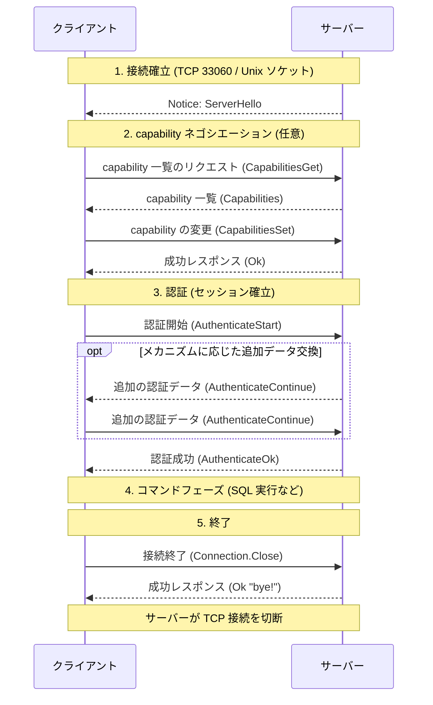
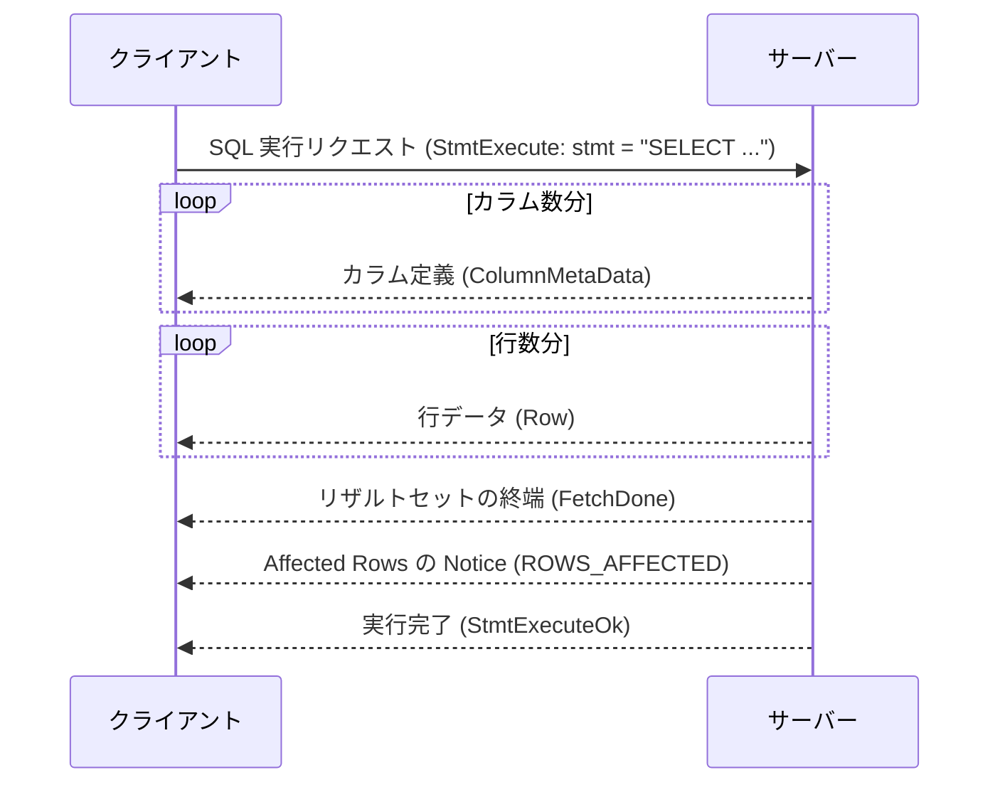

# X プロトコルの通信の流れ

以下、X プロトコルの通信全体の流れ

メッセージの形式 (フレーム構造) は [x_protocol.md](./x_protocol.md)、各メッセージの詳細な仕様は [message_spec.md](./message_spec.md) を参照

## 全体像

1 つの接続は「接続確立 → capability ネゴシエーション → 認証 → コマンド実行 → 終了」という段階を踏む

### 1. 接続確立

- クライアントがサーバーの X プロトコル用ポート (デフォルト 33060) に TCP または Unix ソケットで接続する
- サーバーは接続を受け付けるとすぐに `ServerHello` の Notice を送る

### 2. capability ネゴシエーション (任意)

- capability とは「この接続で何ができるか」を表す名前付きの設定値
  - 例: TLS を使うか、どの認証メカニズムが使えるか、どの圧縮アルゴリズムが使えるか
- クライアントは capability の一覧を取得し、必要なら変更を求める (例: TLS 接続への切り替え)
- この手続きは認証より前にだけ行える
  - 認証後に送ると、セッションのディスパッチャが扱えないメッセージとして通常の `Error` (`ER_UNKNOWN_COM_ERROR`) が返る
  - 参照:
    - [mysqlx_connection.proto の CapabilitiesSet の前提条件](https://github.com/mysql/mysql-server/blob/aa461240270d809bcac336483b886b3d1789d4d9/plugin/x/protocol/protobuf/mysqlx_connection.proto#L74)
    - [xpl_dispatcher.cc の dispatch](https://github.com/mysql/mysql-server/blob/aa461240270d809bcac336483b886b3d1789d4d9/plugin/x/src/xpl_dispatcher.cc#L46-L119)

### 3. 認証 (セッション確立)

- クライアントが使いたい認証メカニズムを指定して認証を開始する
- メカニズムによっては追加の認証データの往復がある
  - 例: チャレンジレスポンス方式では、サーバーから届いた課題に対してクライアントがパスワードから計算したレスポンスを返す (パスワードそのものは送らない)
- 認証が成功するとセッションが確立し、コマンドを送れるようになる

### 4. コマンドフェーズ

- クライアントが SQL 実行などのリクエストを送り、サーバーのレスポンスを受け取ることを繰り返す (詳細は後述の「SQL 実行の流れ」)

### 5. 終了

- クライアントが接続終了の意思を伝えると、サーバーは成功レスポンスを返して TCP 接続を切断する
- 接続を維持したままセッションだけを閉じ、再認証して同じ接続を使い回すこともできる
  - セッションを閉じた後の接続は認証待ちの状態に戻り、認証以外のリクエストは基本的に受け付けない

## メッセージのやり取りの規則

- やり取りは「シーケンス」(= 最初のリクエスト + それに続くレスポンスの列) という単位で進む
- シーケンスは必ずクライアントからのリクエスト (認証開始、SQL 実行リクエストなど) で開始される
- シーケンスの終わり方は 2 通り
  - レスポンスの列が末尾まで届いて正常終了する
  - サーバーがエラーを返して中断する
- エラーには 2 段階の深刻度がある
  - 継続可能なエラー: 実行中のシーケンスは中断されるが、セッションは継続する
  - 致命的なエラー: クライアントはサーバーが以降のリクエストを処理することを期待せず、接続を閉じるべき
- クライアントは前のレスポンスを待たずに次のリクエストを送ってよい (パイプライン化により往復のレイテンシを削減できる)
- サーバーはリクエストへのレスポンスとは別に、Notice を送ることがある
- Notice には 2 つの種類がある
  - 実行中のシーケンスに関する Notice (SQL 実行で発生した警告や Affected Rows など) で、シーケンスの途中に挟まれて送られるもの
  - シーケンスとは無関係な Notice (接続直後の `ServerHello` など) で、いつでも送られうるもの
- 参照:
  - [mysqlx.proto の `@section messages_Message_Sequence`](https://github.com/mysql/mysql-server/blob/aa461240270d809bcac336483b886b3d1789d4d9/plugin/x/protocol/protobuf/mysqlx.proto#L103-L118)
  - [mysqlx.proto の Error の severity の説明](https://github.com/mysql/mysql-server/blob/aa461240270d809bcac336483b886b3d1789d4d9/plugin/x/protocol/protobuf/mysqlx.proto#L257-L263)
  - [mysqlx-protocol-lifecycle.dox の Stages of Session Setup](https://github.com/mysql/mysql-server/blob/aa461240270d809bcac336483b886b3d1789d4d9/plugin/x/protocol/doc/mysqlx-protocol-lifecycle.dox#L118-L128)

## SQL 実行の流れ

- 1 つの SQL 実行リクエストに対して「カラム定義 → 行データ → リザルトセットの終端 → 実行ステータスの Notice → 実行完了」というレスポンスの列が返る
- 実行により発生した警告や Affected Rows などの実行ステータスは、リザルトセットとは別の Notice として届く
- リザルトセットを返さないステートメント (`INSERT` など) では `ColumnMetaData` / `Row` / `FetchDone` は送られず、Notice と `StmtExecuteOk` だけが返る
- Notice の内訳と順序
  - `ROWS_AFFECTED` はステートメントの種類によらず常に送られる
  - `GENERATED_INSERT_ID` は値が 0 より大きいときだけ、`PRODUCED_MESSAGE` はサーバーからのメッセージがあるときだけ送られる
  - 警告がある場合は、これらの前に警告の Notice がまとめて送られる
- 参照:
  - [streaming_command_delegate.cc の handle_ok](https://github.com/mysql/mysql-server/blob/aa461240270d809bcac336483b886b3d1789d4d9/plugin/x/src/streaming_command_delegate.cc#L503-L523)
  - [custom_command_delegates.cc の try_send_notices](https://github.com/mysql/mysql-server/blob/aa461240270d809bcac336483b886b3d1789d4d9/plugin/x/src/custom_command_delegates.cc#L113-L128)
  - [streaming_command_delegate.cc の defer_on_warning](https://github.com/mysql/mysql-server/blob/aa461240270d809bcac336483b886b3d1789d4d9/plugin/x/src/streaming_command_delegate.cc#L556-L579)

