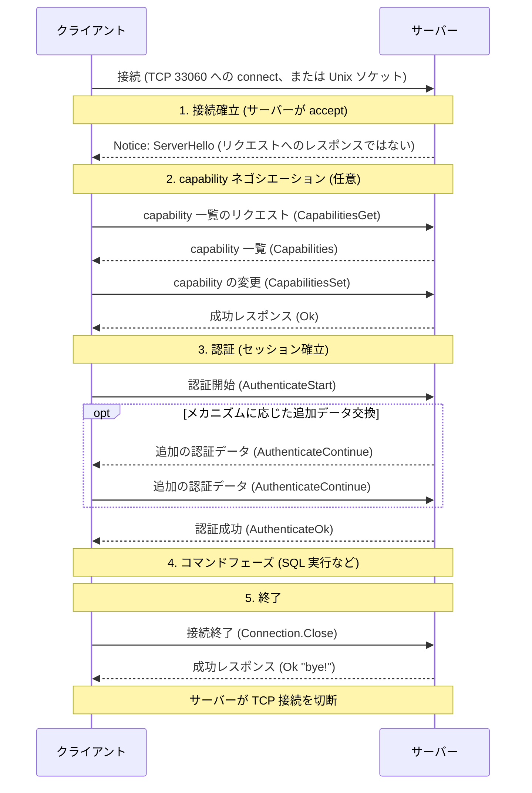
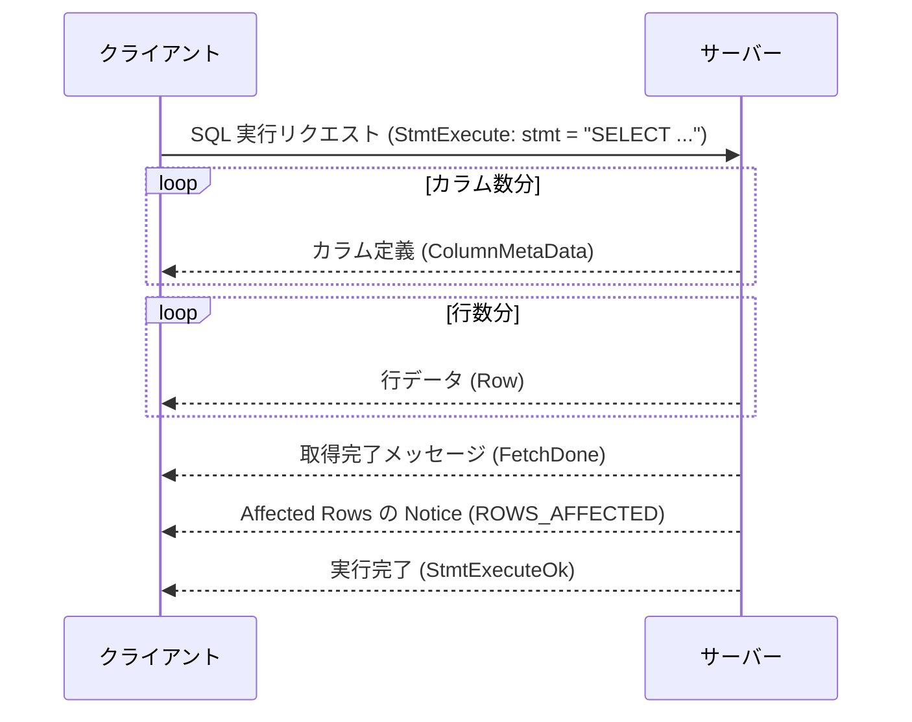

# X Protocol の通信の流れ

## 全体像

1 つの接続は「接続確立 → capability ネゴシエーション → 認証 → コマンド実行 → 終了」という流れになる

```mermaid
sequenceDiagram
    participant C as クライアント
    participant S as サーバー
    C->>S: 接続 (TCP 33060 への connect、または Unix ソケット)
    Note over C,S: 1. 接続確立 (サーバーが accept)
    S-->>C: Notice: ServerHello (リクエストへのレスポンスではない)
    Note over C,S: 2. capability ネゴシエーション (任意)
    C->>S: capability 一覧のリクエスト (CapabilitiesGet)
    S-->>C: capability 一覧 (Capabilities)
    C->>S: capability の変更 (CapabilitiesSet)
    S-->>C: 成功レスポンス (Ok)
    Note over C,S: 3. 認証 (セッション確立)
    C->>S: 認証開始 (AuthenticateStart)
    opt メカニズムに応じた追加データ交換
        S-->>C: 追加の認証データ (AuthenticateContinue)
        C->>S: 追加の認証データ (AuthenticateContinue)
    end
    S-->>C: 認証成功 (AuthenticateOk)
    Note over C,S: 4. コマンドフェーズ (SQL 実行など)
    Note over C,S: 5. 終了
    C->>S: 接続終了 (Connection.Close)
    S-->>C: 成功レスポンス (Ok "bye!")
    Note over C,S: サーバーが TCP 接続を切断
```

### 1. 接続確立

- クライアントがサーバーの X Protocol 用ポート (デフォルトで 33060) に TCP または Unix ソケットで接続する
- サーバーは接続を受け付けると、クライアントのメッセージを待たずに `ServerHello` の Notice を送る

### 2. capability ネゴシエーション (任意)

- capability とは「この接続で何ができるか」を表す名前付きの設定値
  - 例: TLS を使うか、どの認証メカニズムが使えるか、どの圧縮アルゴリズムが使えるか
- クライアントは capability の一覧を取得し、必要なら変更を要求する (例: TLS 接続への切り替え)
- この手続きは認証より前にだけ行える
  - 認証後に送ると、ディスパッチャが扱えないメッセージとして `Error` (`ER_UNKNOWN_COM_ERROR`) が返る

### 3. 認証 (セッション確立)

- クライアントが使いたい認証メカニズムを指定して認証を開始する
- メカニズムによっては追加の認証データの往復がある
  - 例: チャレンジレスポンス方式では、サーバーが送るチャレンジに対して、クライアントがパスワードから計算した値を返す (パスワードそのものは送らない)
- 認証が成功するとセッションが確立し、コマンドを送れるようになる

### 4. コマンドフェーズ

- クライアントが SQL 実行などのリクエストを送り、サーバーのレスポンスを受け取ることを繰り返す (詳細は後述の「SQL 実行の流れ」にて記載)

### 5. 終了

- クライアントが接続の終了を送ると、サーバーはそれに対応するレスポンスを返した後 TCP 接続を切る
- 接続を維持したままセッションだけを閉じ、再認証して同じ接続を使い回すこともできる
  - セッションを閉じた後の接続は認証待ちの状態に戻り、認証以外のリクエストは基本的に受け付けない

## SQL 実行の流れ

- 1 つの SQL 実行リクエストに対して「カラム定義 → 行データ → 取得完了メッセージ → 実行ステータスの Notice → 実行完了」という一連のレスポンスが返る
- 警告や Affected Rows などの実行ステータスは、リザルトセットとは別の Notice で届く
- リザルトセットを返さないステートメント (`INSERT` など) では `ColumnMetaData` / `Row` / `FetchDone` は送られず、Notice と `StmtExecuteOk` だけが返る
- Notice の内訳と順序
  - `ROWS_AFFECTED` はステートメントの種類によらず常に送られる
  - `GENERATED_INSERT_ID` は値が 0 より大きいときだけ、`PRODUCED_MESSAGE` はサーバーからのメッセージがあるときだけ送られる
  - 警告がある場合は、これらの前に警告の Notice がまとめて送られる

```mermaid
sequenceDiagram
    participant C as クライアント
    participant S as サーバー
    C->>S: SQL 実行リクエスト (StmtExecute: stmt = "SELECT ...")
    loop カラム数分
        S-->>C: カラム定義 (ColumnMetaData)
    end
    loop 行数分
        S-->>C: 行データ (Row)
    end
    S-->>C: 取得完了メッセージ (FetchDone)
    S-->>C: Affected Rows の Notice (ROWS_AFFECTED)
    S-->>C: 実行完了 (StmtExecuteOk)
```

## メッセージのやり取りの規則

- やり取りは「シーケンス」という単位で進む
  - シーケンスとは、クライアントの 1 つのリクエストと、それに対するサーバーの一連のレスポンス
    - 一連のレスポンスの最後に来る終端メッセージは、リクエストの種類ごとに決まっている\
    (`StmtExecute` なら `StmtExecuteOk`、`AuthenticateStart` なら `AuthenticateOk`、失敗したときは `Error` など)
  - フレームやパケットの分割とは関係なく、どのリクエストにどのメッセージが属するかの区切り
  - 例
    - `StmtExecute` (SELECT) を 1 つ送ると、`ColumnMetaData` × カラム数 → `Row` × 行数 → `FetchDone` → Notice → `StmtExecuteOk` が返る (このリクエスト 1 つとレスポンス全部で 1 つのシーケンス)
    - `CapabilitiesGet` → `Capabilities` の 1 往復で 1 つのシーケンス
    - `AuthenticateStart` から `AuthenticateOk` (または `Error`) までが 1 つのシーケンス
- シーケンスは必ずクライアントのリクエスト (認証の開始、SQL の実行など) で始まる
- シーケンスの終わり方は以下の 2 通り
  - 一連のレスポンスが末尾まで届いて正常終了する
  - サーバーがエラーを返して中断する
- エラーにはの深刻度は以下の 2 段階
  - 継続可能なエラー: 実行中のシーケンスは中断されるが、セッションは継続する
  - 致命的なエラー: サーバーは以降のリクエストを処理しないので、クライアントは接続を閉じる
- クライアントは前のレスポンスを待たずに次のリクエストを送ってよい
- サーバーはリクエストへのレスポンスとは別に、Notice を送ることがある
- Notice には 2 つの種類がある
  - 実行中のシーケンスに関する Notice (SQL 実行で発生した警告や Affected Rows など) で、シーケンスの途中に挟まれて送られるもの
  - シーケンスとは無関係な Notice (接続直後の `ServerHello` など) で、いつでも送られうるもの

## 参考資料

- [mysqlx_connection.proto の CapabilitiesSet の前提条件](https://github.com/mysql/mysql-server/blob/aa461240270d809bcac336483b886b3d1789d4d9/plugin/x/protocol/protobuf/mysqlx_connection.proto)
- [mysqlx.proto の `@section messages_Message_Sequence`](https://github.com/mysql/mysql-server/blob/aa461240270d809bcac336483b886b3d1789d4d9/plugin/x/protocol/protobuf/mysqlx.proto)
- [mysqlx-protocol-lifecycle.dox の Stages of Session Setup](https://github.com/mysql/mysql-server/blob/aa461240270d809bcac336483b886b3d1789d4d9/plugin/x/protocol/doc/mysqlx-protocol-lifecycle.dox)
